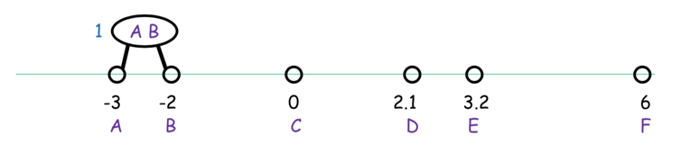

== 聚类和近邻算法

=== K-means算法

聚类是一种无监督的学习方法，目的是能够自动地将样本点根据其相似性划分到不同的组，更好地理解数据背后潜在的结构，为未来可能的数据分析做预处理。应用包括网页或文档主题的自动聚类，
蛋白质结构序列聚类，基于兴趣的虚拟社区发现等等。 +

目前，常用的聚类算法，大致包括：k-means、基于层次的聚类、基于密度的聚类等。本节主要讲述最重要的 `k-means聚类` 算法，下图是该算法的主要逻辑: +

k-means算法的主要逻辑： +
--
* 随机初始化\(k\)个中心点
* 针对每个样本点，随机赋值其所属组的编号

* 针对每个样本点，计算距离其最近的中心点，重新将该点的组编号赋值给最近的中心点
* 针对每个中心点，根据该组下所有的样本点求均值，更新中心点数据

* 迭代以上步骤，直到没有变化
--

这就是经典的k-means算法，是一种启发式方法。 +

k-means的主要问题集中在: 算法开始时\(k\)个中心点随机初始化的问题。可能会导致无法收敛到最优解，或者收敛到比较差的聚类结果上，例如: +

从上图可以看出，如果随机初始化的中心点，刚好选择了中间的三个点，则最终聚类的结果就是每行的三个数据点会成为一个组，而很明显最优的分组应该是每列一组. +

这种现象并不是只有很少情况下才会出现，实际在一些样本本身分割的很不错的情况下也会发生，比如: +

上图是一个数据点很明显应该分为三个符合高斯分布的组内，但是如果你选择的初始中心点的位置有问题，比如上图，那么会出现如下的收敛效果。 +

上面的这些例子说明原始的kmeans算法确实存在由于随机初始化而造成的收敛效果很差的问题，针对这个问题，一个常用的解决方案是中心点的最远距离启发式初始化方法，实现于kmeans++算法中。 +

=== k-means++算法

从算法名字上就可以看出，kmeans++算法是在kmeans算法基础上的进一步优化，优化一定是解决原始算法的局限性或问题，主要解决了kmeans组中心点随机初始化的问题，
同时可以通过一种基于概率的中心点选择策略，可有效降低噪音数据对算法的干扰。 +

==== 基本理论

**(1).初始化问题优化** +

kmeans++采用了中心点最远间隔启发式初始化方法，即当随机选择第一个中心点后，后面的中心点都是选择与已选中心点距离尽可能远的点，例如: +

上节中的三个高斯分布的例子，在新的初始化策略下，一定可以有效的找到这三个明显分割的高斯分布组，但这种方法对异常点非常敏感，比如: +

**(2).解决噪音敏感问题** +

噪音的特点就是数量少，因此如果我们选择中心点的时候不是仅用距离最远进行直接最优的唯一性选择，而是改成概率选择，那么在数据样本较大的情况下，
即便单个噪音点被选中的概率比其他正常点高，但是由于其他正常点的数量远大于噪音点，因此噪音点被选中的概率仍然很小。 +

上图给出的就是一个典型的依点到中心点距离平方进行中心点概率采样的实例，样本被选中的概率正比于其距离中心点距离的平方值，这种方法被形象地称为 \(D^{2} \hspace{0.2cm} Sampling\).
这种方法同传统kmeans方法最优效果相比，可以达到\(O(log k)\)近似。 +

==== 算法核心

这部分直接上参考的博客内容，觉得写的挺不错。 +

=== 基于层次的聚类

前面讲到了两种非常常用的聚类算法，两个算法中都涉及一个没有提及却又很重要的指标：\(k\)应该取多少? +

关于\(k\)的取值是一个长久的话题，当然也有很多研究成果，主要方法包括如下三种: +
--
* 启发式选择：号称解决了最优\(k\)值的选择问题，其实就是将\(k\)和对应代价输出为函数，找到最大的差异点(或者叫拐点)
* 在一个有监督的学习任务下进行交叉验证
* 试试层次聚类
--

本节，我们就介绍第三种方法，其实也是聚类的一种算法：层次聚类算法。该方法又包括两类：一是，自上而下的迭代二分层次聚类；二是，自下而上的两两合并层次聚类。
两个数据点聚集在一起的已经仍然是 `距离`，不同含义的距离对应着不同的聚类策略，但这些策略都是基于层次策略之下的。 +

下面给出一种自底向上，按照最小距离进行两两聚类的算法示意图: +

=== KNN算法

**KNN算法的基本思路** :如果一个样本在特征空间中的k个最相似(即特征空间中最邻近)的样本中的大多数属于某一个类别，则该样本也属于这个类别。
该方法在定类决策上只依据最邻近的一个或者几个样本的类别来决定待分样本所属的类别. +

KNN算法的过程是这样的： +

--
* 从上图中我们可以看到，图中的数据集是良好的数据，即都打好了label，一类是蓝色的正方形，一类是红色的三角形，那个绿色的圆形是我们待分类的数据
* 如果K=3，那么离绿色点最近的有2个红色三角形和1个蓝色的正方形，这3个点投票，于是绿色的这个待分类点属于红色的三角形
*  如果K=5，那么离绿色点最近的有2个红色三角形和3个蓝色的正方形，这5个点投票，于是绿色的这个待分类点属于蓝色的正方形
* 我们可以看到，KNN本质是__基于一种数据统计的方法！其实很多机器学习算法也是基于数据统计的__
* KNN是一种memory-based learning，也叫instance-based learning，属于lazy learning。即它没有明显的前期训练过程，而是程序开始运行时，把数据集加载到内存后，不需要进行训练，就可以开始分类了
* 具体是每次来一个未知的样本点，就在附近找K个最近的点进行投票
--

下面给出kmeans和knn算法的对比: +

=== kd树

实现\(k\)近邻算法时，主要考虑的问题就是如何对训练数据进行快速\(k\)近邻搜索，这点在特征空间的维度大以及训练数据容量大时尤其必要，为了提高\(k\)近邻搜索的效率，可以使用特殊的结构存储训练数据，以减少计算距离的次数，
具体方法很多，本节介绍\(kd\)树方法。 +

==== 构造\(kd\)树

构造\(kd\)树的基本思路：就是用递归的方法，不断地对\(k\)维空间进行切分，生成子节。下面给出构造算法: +

====
. 构造根节点，根节点对应于包含了所有\(T\)个数据样本的\(k\)维空间的超矩形区域

--
* 选择\(x^{(1)}\)作为坐标轴，以\(T\)中所有实例的 \(x^{(i)}\)坐标的中位数为切分点，将根节点对应的超矩形区域切分为两个子区域，切分由通过切分点并与坐标轴 \(x^{(1)}\)垂直的超平面实现。
* 由根节点生成深度为1的左右子节点；左子节点对应坐标 \(x^{(1)}\)小于切分点的子区域，右子节点对应于坐标 \(x^{(1)}\)大于切分点的子区域
* 将落在切分超平面上点保存在根节点
--

. 迭代构造

--
* 对深度为\(j\)的节点，选择 \(x^{(l)}\)为切分的坐标轴，\(l = j (mod \hspace{0.2cm} k ) + 1\)，以该节点的区域中所有实例的 \(x^{(l)}\)坐标的中位数为切分点，将该节点对应的超矩形区域切分为两个子区域，切分由通过切分点并与坐标轴 \(x^{(l)}\)垂直的超平面实现
* 由该节点生成深度为\(k+1\)的左右子节点，左子节点对应坐标 \(x^{(l)}\)小于切分点的子区域，右子节点对应坐标 \(x^{(l)}\)大于切分点的子节点
* 将落在切分超平面上的实例点保存在该节点
--

. 直到两个子区域没有实例存在时停止，从而形成\(kd\)树的区域划分
====

==== 搜索\(kd\)树

给定一个目标点，搜索其最近邻。首先找到包含目标点的叶节点；然后从叶节点出发，依次回退到父节点；不断查找与目标最近的节点，当确实不可能存在更近的节点时终止，这样的搜索被限定在了空间的局部区域上，效率大为提高。 +

其中，保证可以找到最近邻的思想是：目标点的最近邻一定在以目标点为中心并通过当前最近点的超球体的内部，下面给出算法的整体逻辑: +

====
. \(kd\)树最近邻搜索算法

--
* 在\(kd\)树中找到包含目标节点的叶节点：从根节点出发，递归的向下访问\(kd\)树，若目标点\(x\)当前维的坐标小于切分点的坐标，则移动到左子节点，否则移到右子节点，直到子节点为叶节点为止
* 以此节点为当前最近点
* 递归的向上回退，在每个节点上进行如下操作
** 如果该节点保存的实例点比当前最近点距离目标点更近，则以该实例点为当前最近点
** 当前最近点一定存在于该节点一个子节点对应的区域，检查该子节点的父节点的另一个节点对应的区域是否有更近的点，具体的，检查另一个节点对应的区域是否与以目标点为球心，以目标点与当前最近点间的距离为半径的超球体相交
** 如果相交，可能在另一个子节点对应的区域内存在距目标点更近的点，移动到另一个子节点，接着递归的进行近邻搜索
** 如果不相交，则向上回退
* 当回退到根节点时，搜索结束，最后的当前最近点即为\(x\)的最近邻点
--

如果实例点是随机点，\(kd\)树的平均计算复杂度为\(O(log\hspace{0.1cm} N)\). +
====

