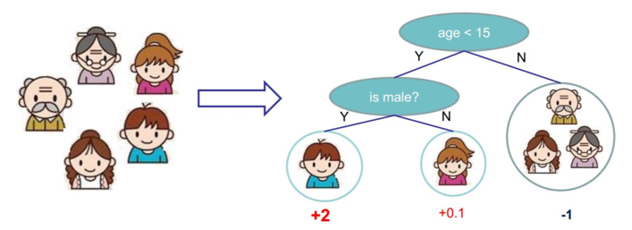

== 决策树和集成学习

本章我们将介绍两个非常重要的概念，决策树和集成学习。应该说市面上还没有哪本书会将这两个概念放在一个章节去讲，我觉得主要的考虑应该是这两个概念并没有本质上的联系，
比如决策树不属于集成学习，而集成学习没有限定用到的基模型必须是树模型。 +

大家可以这样简单理解这个章节，首先决策树具有很多优势：简单、解释性强、分类速度快等，也正式因为这些因素，使得决策树模型很容易过拟合；没办法我们不想让它泛化能力太差，
于是每个决策树就变成了一个弱决策树，`三个臭皮匠胜于诸葛亮`，所以我们多来几个弱决策树，让他们投票表决结果，这就有了随机森林，而随机森林是典型的集成学习，
所以这就是本章节两大基本概念的关系。 +

举个例子先来感性的认识下刚才说了啥： +

这是一颗 `CART` 树，关于什么是 `CART` 树，后面会单独讲，你可以认为这就是一个决策树，图中给出的是预测样本中的每个人是不是喜欢计算机游戏，这是一个典型的二分类问题，
我们假定了样本共有三个特征，我们的这棵决策树深度为2，对每个样本首先判断年龄是否小于15岁，然后在小于15岁的样本里再判定性别是否为男性，如果样本里只有小明(左侧男孩)一个人爱玩计算机游戏，
那么最左边的决策路径就可以很好的知道爱玩计算机游戏的样本，同时可以看到决策树在这条路径上输出的结果最大。 +

上面的那颗决策树对我们的例子没什么问题，但是并没有考虑是否每天都有使用计算机这个特征，因此容易欠拟合，但是考虑到其在训练样本中已经有了很高的准确率，因此再增加树的深度，又有过拟合的风险，
因此我们又单独生成了一个决策树，这棵决策树只考虑第三个特征，如下图，我们发现小明和爷爷每天都有使用计算机的习惯，因此在这条决策路径上输出的结果较大。 +

image::images/random_forest.png[title="随机森林",width="50%", height="55%"]

最后的结果我们可以通过利用两棵树投票加权来决定谁更喜欢玩计算机游戏，很显然小明非常喜欢玩。 +

=== 决策树模型

下面开始介绍第一个概念：`决策树`，决策树是一种基本的分类和回归方法，既可以用来解决分类问题也可以解决回归问题，因此又可以分为分类树和回归树，
回归树主要优势就是模型简单，可读性强，分类速度快，学习时，利用训练数据，根据损失函数最小化的原则建立决策树模型，决策树的学习主要包括三个步骤: +

--
* 特征选择
* 决策树的生成
* 决策树的剪枝
--

==== 决策树思想

决策树模型结构类似于数据结构中的树，虽然大家常看到的决策树是二叉树，但其实决策树并没有这个限制。决策树的节点包括：内部节点和叶子节点，内部节点表示一个特征或属性，
叶子节点表示一个类。 +

可以将决策树理解为一个 `if-then` 的规则集，决策树的根节点到叶子节点的每一条路径构成一条规则，叶节点的类对应着规则的结论，这个规则集有个很重要的性质：互斥并且完备。
也就是说每个样本都被一条路径或一条规则所覆盖，并且只被一条路径或一条规则覆盖。决策树还可以理解为给定特征条件下的条件概率分布，决策树在分类时将节点的样本强行分类到条件概率大的那一类。 +

决策树学习本质上就是从训练数据集中归纳出一组分类规则，与训练集不相矛盾的规则有很多，我们需要的是一个与训练集矛盾较小的决策树，同时具有很好的泛化能力。
从另一个角度来看，我们选择的条件概率模型应该不仅对训练数据有很好的拟合，而且对未知数据有很好的理解。 +

不失一般性，决策树学习也用损失函数表示这一目标，决策树学习的损失函数通常是正则化的极大似然函数。因为所有可能的决策树中选取最优决策树是一个 `NP` 完全问题，
所以现实中决策树学习算法通常采用启发方法，近似求解这一最优化问题，决策树通常是递归的选择最优特征进行生长，因此是个典型的 `贪心算法`。 +

决策树学习算法的最大优点是：它可以自学习。在学习过程中不需要使用者了解太多背景知识，只需要对训练实例进行较好的标注，就能够进行学习，属于有监督学习。 +

==== 特征选择

由于决策树模型是个典型的树形结构，每层的节点代表一个特征，那么在节点进行分裂的时候，我们应该如何选择本层应该选择的特征呢？ 上节我们提到了这种最优的选择方法是启发式的，
是贪心的，也就是说我们在每次特征选择时都会选择这样的特征，它可以将训练样本尽可能明确的分开到各个类别中去。 +

这种描述实在是太绕嘴了，我们思索着用什么概念可以表征这种好与不好的差异呢？ +

===== 信息熵

想想我们的目标是什么，输入给我们的是一堆包含了很多特征的数据，我们对如何根据数据判定其类别一无所知，而结果是要有一系列规则，通过规则可以很容易知道所有数据属于哪类，
我们从一个信息量很大，收敛到一个明确的，完全没有任何信息量的事件，这个信息量其实就是信息论中 `熵` 的概念。 +

**熵的定义**：熵是表示随机变量不确定性的度量，假设\(X\)是一个可以取有限个值的离散随机变量，其概率分布为: +

[stem]
++++
P(X = x_{i}) = p_{i}, \hspace{1cm} i=1,2,...,n
++++

则随机变量\(X\)的熵定义为: +

[stem]
++++
H(X) = -\sum_{i=1}^{n}p_{i}log \hspace{0.1cm} p_{i}
++++

熵值越大，随机变量的不确性越大，由定义可知: +

[stem]
++++
 0 \leq H(X) \leq log \hspace{0.1cm} n
++++

通常对数是以2或者e为底，对应的熵的单位分别为比特或者纳特。 +

**条件熵**：随机变量\(X\)给定的条件下，随机变量\(Y\)的不确定性就叫做条件熵\(H(Y|X)\)，定义为\(X\)给定条件下的概率分布的熵对\(X\)的数学期望: +

[stem]
++++
H(Y|X) = \sum_{i=1}^{n}p_{i} H(Y | X = x_{i})
++++

条件熵也等于\((X, Y)\)发生所包含的熵，减去\(X\)单独发生包含的熵: +

[stem]
++++
H(Y|X) = H(X,Y) - H(X)
++++

下面给出条件熵的推导公式： +

\begin{align}
H(X, Y) - H(X) & = -\sum_{x,y}p(x,y) log \hspace{0.1cm} p(x,y) + \sum_{x} p(x) log \hspace{0.1cm} p(x) \\
& =  -\sum_{x,y}p(x,y) log \hspace{0.1cm} p(x,y) + \sum_{x}(\sum_{y} p(x,y)) log \hspace{0.1cm} p(x) \\
& = -\sum_{x,y}p(x,y) log \hspace{0.1cm} p(x,y) + \sum_{x,y}p(x,y) log \hspace{0.1cm} p(x) \\
& = -\sum_{x,y}p(x,y) log \frac{p(x,y)}{p(x)} \\
& = -\sum_{x,y}p(x,y) log \hspace{0.1cm} p(y | x)
\end{align}

根据条件熵的定义，我们还可以推出如下结论: +

\begin{align}
H(X, Y) - H(X) & = -\sum_{x,y}p(x,y)log \hspace{0.1cm} p(y | x) \\
& = -\sum_{x} \sum_{y} p(x,y) log \hspace{0.1cm} p( y|x) \\
& = - \sum_{x} \sum_{y} p(x) p( y|x ) log \hspace{0.1cm} p( y|x) \\
& = - \sum_{x} p(x) \sum_{y} p( y|x ) log \hspace{0.1cm} p( y|x) \\
& = \sum_{x} p(x) (-\sum_{y} p( y|x ) log \hspace{0.1cm} p( y|x)) \\
& = \sum_{x} p(x) H(Y | X = x)
\end{align}

当熵和条件熵中的概率由数据估计(特别是极大似然估计)得到时，所对应的熵与条件熵分别成为经验熵和经验条件熵。 +

===== 信息增益

**信息增益**：特征A对训练数据集D的信息增益\(g(D, A)\),定义为集合D的经验熵\(H(D)\)与特征A给定条件下D的经验条件熵\(H(D|A)\)之差，即: +

[stem]
++++
g(D, A) = H(D) - H(D|A)
++++

**决策树学习中的信息增益等价于训练数据集中类与特征的互信息。**下面给出信息增益的计算方法： +

假设训练数据集为\(D\)，\(|D|\)表示样本的个数，样本共有\(K\)类，用\(C_{k}\)表示每个类，其中\(k=1,2,...,K\),\(|C_{k}|\)为属于类\(C_{k}\)的样本个数，
有：\(\sum_{k} |C_{k}| = |D| \)；假设特征\(A\)有\(n\)个不同的取值\({a_{1}, a_{2}, ..., a_{n}}\)，根据特征\(A\)的取值，将训练数据划分为\(n\)个子集，
\(D_{1}, D_{2},..., D_{n}\)，\(|D_{i}|\)为\(D_{i}\)的样本个数，有：\(\sum_{i} |D_{i}| = D\)；记\(D_{i}\)中属于类\(C_{k}\)的集合为\(D_{ik}\),
\(|D_{ik}|\)为\(D_{ik}\)的样本个数。 +

首先计算样本\(D\)的经验熵，为： +

[stem]
++++
H(D) = -\sum_{k=1}^{K} \frac{|C_{k}|}{|D|} log \frac{|C_{k}|}{|D|}
++++

然后遍历所有特征，对于特征\(A\): +

--
* 计算特征\(A\)对数据集\(D\)的经验条件熵\(H(D|A)\)，方法见下面公式
* 计算特征\(A\)的信息增益，\(g(D,A) = H(D) - H(D|A)\)
* 选择信息增益最大的特征作为当前的分裂特征
--

\begin{align}
H(D | A) & = - \sum_{ik}p(D_{k}, A_{i})log \hspace{0.1cm} p(D_{k} | A_{i}) \\
& = -\sum_{ik} p(A_{i}) p(D_{k} | A_{i})log \hspace{0.1cm} p(D_{k} | A_{i}) \\
& = -\sum_{i}^{n} \sum_{k}^{K} p(A_{i}) p(D_{k} | A_{i})log \hspace{0.1cm} p(D_{k} | A_{i}) \\
& = -\sum_{i}^{n} p(A_{i}) \sum_{k}^{K} p(D_{k} | A_{i})log \hspace{0.1cm} p(D_{k} | A_{i}) \\
& = -\sum_{i}^{n} \frac{|D_{i}|}{|D|} \sum_{k=1}^{K} \frac{|D_{ik}|}{|D_{i}|}log \hspace{0.1cm} \frac{|D_{ik}|}{|D_{i}|}
\end{align}

===== 信息增益比

使用信息增益进行特征选择有个比较大的问题是：信息增益比较倾向于选择取值较多的特征，比如 `id` 这种，信息熵直接将为0，但实际毫无意义的特征，当然这里只是距离说明，
真实是不会存在这种特征。但是信息增益的这种倾向性，必须进行校正，我们可以使用信息增益比。 +

**信息增益比**：特征\(A\)对训练数据集\(D\)的信息增益比\(g_{R}(D,A)\)定义为其信息增益\(g(D, A)\)与训练数据集\(D\)关于特征\(A\)的值的熵\( H_{A} (D) \)之比，即 +

[stem]
++++
g_{R}(D, A) = \frac{g(D,A)}{H_{A}(D)}
++++

其中，\(H_{A}(D) = -\sum_{i=1}^{n} \frac{|D_{1}|}{|D|} log_{2} \frac{|D_{i}|}{|D|}\), \(n\)是特征\(A\)取值的个数。 +

===== 基尼指数

对于分类树，一般常用基尼指数选择最优特征，同时决定该特征的最优二值切分点。 +

**基尼指数**：分类问题中，假如有\(K\)个类，样本的点属于第\(k\)个类的概率为\(p_{k}\)，则概率分布的基尼指数定义为: +

[stem]
++++
Gini(p) = \sum_{k=1}^{K}p_{k}(1-p_{k}) = 1 - \sum_{k=1}^{K} p_{k}^{2} = 1 - \sum_{k=1}^{K} (\frac{|C_{k}|}{|D|})^{2}
++++

如何理解基尼指数的具体含义呢？根据下面的公式可以将基尼指数看作信息熵的一阶近似。 +

[stem]
++++
H(X) = -\sum_{k=1}^{K}p_{k} ln p_{k} \approx \sum_{k=1}^{K} p_{k}(1-p_{k})
++++

==== 决策树生成

决策树的生成主要包括 `ID3算法`、`C4.5` 和 `CART`。 +

--
* `ID3`，使用信息增益或者叫互信息，进行特征选择；特征多的属性更容易使数据更纯，其信息增益最大，训练得到的是一棵庞大且深度浅的树，不合理；
* `C4.5`，利用信息增益率
* `CART`，利用基尼指数
--

===== CART生成

决策树的生成就是递归地构建决策树的过程，对回归树用平方误差最小化准则，对分类树用基尼指数最小化准则，进行特征选择，生成决策树。记住CART树是二叉树！ +

**(1)回归树的生成** +

使用平方误差来表示回归树对于训练数据的预测误差，用平方误差最小的准则求解每个单元上的最优输出值，很显然这个值就是在该单元上的均值，这样的回顾树通常被称为最小二乘回归树，算法如图: +

image::images/mse_tree.png[title="回归树的生成算法",width="50%", height="55%"]

实在是懒得敲了，毕竟这个算法比较简单，浪费时间没那个必要了，大家可以直接看 `统计学习方法` 一书的相关介绍，但是要记住一点，上面的过程都是基于我们选择了平方误差作为损失函数的前提下，
当我们选择其他损失函数时，不再使用，后面介绍集成学习时会介绍一个很熟悉的概念 `梯度`。 +

**(2)分类树的生成** +

分类树的构造过程类似于回归树，每次更新时需要对比所有可能的特征和它们所有可能的切分点，选择基尼指数最小的特征和对应的切分点作为最优特征和最优切分点。 +

==== 决策树剪枝

决策树生成算法递归的产生决策树，直到不能继续下去为止。这样产生的树往往对训练数据很准，但对于未知的测试数据的分类却没有那么准，即出现了过拟合现象。
过拟合的原因是因为学习时过多的考虑如何提高对训练数据的正确分类，从而构建出过于复杂的决策树，为了解决这个问题，可以考虑对决策树进行剪枝。 +

决策树的剪枝往往是通过极小化决策树整体的损失函数或代价函数实现，很显然这里的损失函数是正则化后的。 +

假设树\(T\)的叶子节点个数为\(|T|\)，\(t\)是树\(T\)的叶子节点，该叶子节点有\(N_{t}\)个样本点，其中\(k\)类的样本点有\(N_{tk}\)个，\(k=1,2,...,K\),
\(H_{t}(T)\)为叶子节点\(t\)上的经验熵，\(\alpha \geq 0\)为参数，则决策树学习的损失函数可以定义为: +

[stem]
++++
C_{\alpha}(T) = \sum_{t=1}^{|T|}N_{t} H_t(T) + \alpha |T|
++++

其中经验熵为: +

[stem]
++++
H_{t}(K) = -\sum_{k} \frac{N_{tk}}{N_{t}} log \frac{N_{tk}}{N_{t}}
++++

我们也可以将损失函数简写成如下形式: +

[stem]
++++
C_{\alpha}(T) = C(T) + \alpha |T|
++++

此时\(C(T)\)表示模型对训练数据的预测误差，\(|T|\)表示模型复杂度，参数\(\alpha \geq 0\)控制着两者之间的影响。
较大的\(\alpha\)促使选择简单的模型，较小的\(alpha\)促使选择复杂的模型，而\(\alpha=0\)只考虑模型和训练数据的拟合程度，不考虑模型的复杂度。 +

损失函数的作用就是平衡模型对训练数据的拟合程度以及模型的复杂度。可以看出，决策树生成只考虑了通过提高信息增益(或信息增益比)对训练数据进行更好的拟合，
而决策树剪枝通过优化损失函数还考虑了较小模型复杂度，决策树生成学习局部模型，而决策树剪枝学习整体模型。 +

**剪枝的基本思想**： +

--
* 由完全树\(T_{0}\)开始，剪枝部分节点得到\(T_{1}\),再次剪枝部分节点得到\(T_{2}\)，直到仅剩树根的树\(T_{k}\)
* 在验证数据集上对这\(k\)个树分别评价，选择损失函数最小的树\(T_{\alpha}\)
--

剪枝过程的核心是：如何确定剪枝系数!可以按照如下方式确定剪枝的系数。根据损失函数\(C_{\alpha}(T) = C(T) + \alpha \cdot |T_{leaf}|\) +
--
* 假定当前对以\(r\)为根的子树剪枝，剪枝后只保留\(r\)节点本身，删除掉所有的叶子
* 考察以\(r\)为根节点的子树，剪枝后的损失函数为\(C_{\alpha}(r) = C(r) + \alpha\)，让其等于剪枝前的损失函数\(C_{\alpha}(T) = C(T) + \alpha \cdot |T_{leaf}|\)
* 求得\(\alpha = \frac{C(r) - C( R ) }{|R_{leaf}|-1}\)
* \(\alpha\)称为节点\(r\)的剪枝系数
--

**剪枝算法**: +

--
* 根据上面方法，计算所有内部节点的剪枝系数
* 查找最小剪枝系数的节点，剪枝得到决策树\(T_{k}\)
* 重复以上步骤，直到决策树\(T_{k}\)只剩一个节点
* 得到决策树序列\(T_{0}, T_{1}, ..., T_{K}\)
* 使用验证样本集选择最优子树
--

验证集作最优子树的评价标准，可以使用评价函数\(C(T) = \sum_{t \in leaf} N_{t} \cdot H(t)\)。  +

剪枝是为了防止过拟合，提高模型的泛化能力，不过我们还有一种方式可以用来防止过拟合：`随机森林`，由于随机森林属于集成学习的范畴，在开始介绍前，还是先让我们了解下集成学习的世界吧。 +

=== 集成学习

集成学习通过构建并合并多个学习器来完成学习任务，常可以获得比单一学习器显著优越的泛化能力，这对于 `弱学习器` 尤为明显，根据个体学习器的生成方式，目前集成学习大致分为两类： +

--
* 个体学习器之间存在强依赖关系，必须窜行生成的序列化方法，如 `Boostring方法`
* 个体学习器之间不存在强依赖关系，可同时生成的并行化方法，如 `Bagging方法` 和  `随机森林`
--

==== Bagging和随机森林

`Bagging` 是并行式集成学习方法最著名的代表，其学习过程是基于一种叫做 `Bootstrap` 的自助采样法进行的，自助采样法是一种有放回的采样方法： +

`Bootstrap`:假定样本的数据集个数为\(m\)，我们先随机的取出一个样本放到采样集中，再把该样本放回初始样本集，使得下次采样时仍有可能选中该样本，
这样经过\(m\)次的随机采样就得到了\(m\)个样本的采样集。照这样，我们可以采样出\(T\)个含\(m\)个训练样本的采样集，然后基于每个采样集训练出一个基学习器，再将这些基学习器进行结合，这就是 `Bagging` 的基本流程。
一般输出结果都是由这些分类器投票决定。 +

`随机森林` (Random Forest)是 `Bagging` 的一个扩展变体，RF在以决策树为基学习器构建 `Bagging` 集成的基础上，进一步在决策树的训练过程中引入**随机属性选择**。 +

传统决策树在选择划分属性时，是在当前节点的属性集合中选择一个最优的属性，而在RF中，对基决策树的每个节点，先从该节点的属性集合中随机选择一个包含\(k\)个属性的子集，然后再从这个子集中选择一个最优属性进行划分。 +
随机森林的训练效率常优于Bagging，因为在个体决策树的构建过程中，Bagging使用的是"确定型"决策树，在选择划分属性时，要对节点的所有属性进行考察；而随机森林使用的"随机型"决策树则只考虑一个属性子集。 +

==== Boosting

首先来说下提升的概念，提升是一种机器学习技术，可用于回归和分类问题，它每一步产生一个弱学习器，并加权累加到总模型中；如果每一步的弱学习器生成都依赖于损失函数的梯度方向，
则称之为梯度提升(Gradient Boosting)。 +

梯度提升算法首先给定一个目标损失函数，它的定义域是所有可行的弱函数集合(基函数)；提升算法通过迭代的选择一个 `负梯度方向` 上的基函数来逐渐逼近 `局部极小值`。
这种在函数域的梯度提升观点对机器学习的很多领域有深刻影响。 +

提升的理论意义：如果一个问题存在弱分类器，则 可以通过提升的办法得到强分类器。 +

===== Adboost详解

大部分的提升方法都是改变训练数据的概率分布(训练数据的权值分布)，针对不同的训练数据分布调用弱学习算法学习一系列弱分类器。这样提升方法就有两个问题需要解决：
一是，在每一轮如何改变训练数据的权重或概率分布；二是如何将弱分类器组合成一个强分类器。 +

Adboost的做法是：提高那些被前一轮弱分离器错误分类样本的权值，而降低那些被正确分类样本的权值。这样一来，那些没有得到正确分类的数据，由于其权重加大而受到后一轮的弱分类器的更大关注。
Adboost就是根据分类结果动态调整样本分布，巧妙地将这些想法实现在了一种算法里。 +

下面讲解AdaBoost算法，假定给定一个二分类的训练数据集: +

[stem]
++++
T = { (x_{1}, y_{1}), (x_{2}, y_{2}), ..., (x_{N}, y_{N}) }
++++

其中，每个样本由实例和标注组成，标记\(y_{i} \in {-1, +1}\),AdaBoost算法实现如下: +

(1)初始化训练数据的权值分布 +

[stem]
++++
D_{1} = (w_{11},...,w_{1i},..., w_{1N}), \hspace{0.2cm} w_{1i}=\frac{1}{N}, \hspace{0.2cm} i=1,2,...,N
++++

(2)对\(m=1,2,...,N\)
* 使用具有权值分布\(D_{m}\)的训练数据集学习，得到基本分类器 +

[stem]
++++
G_{m}(x) : \chi \rightarrow {-1, +1}, \hspace{0.2cm} x_{i} \in \chi \subseteq R^{n}
++++

* 计算\(G_{m}(x)\)在训练数据集上的分类误差率 +

[stem]
++++
e_{m} = P(G_{m}(x_{i}) \neq y_{i}) = \sum_{i=1}^{N} w_{mi}I(G_{m}(x_{i} \neq y_{i}))
++++

* 计算\(G_{m}(x)\)的系数 +

[stem]
++++
\alpha_{m} = \frac{1}{2} log \frac{1-e_{m}}{ e_{m} }
++++

这里的对数是自然对数。 +

* 更新训练数据集的权值分布

\begin{align}
D_{m+1} & = (w_{m+1,1}, w_{m+1,2},..., w_{m+1, N}) \\
w_{m+1,i} & = \frac{w_{mi}}{Z_{m}} exp( -\alpha_{m} y_{i} G_{m}(x_{i}))
\end{align}

其中,\(Z_{m}\)是归一化因子 +

[stem]
++++
Z_{m} = \sum_{i=1}^{N} w_{mi} exp( -\alpha_{m} y_{i} G_{m}(x_{i}))
++++

它使得\(D_{m+1}\)成为一个概率分布。 +

(3)构建基于分类器的线形组合 +

[stem]
++++
f(x) = \sum_{m=1}^{M} \alpha_{m} G_{m}(x)
++++

得到最终的分类器 +

[stem]
++++
G(x) = sign(f(x)) = sign( \sum_{m=1}^{M} \alpha_{m} G_{m}(x) )
++++

其中，\(w_{m+1,j}\)的更新规则可以写成: +

\begin{align}
w_{m+1,j} = \left\{\begin{matrix}
\frac{w_{mi}}{Z_{m}}e^{-\alpha_{m}}, & G_{m}(x_{i}) = y_{i}\\
\frac{w_{mi}}{Z_{m}}e^{\alpha_{m}}, & G_{m}(x_{i}) \neq y_{i}
\end{matrix}\right.
\end{align}

**定理**: AdaBoost算法是前向分布加法算法的特例。这时，模型是由基本分类器组成的加法模型，损失函数是指数函数，证明参考 `统计学习方法`. +

===== GBDT详解

`GBDT(Gradient Boosting Decision Tree)` 又称为 `MART(Multiple Additive Regression Tree)`,因此GBDT的树不仅是 `CART` 树，而且还是回归树。
GBDT与AdBoost最大的不同是：AdBoost利用前一轮弱学习器的误差率来更新训练集的权重，这样一轮一轮迭代下去；GBDT也是迭代，使用了前向分布算法，但是弱分类器限定只使用CART回归树模型，
同时每轮迭代的目标为找到一个CART回归树模型的弱学习器，让本轮的损失最小，也就是说，本轮迭代的决策树，要让本轮的损失最小。 +

GBDT采用梯度提升算法，利用最速下降法近似方法，其关键是利用损失函数的负梯度在当前模型的值作为回归问题提升树算法中的残差近似值，拟合一个回归树。 +

[stem]
++++
-[ \frac{ \partial L(y,f(x_{i})) }{\partial f(x_{i})}]_{f(x) = f_{m-1}(x)}
++++

**GBDT算法推导** +

__1)相关负号定义__ +

\(f\)决策树，从数学上讲，决策树是一个分段函数，所以它的参数描述了分段方法，我们用\({ R_{j} }_{1}^{J}\)
 和 \({ b_{j} }_{1}^{J}\)表示决策树的参数，前者是分段空间(决策树划分出的disjoint空间)，后者是这些空间上\(f\)输出的函数值。其中\(J\)是叶子节点的数量。 +

[stem]
++++
f(x; {R_{j}, b_{j}}_{1}^{J}) = \sum_{j=1}^{J} b_{j} I(x \in R_{j})  \hspace{1cm} (8.1)
++++

下文我们用\(f(x)\)来省略表示\(f(x; {R_{j}, b_{j}}_{1}^{J})\) . +

在 `Boosting` 框架中，\(f\)理论上可以是很多弱学习器，在 `Gradient Boosting` 框架里，常用且被证明有效的出了决策树外，还有逻辑回归，而xgboost中的gbtree和gblinear就对应这两种实现，下面的讨论仅限于决策树上。 +

\(F\)，决策树的ensemble，定义为: +

[stem]
++++
F = \sum_{i=0}^{K} f_{i}
++++

**注意**：弱学习器不可以是线形函数，因为多个线形函数集成到一起仍然是一个线形函数，等价于一个线形模型，表达能力有限，也不能再叫做集成学习了！ +

\(f_{0}\)为模型初始值，通常是按照一定原则计算出的常熟，同时定义\(F_{k} =  \sum_{i=0}^{k} f_{i}\). +
\(D = {(x_{i}, y_{i})}_{1}^{N}\)，为训练样本. +
\(L\)，目标函数，定义为: +

[stem]
++++
L = L({y_{i}, F(x_{i})}_{1}^{N}) = \underset{\hspace{0.9cm} Trainning \, loss \hspace{1.2cm} Regularization}{\underbrace{\sum_{i=1}^{N} L(y_{i}, F(x_{i}))} + \underbrace{\sum_{k=1}^{K} \Omega (f_{k})}} \hspace{1cm} (8.2)
++++

第一项\(L\)是针对样本的\(Loss\)，\(L\)可以有多种选择：绝对值误差，平方误差，logistic loss，指数误差等. +
第二项\(\Omega\)是正则化函数，它惩罚\(f_{k}\)的复杂度，树结构越复杂它的值越大，其对提升效果非常重要。 +

__2)算法推导__ +

先给出原始GBDT算法的框架 +

image::images/gbdt_base.png[title="基本GBDT算法",width="50%", height="55%"]

下面对基本的GBDT算法步骤进行解释。 +
--
* 初始化\(f_{0}\)，常用的方法有:
** 随机初始化
** 用训练样本中的充分统计量进行初始化
** 用其他模型的预测值初始化
GBDT很健壮，对初始值并不敏感，但是更好的初始值能够获得更快的收敛速度和质量。 +
* 2.1中\(\tilde{y}_{i}\)被称作 `响应`，它是一个和残差正相关的变量。
* 2.2公式背后表达了，使用平方误差训练一颗决策树\(f_{k}\)，拟合数据\( {(x_{i}, \tilde{y}_{i})} \)
* 2.3进行line search,在2.2中的\(f\)是在平方误差下学到的，这一步进行一次line search，让\(f\)乘以步长\(\rho\)后最小化损失\(L\)
* 2.4 讲训练出来的\(f_{k}\)叠加到\(F\)

总体来说，GBDT就是一个不断拟合响应(残差)并叠加到\(F\)上的过程，在这个过程中，Loss不断接近最小值。 +
--

GBDT每次迭代都对伪残差样本采用无放回的降采样，用部分样本训练基模型的参数，能增强随机性，防止过拟合，并且收敛快。 +

===== XGBoost详解

XGBoost可以认为是在GBDT基础上的优化，GBDT每次计算出响应后，都会生成一颗最小二乘CART回归树，然后根据损失函数优化树的步长，XGBoost直接对损失函数泰勒展开到二阶，直接求解。首先我们给出XGBoost的正则化函数: +

[stem]
++++
\Omega (f_{k}) = \frac{\gamma}{2} J + \frac{\lambda}{2} \sum_{j=1}^{J} b_{j}^{2} \hspace{1cm} (8.3)
++++

接上节，下面给出XGBoost的推导过程: +

\begin{align}
L_{k} & = \sum_{i=1}^{N} L(y_{i}, F_{k-1}(x_{i}) + f_{k}(x_{i})) + \Omega (f_{k}) \\
& = \sum_{i=1}^{N} L(y_{i}, F_{k-1} + f_{k}) + \Omega (f_{k}) \\
& \approx \sum_{i=1}^{N} ( L(y_{i}, F_{k-1}) +  \underset{:=g_{i} \hspace{4cm} :=h_{i}}{\underbrace{ \frac{\partial L(y_{i}, F_{k-1})}{ \partial F_{k-1}}} f_{k} + \frac{1}{2} \underbrace{ \frac{ \partial^{2} L(y_{i}, F_{k-1})}{\partial F_{k-1}^{2}}} f^{2}_{k}}) + \Omega(f_{k}) \\
& = \sum_{i=1}^{N} (L( y_{i}, F_{k-1} ) + g_{i} f_{k} + \frac{1}{2} h_{i} f_{k}^{2}) + \Omega(f_{k}) \\
& = \sum_{i=1}^{N} (L( y_{i}, F_{k-1} ) + g_{i} \sum_{j=1}^{J} b_{j} + \frac{1}{2} h_{i} \sum_{j=1}^{J} b_{j}^{2}) + \frac{\gamma}{2} J + \frac{\lambda}{2} \sum_{j=1}^{J} b_{j}^{2} \\
& \propto \sum_{i=1}^{N}( g_{i} \sum_{j=1}^{J} b_{j} + \frac{1}{2} h_{i} \sum_{j=1}^{J} b_{j}^{2}) + \frac{\gamma}{2}J + \frac{\lambda}{2} \sum_{j=1}^{J} b_{j}^{2} \\
& = \sum_{x_{i} \in R_{j}}( g_{i} \sum_{j=1}^{J} b_{j} + \frac{1}{2} h_{i} \sum_{j=1}^{J} b_{j}^{2}) + \frac{\gamma}{2}J + \frac{\lambda}{2} \sum_{j=1}^{J} b_{j}^{2} \\
& = \sum_{j=1}^{J}( \sum_{x_{i} \in R_{j}} g_{i}  b_{j} + \sum_{x_{i} \in R_{j}} \frac{1}{2} h_{i}  b_{j}^{2}) + \frac{\gamma}{2}J + \frac{\lambda}{2} \sum_{j=1}^{J} b_{j}^{2} \\
& = \sum_{j=1}^{J}( \sum_{x_{i} \in R_{j}} g_{i}  b_{j} + \frac{1}{2} (\sum_{x_{i} \in R_{j}} h_{i}  + \lambda) b_{j}^{2}) + \frac{\gamma}{2}J  \\
& = \sum_{j=1}^{J}(G_{j}  b_{j} + \frac{1}{2} (H_{j}  + \lambda) b_{j}^{2}) + \frac{\gamma}{2}J \hspace{1cm} (8.4)
\end{align}

对上述推导过程说明如下： +
--
* XGBoost通过在\(f_{k}\)处进行二阶泰勒展开，来近似经验损失
* 令\(G_{j} = \sum_{x_{i} \in R_{j}} g_{i}\), \(H_{j}= \sum_{x_{i} \in R_{j}} h_{i}\)
--
现在问题来了，如何同时求解\(R_{j}\)和\(b_{j}\)，为了解决这个问题，把问题分成两个子问题: +
--
* 问题1:如果已经得到了\(R_{j}\)，最小化\(L_{k}\)的\(b_{j}\)是多少?
* 问题2:如果将当前节点\(R_{i}\)分裂，应该在哪一个分裂点使得\(L_{k}\)最小，这一步我们称为树分裂算法
--

**问题1:** +

对公式(8.4)的\(b_{j}\)求导，令结果为零，容易求得： +

[stem]
++++
b_{j}^{ * } = - \frac{G_{j}}{ H_{j} + \lambda } \hspace{3cm} (8.5)
++++

此时最小的\(L_{k}\)是: +

[stem]
++++
L_{k}^{ * } = - \frac{1}{2} \sum_{j=1}^{J} \frac{G_{j}^{2}}{ H_{j} + \lambda} + \frac{\gamma}{2} J \hspace{1cm} (8.6)
++++

**问题2:** +

求\(R_{j}\)的方法不同于\(b_{j}\)，因为它是对输入\(x\)所属空间的一种划分方法，不连续，无法求导。 精确得到划分是一个NP问题，通常使用贪心算法，即分裂某节点时，
只考虑对当前节点分裂后，哪个分裂方案能得到最小的损失。 +

GBDT中的CART树使用这种贪心方法时是需要遍历\(x\)的每个维度的每个分裂点，XGBoost在这个过程中有所优化，后面详解介绍。那么问题2就可以形式的描述为：将当前节点\(R_{j}\)分裂成
\(R_{L}\)和\(R_{R}\)，使得分裂后整个树的损失最小。 +

由于整棵树的损失等于每个叶子节点上的损失之和，而整个分裂过程仅涉及到三个节点，其他任何节点的损失不变，因此这个问题又等价于下列形式: +

[stem]
++++
max_{R_{L}, R_{R}} \frac{G_{L}^{2} }{ H_{L} + \lambda} + \frac{ G_{R}^{2}}{ H_{R} + \lambda} - \frac{(G_{L} + G_{R})^{2}}{ H_{L} + H_{R} + \lambda} - \gamma \hspace{1cm} (8.7)
++++

其中\(\gamma\)为增加了叶子节点后带来的模型复杂度惩罚项，公式(8.7)表示的是每轮叶子节点分裂时整个树最小损失的降低量，显然这个值越大越好。如果公式(8.7)的值小于0，则不能分裂。 +

下面给出树分裂算法的处理逻辑: +

image::images/tree_split.png[title="树分裂算法",width="50%", height="55%"]

===== 总结

关于XGBoost可以说的内容很多，下面列举说明部分注意事项: +
====
* XGBoost如何处理缺省值？ 基于公式(8.7)分裂的评分函数，我们还可以用来处理缺失值。处理的方法就是，我们把缺失值部分额外取出来，分别放到IL和IR两边分别计算两个评分，看看放到那边的效果较好，则将缺失值放到哪部分。
* 除了以上提到了正则项以外，我们还有shrinkage与列采样技术来避免过拟合的出现。所谓shrinkage就是在每个迭代中树中，对叶子结点乘以一个缩减权重eta。该操作的作用就是减少每颗树的影响力，留更多的空间给后来的树提升。
* 另一个技术则是采样的技术，包括行采样和列采样，其中列采样的实现一般有两种方式，一种是按层随机colsample_bylevel（一般来讲这种效果会好一点），另一种是建树前就随机选择特征colsample_bytree。按层随机抽样的意思就是，之前每次分裂一个结点的时候，我们都要遍历所有的特征和分割点，从而确定最优的分割点，那么如果加入了列采样，我们会在对同一层内每个结点分裂之前，先随机选择一部分特征，于是我们只需要遍历这部分的特征，来确定最优的分割点。
* 而行采样则是bagging的思想，每次只抽取部分的样本进行训练，而不使用全部的样本，从而增加树的多样性。
====

===== 深度思考

====
. (1)xgboost相比传统gbdt有何不同？xgboost为什么快？xgboost如何支持并行？

--
* 传统GBDT以CART作为基分类器，xgboost还支持线性分类器，这个时候xgboost相当于带L1和L2正则化项的逻辑斯蒂回归（分类问题）或者线性回归（回归问题）
* 传统GBDT在优化时只用到一阶导数信息，xgboost则对代价函数进行了二阶泰勒展开，同时用到了一阶和二阶导数。顺便提一下，xgboost工具支持自定义代价函数，只要函数可一阶和二阶求导
* xgboost在代价函数里加入了正则项，用于控制模型的复杂度。正则项里包含了树的叶子节点个数、每个叶子节点上输出的score的L2模的平方和。从Bias-variance tradeoff角度来讲，正则项降低了模型的variance，使学习出来的模型更加简单，防止过拟合，这也是xgboost优于传统GBDT的一个特性
* Shrinkage（缩减），相当于学习速率（xgboost中的eta）。xgboost在进行完一次迭代后，会将叶子节点的权重乘上该系数，主要是为了削弱每棵树的影响，让后面有更大的学习空间。实际应用中，一般把eta设置得小一点，然后迭代次数设置得大一点。
* 列抽样（column subsampling）。xgboost借鉴了随机森林的做法，支持列抽样，不仅能降低过拟合，还能减少计算，这也是xgboost异于传统gbdt的一个特性
* 对缺失值的处理。对于特征的值有缺失的样本，xgboost可以自动学习出它的分裂方向
* xgboost工具支持并行。boosting不是一种串行的结构吗?怎么并行的？注意xgboost的并行不是tree粒度的并行，xgboost也是一次迭代完才能进行下一次迭代的（第t次迭代的代价函数里包含了前面t-1次迭代的预测值）。xgboost的并行是在特征粒度上的。我们知道，决策树的学习最耗时的一个步骤就是对特征的值进行排序（因为要确定最佳分割点），xgboost在训练之前，预先对数据进行了排序，然后保存为block结构，后面的迭代中重复地使用这个结构，大大减小计算量。这个block结构也使得并行成为了可能，在进行节点的分裂时，需要计算每个特征的增益，最终选增益最大的那个特征去做分裂，那么各个特征的增益计算就可以开多线程进行
* 可并行的近似直方图算法。树节点在进行分裂时，我们需要计算每个特征的每个分割点对应的增益，即用贪心法枚举所有可能的分割点。当数据无法一次载入内存或者在分布式情况下，贪心算法效率就会变得很低，所以xgboost还提出了一种可并行的近似直方图算法，用于高效地生成候选的分割点
--
====

最后奉上一张XGBoost优化点的图，关于XGBoost的话还有很多，后续继续补充. +

image::images/xgb_opti.png[title="XGBoost 优化点",width="50%", height="55%"]
