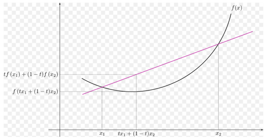
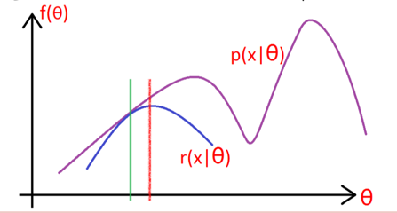
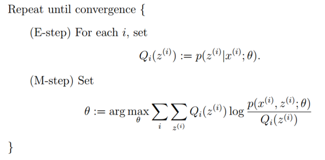

== `EM` 算法

=== 前置知识点

==== Jensen不等式

虽然可能很多人都已经对这个著名的不等式有了很深的认识，但是这里我们还是要再啰嗦一边，了解的同学可以略过。 +

首先，我们先来形象的看下 `Jensen不等式` 到底在说个什么事，公式如下。 +

[stem]
++++
f( \theta x + (1- \theta y)) \leq \theta f(x) + (1-\theta) f(y)  \hspace{1cm} (7.1)
++++

其中，对于任意的参数，都满足\(\theta_{i} \leq 0 \)且\(\sum_{i=1}^{k} \theta_{i} = 1\)，这个公式的理解可以参考下图。 +

上图是一个凸函数(我一直认为是个凹函数，因为图像和凹更像点.)，那么任意一条与图像相交(两个交点)的直线上，两交点间的直线段内的任意一个点的横坐标对应的凹函数上的函数值一定小于直线段上的函数值。
看图说话，这是显而易见的，而且只有两个交点的横坐标在两个函数上的函数值才相等。 +

那么公式(7.1)中的\(\theta\)用来干什么的呢？在左边的公式中是用来控制选取交点间凹函数上的哪个函数值，右边的公式中是用来控制选取交点间直线段上的哪个函数值。那么根据图就可以直接得出，公式(7.1)一定成立。 +

上面的等式推广到\(k\)维空间仍然成立，即: +

[stem]
++++
f(\theta_{1} x_{1} + ... + \theta_{k} x_{k}) \leq \theta_{1} f(x_{1}) + ... + \theta_{k} f(x_{k})
++++

再继续推广，我们可以将参数变成连续值，因为其具有累加和为1的特点，所以可以把它变成概率，设为\(p(x)\)，则等式依旧成立: +

[stem]
++++
f\left ( \int_{S} p(x) x dx \right ) \leq \int_{S} f(x) p(x) dx \hspace{1cm} (7.2)
++++

熟悉概率与统计分析的同学，应该一眼看出公式(7.2)实际就是在说:\(x\)的期望的函数值小于等于\(x\)函数值的期望. +

[stem]
++++
f(E x) \leq E f(x)
++++

`Jensen不等式` 很重要，机器学习中的很多模型的推导都用到了这个不等式，务必掌握。 +

==== 最大似然估计

讲解这么老套的概念，还是来点不一样的感觉吧，直接上例子。 +

**例1:** 二项分布 +
10次抛硬币的结果为:正正反正正正反反正正,假设\(p\)是每次抛硬币结果为正的概率，问题是找到与样本的分布最接近的概率分布模型。 +

毫无疑问这是个二项分布，那么要求的是二项分布的参数，因为参数决定了这个分布到底是啥样，假定试验结果的概率为\(P\)，则： +

[stem]
++++
P = pp(1-p)ppp(1-p)(1-p)pp = p^{7} (1-p)^{3}
++++

这个最优解为\(p=0.7\)，可以将上面的例子抽象成如下数学问题:抛硬币试验中，进行\(N\)次独立试验，有\(n\)次朝上，\(N-n\)次朝下，假定朝上的概率为\(p\)，
使用对数似然函数作为目标函数: +

\begin{align}
f( n | p) & = log (p^{n} (1-p)^{N-p}) = n log p + (N-n) log (1-p) = h(p) \\
\frac{\partial h(p)}{\partial p} & = \frac{n}{p} - \frac{N-n}{1-p} = 0 \\
p &= \frac{n}{N}
\end{align}

上面的例子说明：有限次伯努利试验中，对参数的最大估计就是其发生的频率。 +

**例2:** 高斯分布 +

若给定一组样本\(x_{1}, x_{2}, ..., x_{n}\)，若已知它们都来自高斯分布\(N(\mu, \sigma)\)，试估计参数\(\mu , \sigma \) +

首先看下高斯分布的概率密度: +
[stem]
++++
f(x) = \frac{1}{\sqrt{2\pi}} e^{ - \frac{ (x-\mu)^{2} }{2 \sigma^{2}} }
++++

同样，我们求对数似然，则似然函数为: +

\begin{align}
l(x) & = log \prod_{i} \frac{1}{ \sqrt{2\pi} \sigma} e^{ - \frac{ (x_{i}-\mu)^{2} }{2 \sigma^{2}} } \\
& = \sum_{i} log \frac{1}{ \sqrt{2\pi} \sigma} e^{ - \frac{ (x_{i}-\mu)^{2} }{2 \sigma^{2}} } \\
& = l(x) =\sum_{i} log \frac{1}{ \sqrt{2\pi} \sigma} + \sum_{i}(- \frac{ (x_{i}-\mu)^{2} }{2 \sigma^{2}})  \\
& = -\frac{n}{2}log(2\pi \sigma^{2}) - \frac{1}{2\sigma^{2}} \sum_{i}(x_{i}-\mu)^{2} \hspace{1cm} (7.3)
\end{align}

公式(7.3)对参数\(\mu, \sigma\)分别求偏导，容易得到: +

\begin{align}
\left\{\begin{matrix}
\mu &= \frac{1}{n} \sum_{i} x_{i}\\
\sigma^{2} &= \frac{1}{n} \sum_{i} (x_{i} - \mu )^{2}
\end{matrix}\right.
\end{align}

总结：上述结论和矩估计的结果是一致的，并且意义非常直观，样本的均值即为高斯分布的均值，样本的伪方差即为高斯分布的方差。 +
好了，再来一个问题，让我们进入正题吧，比如上面的高斯分布的例子，如果假定样本是来自多个高斯分的样本，让求每个高斯分布的参数，要怎样求解呢？ +

=== EM算法

上节最后留了个扩展思考题，即假定我们给的样本数据是来自多个，比如\(K\)个高斯分布，那么如何根据样本来估计每个高斯分布的参数呢？让我们先将这个问题数学化： +
假定变量\(X\)是由\(k\)高斯分布混合而成，取各个高斯分布的概率为\(\pi_{1}, \pi_{2},..., \pi_{K}\)，第\(i\)个高斯分布的均值为\(\mu_{i}\)，方差为\(\Sigma_{i}\),
若观察到随机变量\(X\)的一系列样本\(x_{1}, x_{2}, ..., x_{n}\)，试估计参数\(\pi, \mu, \Sigma\). +

==== 直通结论

对于上面的混合高斯模型问题，首先给出目标函数: +

[stem]
++++
l_{\pi, \mu, \Sigma} (x) = \sum_{i}^{N} log\left ( \sum_{k=1}^{K} \pi_{k}N(x_{i} | \mu_{k}, \Sigma_{k}) \right )
++++

由于在对数函数里面又有加和，我们没法直接用求导解方程的办法直接求得最大值。为了解决这个问题，我们分为两部。 +

**(1).** 估计数据来自哪个组份 +

首先来看数据来自每个组份的概率:对于每个样本\(x_{i}\)，它由第\(k\)个组份生成的概率为: +

[stem]
++++
\gamma(i,k) =  \frac{ \pi_{k} N(x_{i} | \mu_{k}, \Sigma_{k}) }{\sum_{j=1}^{K} \pi_{j} N(x_{i} | \mu_{j}, \Sigma_{j})}
++++

在上式中，我们需要先假定\(\mu, \Sigma\)，即给定初始值 +

**(2).** 估计每个组份的参数 +

对于所有的样本点，对于组份\(k\)而言，可以看作生成了\(\gamma (i,k) x_{i}\)这些点，组份\(k\)是一个标准的高斯分布，因此可以直接使用上节例子的结论，得到: +

\begin{align}
\left\{\begin{matrix}
 N_{k}= &\sum_{i=1}^{N} \gamma(i,k)\\
\pi_{k}= & \frac{N_{k}}{N}  = \frac{1}{N} \sum_{i=1}^{N} \gamma(i,k)\\
\mu_{k} = & \frac{1}{N_{k}} \sum_{i=1}^{N} \gamma(i,k) x_{i} \\
\Sigma_{k} = &  \frac{1}{N_{k}} \sum_{i=1}^{N} \gamma(i,k) (x_{i} - \mu) (x_{i} - \mu)^{T}
\end{matrix}\right.
\end{align}

然后根据新的分布参数，再计算每个样本属于每个组份的概率，再继续迭代每个组份高斯分布的参数，一直迭代到收敛或满足迭代次数为止，上述这个过程就叫做 `EM算法`。 +

==== EM推导

前面的例子是在假定样本符合多个高斯分布的情况下，进行了模拟EM迭代过程的介绍，下面正式介绍该算法。 +

假定有训练数据集： \({x^{(1)}, x^{(2)}, ..., x^{(m)}}\)，包含\(m\)个独立样本，我们希望从中找到改组数据的模型\(p(x,z)\)的参数. +

首先还是构建对数似然函数: +

\begin{align}
l(\theta) & = \sum_{i=1}^{m} log \hspace{0.1cm} p(x | \theta) \\
& = \sum_{i=1}^{m} log \sum_{z} p(x, z; \theta)
\end{align}

其中，\(z\)是隐含随机变量，不方便直接找到参数估计，策略：计算\(l(\theta)\)的下界，求该下界的最大值，重复该过程知道收敛到局部最大值。 +

如上图所示，我们每一步逼近的时候都希望，逼近点刚好等于曲线上的对应点，并且逼近曲线的最大值如果小于对应的曲线上的值，则继续在该点构建逼近函数进行近似，
如果一直都可以使得近似点和曲线上的点相同，就可以求得曲线的局部最大值点。 +

我们假设\(Q_{i}\)是\(z\)的某一个分布，\(Q_{i} \geq 0\), 有： +

\begin{align}
l(\theta) & = \sum_{i=1}^{m} log \sum_{z} p(x^{i}, z | \theta) \\
& = \sum_{i=1}^{m} log \sum_{ z^{i} } p(x^{i}, z^{i} | \theta) \\
& = \sum_{i=1}^{m} log \sum_{ z^{i} } Q_{i}(z^{i}) \frac{p(x^{i}, z^{i} | \theta)}{ Q_{i}(z^{i})} \\
& = \geq \sum_{i=1}^{m} \sum_{ z^{i} } Q_{i}(z^{i})  log \frac{p(x^{i}, z^{i} | \theta)}{ Q_{i}(z^{i})} \hspace{1cm} (7.4)
\end{align}

上面公式的关键一步在(7.4)的不等式变换，实际使用的就是 `Jensen不等式`,\(Q_{i}\)刚好是某个分布，所以对应的值就是概率，同时log函数是凹函数，所以结论刚好和凸函数相反。
在说到Jensen不等式的时候我们已经提到了，要想让等式成立，必须让两个交点重合，两个交点重合就意味着是一个点，是常数值: +

[stem]
++++
\frac{p(x^{i}, z^{i}; \theta)}{Q_{i}(z^{i})} = C
++++

也就是分子和分母成比例相关，又因为\(\sum_{z} Q_{i}(z^{i}) = 1\)，因此 +

\begin{align}
Q_{i}(z^{i}) & = \frac{p(x^{i}, z^{i} ; \theta)}{\sum_{z} p( x^{i}, z^{i} ; \theta)} \\
& = \frac{p(x^{i}, z^{i} ; \theta)}{\sum_{z} p( x^{i} ; \theta)} \\
& = p(z^{i} | x^{i} ; \theta) \hspace{1cm} (7.5)
\end{align}

根据公式(7.5)，代入似然函数即公式(7.4)，可以求出参数\(\theta\). EM算法的整体框架如下: +

__**下面给出GMM理论推导过程**__ +

(1). E-step +

[stem]
++++
w_{j}^{(i)} = Q_{i}(Z^{(i)} = j) = P(z^{(i)} = j | x^{(i); \varphi, \mu, \Sigma})
++++

这一步非常简单，就是对每个样本\(x^{(i)}\)求它属于第\(j\)个高斯分布的概率，将样本值直接代入高斯分布函数中即可，这里高斯分布的参数是上一轮的结果，初始时我们会根据经验指定。 +

(2). M-step +

将高斯分布和多项式分布的参数代入公式(7.4) +

\begin{align}
l(\theta) & = \sum_{i=1}^{m} \sum_{z^{(i)}} Q_{i}(z^{i}) log \frac{p(x^{(i)}, z^{(i)} | \phi , \mu, \Sigma)}{Q_{i}(z^{(i)})} \\
& = \sum_{i=1}^{m} \sum_{j=1}^{k} Q_{i}(z^{(i)} = j) log \frac{ p(x^{(i)} | z^{(i)}=j; \mu, \Sigma) p(z^{(i)} = j ; \phi ) }{Q_{i}(z^{(i)} = j)} \\
& = \sum_{i=1}^{m} \sum_{j=1}^{k} w_{j}^{(i)} log \frac{ \frac{1}{ (2\pi)^{n/2} |\Sigma_{j}|^{1/2}}exp(-\frac{1}{2} (x^{(i)} - \mu_{j})^{T} \Sigma_{j}^{-1} (x^{(i)} - \mu_{j})) \cdot \phi_{j} }{w_{j}^{(i)}} \hspace{1cm} (7.6)
\end{align}

对公式(7.6)的损失函数求参数的偏导，分别求出参数\(\mu_{l}\)和\(\Sigma_{j}\)，推导如下: +

对均值求偏导 +

\begin{align}
\nabla_{\mu_{l}} & \sum_{i=1}^{m} \sum_{j=1}^{k} w_{j}^{(i)} log \frac{ \frac{1}{ (2\pi)^{n/2} |\Sigma_{j}|^{1/2}}exp(-\frac{1}{2} (x^{(i)} - \mu_{j})^{T} \Sigma_{j}^{-1} (x^{(i)} - \mu_{j})) \cdot \phi_{j} }{w_{j}^{(i)}} \\
& = -\nabla_{\mu_{l}} \sum_{i=1}^{m} \sum_{j=1}^{k} w_{j}^{(i)} \frac{1}{2} (x^{(i)} - \mu_{j})^{T} \Sigma_{j}^{-1} (x^{(i)} - \mu_{j}) \hspace{1cm} (7.7) \\
& = \frac{1}{2}\sum_{i=1}^{m} w_{l}^{(i)} \nabla_{\mu_{l}} 2[ \mu_{l}^{T} \Sigma_{l}^{-1} x^{(i)} - \mu_{l}^{T} \Sigma_{l}^{-1} \mu_{l}] \hspace{1cm} (7.8) \\
& = \sum_{i=1}^{m} w_{l}^{(i)} (\Sigma_{l}^{-1} x^{(i)} -\Sigma_{l}^{-1} \mu_{l}) \hspace{1cm} (7.9)
\end{align}

令公式(7.9)等于0，得到: +

[stem]
++++
\mu_{l} = \frac{\sum_{i=1}^{m} w_{l}^{(i)} x^{(i)}}{\sum_{i=1}^{m} w_{l}^{(i)}}
++++

同理，可求得方差为: +

[stem]
++++
\Sigma_{j} = \frac{\sum_{i=1}^{m} w_{j}^{(i)} (x^{(i)} - \mu_{j}) (x^{(i)} - \mu_{j})^{T} }{\sum_{i=1}^{m} w_{j}^{(i)}}
++++

最后求解多项式分布的参数\(\phi\)，稍微麻烦点，我们先看下损失函数 : +

[stem]
++++
\sum_{i=1}^{m} \sum_{j=1}^{k} w_{j}^{(i)} log \frac{ \frac{1}{ (2\pi)^{n/2} |\Sigma_{j}|^{1/2}}exp(-\frac{1}{2} (x^{(i)} - \mu_{j})^{T} \Sigma_{j}^{-1} (x^{(i)} - \mu_{j})) \cdot \phi_{j} }{w_{j}^{(i)}}
++++

删除和\(\phi\)无关的常熟项，可得到: +

[stem]
++++
\sum_{i=1}^{m} \sum_{j=1}^{k} w_{j}^{(i)} log \hspace{0.1cm} \phi_{j}
++++

上式无解，为了求解多项式分布的参数，我们用拉格朗日乘子法，由于多项式分布的概率和为1，所以得到下面的拉格朗日函数: +

[stem]
++++
l(\phi) = \sum_{i=1}^{m} \sum_{j=1}^{k} w_{j}^{(i)}log \hspace{0.1cm} \phi_{j} + \beta(\sum_{j=1}^{k} \phi_{j} - 1) \hspace{1cm} (7.10)
++++

因为有\(log\)函数的限制，所以\(\phi\)一定非负，所以不用考虑其大于等于0的限制条件了。求偏导，令偏导为0， 得到: +

\begin{align}
\frac{\partial}{\partial \phi_{j}} l(\phi) & = \sum_{i=1}^{m} \frac{w_{j}^{(i)}}{\phi_{j}} + \beta \\
-\beta & = \sum_{i=1}^{m} \sum_{j=1}^{k} w_{j}^{(i)}  = \sum_{i=1}^{m} 1 = m \\
\phi_{j} & = \frac{1}{m} \sum_{i=1}^{m} w_{j}^{(i)}  \hspace{1cm} (7.11)
\end{align}

**总结:** 对于所有的数据点，可以看作组份\(k\)生成了这些点，组份\(k\)是一个标准的高斯分布，则根据上面的推导得出: +

\begin{align}
\left\{\begin{matrix}
\pi_{k} = & \frac{1}{N} \sum_{i=1}^{N} w_{j}^{(i)}\\
N_{k} =  & N \cdot \pi_{k} = \sum_{i=1}^{N} w_{j}^{(i)} \\
\mu_{k} = & \frac{1}{N_{k}} \sum_{i=1}^{N} w_{j}^{(i)} x^{(i)}\\
\Sigma_{k} = & \frac{1}{N_{k}} \sum_{i=1}^{N} w_{j}^{(i)} (x^{(i)} - \mu_{k})(x^{(i)} -\mu_{k})^{T}
\end{matrix}\right.
\end{align}

关于高斯混合模型的EM推导过程结束。EM还有很多应用场景，比如 `pLSA模型` 的参数求解中也用到了EM算法，这部分内容，有时间了再补充上。 +
