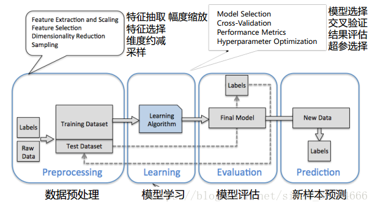

== 特征工程
=== 引子

首先来看一张关于梯度下降的示意图： +

image::images/feature_scaling.png[title="梯度下降", width="60%", height="45%"]

上图给出了两个损失函数的等高线，左图是一个很扁的等高线，右图是一个很规整的等高线，哪一个损失函数好？ +

一个很直观的结论是：当在左图进行梯度下降时，如果我们选择的初始位置为长轴附近，那么需要很多次的迭代才能到达最优点，现象就是算法收敛的很慢，模型学不动。由于模型学习时初始位置都是随机选取的，因此我们更倾向于选择第二种损失函数。 +

怎样才能保障我们的损失函数像右图那样规整呢？这就是特征工程的一个典型作用，当然特征工程的作用还有很多，以至于它是非常非常重要！ +

=== 特征工程
下图是一个机器学习任务典型的工作流程: +

这个 `pipline` 包括了数据预处理、模型学习、模型评估和新样本预测，每个过程的时间和收益比是按照流程越来越低的，也就是我们把更多的时间花在数据预处理上，获得的收益远大于模型算法的选择；换言之，如果数据处理有问题，后面的环节再完美，也无法得到不错的模型。 +

工业界，大概有70%的时间都花在了数据预处理上，当然数据预处理中又包含了数据清洗、特征工程等。一般，算法工程师拿到的数据是经过数据挖掘或数据分析师们清洗后的数据，因此更重要的工作是进行特征工程！ +

不过有的时候，算法工程师们也需要从头做起，数据清洗往往是第一步，我们就从数据清洗开始讲述特征工程。 +

==== 数据清洗

`Garbage in , garbage out !` 当你给模型丢进一堆错误数据时，很显然你得到的也肯定是毫无意义的结果; +

算法大多数情况下就是个加工厂，至于最后的产品(输出)如何，取决于原材料的好坏: +

这个过程会花掉你一般的时间，当然会促进你对业务的理解; +

数据清洗要做的事情就是去掉脏数据！ +

比如，一个人的身高为3米...    缺省值太多的样本丢弃...    数据间存在相互矛盾... +

==== 数据采样

很多情况下数据样本是不均衡的，如小黄车中好车和坏车的比例 +

往往好车的数量要远远大于坏车的数量，这个时候该如何采样？ +

如果坏车的数量也很多，那就下采样；如果坏车的数量很有限，多采集、过采样(旋转等)、修改损失函数 +

==== 特征处理

===== 数值型特征
* 幅度调整/归一化 如，各种 `scalar`
* `log` 等变换
* 换成统计值，如 `max、min、mean、std`
* 离散化、`Hash` 分桶
* 尝试转为类别型特征

===== 类别型特征
* `One-hot` 编码, [0 0 0 1 0]
* 哑变量，虚拟变量，如没有填写性别的用户由于数据量较大，给他们一个类别标识
* `Hash` 与聚类处理，如海量数据推荐，不会直接比较每个数据的相似性，往往会先进行聚类
* 尝试转为数值型

===== 时间型特征
* 看作连续值，如转为持续时间或间隔时间
* 看作离散值，如一天中的哪个时段、一周中的星期几、一年中的哪个月、是不是周末、是不是假期等

===== 文本型特征
* 词袋，去掉停用词后，在词库中的映射稀疏向量
* `N-gram`
* 使用 `TF-IDF` 统计 +
  TF(t) = (词t在当前文中出现次数) / (t在全部文档中出现次数) +
  IDF(t) = ln(总文档数/ 含t的文档数) +

===== 统计特征
* 多维度统计特征，具备良好特征的潜质

===== 组合特征
* 一般用树模型进行组合特征的筛选，一条组合路径就是一个组合特征
