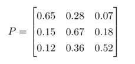
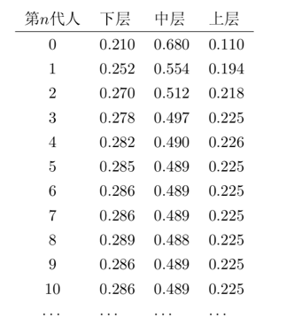
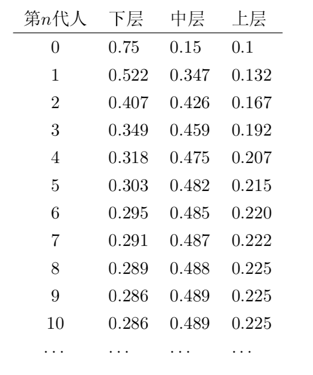

== 主题模型
=== 解决什么问题

主题模型主要应用于自然语言处理领域，其核心应用正如其名，可以用来进行文章的主题发现，信息的语义提取，生成文章摘要，更进一步可以进行社区的挖掘。为了更好地说明本节主题内容，这里可以假定我们要处理地应用为 `文章主题发现`。 +

文章主题发现的模型有很多，我个人比较喜欢LDA(Latent Dirichlet Allocation，隐狄利克雷分布)模型，它在文本建模中是一个非常优雅的模型，
刚开始学习这个模型的时候，读了Richjin的《LDA数学八卦》，被文章中涉及的数学之美深深吸引，可能是由于篇幅过长的原因，读完感觉很爽，
却无法将所有内容串联起来，每部分的内容都可以看懂，到最后却没能领悟到如此简单的实现过程中，那些数学的美都藏在何处？ +

个人感觉，学习LDA的门槛并不低，想要让大家都能理解也绝非易事。我反复阅读了许多相关博客和论文，等到拨开云雾见青天的时候，觉得很有必要将自己的领悟和遇到的坑都记录下来，
也可能是自己能力有限，无法用简短的语言将这个模型讲清楚，本节内容会比较多，我将尽我所能，从先验我本人为一个小白开始，不断假设、追问，又不断找到答案，
从一个正常人的思路，循序渐进讲述一个小白都可以理解的LDA，希望对大家有所助益。 +

=== 给问题建模
我们的目的是想训练一个主题模型，它可以自动完成新文章主题的发现，也就是说当我们将一篇文章输入给训练好的主题模型后，它可以返回该文章对应的 `主题分布`，
比如：我们将 `天龙八部` 这本书(假定为一篇很长的文章)作为模型的输入，则模型返回的结果为：[60%:武侠，30%:爱情，0%:计算机, 5%:教育...],
返回结果显示 `天龙八部` 属于武侠爱情小说的概率很高，这比较符合我们的预期，所以对应的我们可以说主题模型学的不错，而如果返回的结果显示90%的是计算机，
那将是一个很糟糕的模型。 +

上面的例子看上去很好理解，但是有个问题大家有没有考虑到：那些主题(武侠、爱情、计算机等)是哪里来的？其实，在模型训练时，我们丢给模型的是一堆文章，
这些文章的主题是什么我们也不知道，因此这个模型是一个无监督的模型，我们希望计算机可以帮我们自动发现主题，但这里的主题是数字，不能包含具体的含义。
打个比方，我们认为所有的文章共有K个主题，那么我们将主题进行编号 \(Z_{i}\) 表示第\(i\)个主题，模型可以返回文章对应每个主题编号的概率，
我们可以按照文章概率最大的主题编号对文章进行分类，这样就可以将文章分为\(k\)类，简单看下各类文章的内容，可以很容易的将文章分为：新闻、体育、教育等，
这不就是基于内容的新闻网站的典型应用么。 +

在继续阅读前，大家可以想一个问题，我们的模型是否真的可以学出来？我个人任务这个思考很有意义，而且我也认为一定是可以学的出来，大家可以想下：文章是如何产生的？
思考下我们上学时写作文的场景，在一篇作文开始书写前，我们首先看到的是作文的要求，比如写一篇 `我的爸爸是...`，很显然这是一篇写人的文章，
然后有了这个主题后，我们的作文里的词就会围绕这个主题展开，很难想象在写这篇作文的时候你会用到 `百合花` 这种写物的词。简单点说，文章是由一个个词构成的，
但是每个文章的词又是由这篇文章的主题构成的，当老师给你作文打了0分，并批注 `跑题` 了的时候，就说明你文章里那800多个词真的有可能是 `百合花`，
其实我们模型学习的目的就是希望它可以像老师一样发现你作文的主题，很显然这个事情是可以做到的。 +

==== 建模
假定：我们提供的文章数目为\(M\)，称为 `预料`，预料中所有不重复的词共有\(V\)个，假定所有文章共包含的主题有\(K\)个，用\(d\)表示某个文档，\(k\)表示主题，
\(w\)表示词汇,\(n\)表示词，下面的定义完全不用care。 +
--
* \(z[d][w]\)：第\(d\)篇文章的第\(w\)个词来自哪个主题，\(M\)行，\(X\)列，\(X\)为相应文档的长度，即词(可重复的数目
* \(nw[w][t]\)：第\(w\)个词是第\(t\)个主题的次数， `word-topic` 矩阵，列向量\(nw[][t]\)表示主题\(t\)的词频分布，共\(V\)行，\(K\)列
* \(nd[d][t]\)：第\(d\)篇文章中第\(t\)个主题出现的次数， `doc-topic` 矩阵，行向量\(nd[d]\)表示文档主题频数的分布，共\(M\)行，\(K\)列
--

image::images/topic_word_article.png[title="跑题",width="50%", height="55%"]

==== 第一次思考
.脑洞大开
====
[square]
* 训练的目标是什么? 如何抽象这个问题?
====

为了回答这个问题，首先想下我们有什么，我们有一个矩阵，\(M*N\)的矩阵，\(N\)是一个向量，元素\(N_{i}\)表示第\(i\)篇文章的长度(词个数)。
我们希望通过训练让计算机帮我们自动获得预料库中每篇文章的主题，`如何表征一篇文章的主题？文章的主题不是显示存在的，是隐藏在文章的所有词背后的隐变量。` +
假定主题个数\(K=5\)，分别为 `爱情、武侠、教育、音乐、体育` ，如果可以统计出文章对应这5个主题的概率就可以了，怎么统计？一个很直观的想法就是统计出文章的所有\(N_{i}\)个词对应主题的个数。 +

例如：我们有两篇文章，第一篇文章为：“小龙女教杨过武功，后来爱上了杨过”；第二篇文章为：“学习英语重在培养语感，多听英文歌曲可以培养语感”。 +
如何进行统计呢？每篇文章的词是已知，但是主题我们并不知道，只知道个数，假定我们已知每个主题对应的词分布，比如：
--
* 爱情：爱、爱上
* 武侠：小龙女、杨过、武功、教
* 教育：教、学习、英语、语感、培养、英文
* 音乐：歌曲、听
* 体育：篮球、足球、运动·
--
那统计后的结果大致为：

image::images/article_topic_alloc.png[title="文章主题分布",width="50%", height="55%"]
image::images/article_topic_alloc_line.png[title="文章主题分布-平滑",width="50%", height="55%"]

统计的过程比较简单，对文章进行分词，然后按照主题进行统计，上图可以看出第一篇文章的主题是武侠，第二篇文章的主题是教育，对于平滑后的分布图，可以看出最高点就是文章对应的主题，这里假设每个文章只有一个主题。
而平滑主题分布图中的最高点实际就是对应主题分布的 `期望`。对于上面的两张图的横坐标，我采用了两种形式表示，第一幅图是明文的主题，第二幅图是主题的编号，而实际计算机训练时是按照第二副图进行的，它并不知道主题具体是什么。 +

事情进展的很顺利，看上去主题发现是很简单的问题，只不过在上面的描述中我们有一个假定条件：`假定我们已知每个主题对应的词分布` 。如果这个分布已知，事情就会像上面那么简单顺利，因此问题的关键就转换为如何求解这个分布！

**[关键点01]** +

`如何求解主题对应的词分布？`

==== 第二次思考
通过第一次的思考，我们终于把要解决的问题想清楚了，没错，就是要求解所有\(K\)个主题对应的词分布。 +
.脑洞大开
====
[square]
* 如何求解所有主题对应的词分布？
====
一个很大胆的想法就是，如果我们看到的不是每篇文章都写满了词，而是每篇文章中写满了词和对应主题编号，形如：[word:topic]，那么我们就可以统计出每个主题对应的词(统计每个主题下的词频即可)，当然也可以统计出每篇文章的主题分布。 +
悲剧的是，开始训练时，我们对主题一无所知，只知道主题的个数\(K\)，还是拍脑袋定的！！！ +

那么，再来一个大胆的想法：`能不能我随便给每个词指定一个主题，然后通过不断迭代，最终所有词都可以收敛到它本应该对应的主题上呢？` +
直觉告诉我们，这是有可能的，就像随机梯度下下降算法，不管我们初始位置选哪里，而且尽管每次我们都随机的挑选一个样本来更新参数，最后仍然可以收敛，关键在于如何定义损失，在这里就是如何找到一个合理的方向让算法迭代到收敛，毕竟每篇文章不是胡乱编写的，它背后是隐藏这一个明确主题的！ +

**[关键点02]** +
`能不能我随便给每个词指定一个主题，然后通过不断迭代，最终所有词都可以收敛到它本应该对应的主题上呢？`

如果你之前了解过相关知识，我相信你应该能想到答案了，没错，马尔可夫链的平稳分布就具有这个特点：`不管初始状态是什么，经过有限次的迭代，最终收敛到一个稳定的分布`。我不敢假设所有人都有这个先验的知识，如果你不知道，那就让我来讲个故事，把马氏链引出来吧。 +

社会学家经常把人按照其经济状态分成3类：下层、中层和上层，我们用1、2、3分别代表这三个阶层。社会学家们发现决定一个人的收入阶层的最重要因素就是其父母的收入阶层。如果一个人的收入属于下层类别，那么他的孩子属于下层输入的概率为0.65，
属于中层收入的概率是0.28，属于上层收入的概率是0.07。事实上，从父代到子代，收入阶层变化的转移概率如下： +

image::images/transfer_prob.png[title="收入阶层的转换概率",width="50%", height="55%"]
使用矩阵的表达方式，转换概率矩阵记为：

假定当前一代人处于下层、中层和上层的人的比例是概率分布向量\(\pi_{0}=[\pi_{0}(1),\pi_{0}(2),\pi_{0}(3)]\),那么他们子女的分布比例将是\(\pi_{1}=\pi_{0}P\),他们孙子代的分布比例将是\(\pi_{2}=\pi_{1}P=\pi_{0}P^{2},...\),
第\(n\)代子孙的收入分布比例将是\(\pi_{n}=\pi_{n-1}P=\pi_{0}P^{n}\)。 +

假设初始概率分布为\(\pi_{0} = [0.21, 0.68, 0. 11]\)，则我们可以计算前\(n\)代人的分布状态如下： +

我们发现从第7代人开始，这个分布就稳定不变了，这个是偶然吗？我们换一个初始概率分布\(\pi_{0}=[0.75, 0.15, 0.1]\)试试看，继续计算前n代人的分布状况如下： +

我们发现到第9代的时候，分布又收敛了。最奇怪的是，两次给定不同的初始概率分布，最终都收敛到概率分布\(\pi=[0.286, 0.489, 0.225]\)，也就是说 `收敛的行为和初始概率分布无关`。走到这一步，你一定会惊叹： +
** 发现上帝了，我们的问题可以求解了！ **

===== 一个重大的发现
为了突出惊叹，我们就另起一个小节吧，先把重大的发现记录下来： +
`概率分布收敛的行为和初始概率分布无关` +
继续聊上面的例子，如果最终的分布同初始分布无关，那就说明主要是由状态转移矩阵\(P\)决定的，让我们计算下\(P^{n}\) +

image::images/pn.png[width="50%", height="55%"]

我们发现当\(n\)足够大的时候，这个\(p^n\)矩阵的每一行都稳定的收敛到\(\pi=[0.286, 0.489, 0.225]\)这个概率分布。自然的这个收敛现象并不是马氏链独有的，
而是绝大多数马氏链的共同行为，关于马氏链的收敛性我们有个漂亮的定理。 +

在继续下去之前，我们需要重新更新下我们的问题：**找到一个转移矩阵，使得我们随机指定每个词的主题，经过\(n\)轮迭代，最终所有词的主题分布会收敛到稳定分布，即合理分布。** +

**定理01:** 如果一个非周期马氏链具有转移概率矩阵\(P\),且它的任何两个状态都是联通的，那么\(\lim_{n \to \infty }P_{ij}^{n}\)存在且与\(i\)无关，记\(\lim_{n \to \infty }P_{ij}^{n}=\pi (j)\),我们有： +
====
* \(\lim_{n \to \infty }P^{n}=[\pi_{1} \pi_{2} ...\pi_{j}...]\) +
* \(\pi (j) = \sum_{i=0}^{\infty }\pi(i)P_{ij}\) +
* \(\pi\)是方程\(\pi P=\pi\)唯一非负解,其中\(\pi=[\pi_{1}, \pi_{2},...,\pi_{j},..]\)，\(\sum_{i=0}^{\infty }\pi(i)=1\) +
====
则\(\pi\)称为马氏链的平稳分布。 +
这个马氏链的收敛定理非常重要，`所有的MCMC(Markov Chain Monte Carlo)方法都是以这个定理作为理论基础的`。 定理的证明比较复杂，一般的随机过程的课本中也不给出证明，
我们就不纠结于此了，直接用这个定理就好了。下面对于这个定理的内容做一些解释说明： +
--
* 该定理中马氏链的状态不要求有限，可以是无穷多个
* 定理中的 `非周期` 概念，我们不打算解释，因为我们遇到的绝大多数马氏链都是非周期的
* 两个状态\(i,j\)是联通的，并不是指\(i\)可以一步就转移到\(j\)，而是指有限步联通，马氏链的任意两个状态是联通的含义是指存在一个\(n\)，使得矩阵\(P^{n}\)中任何一个元素的数值都大于零。
* 由于马氏链的收敛行为，假定\(n\)步后收敛，则\(x_{n}, x_{n+1},...\)都是平稳分布\(\pi_{x}\)的样本。
--

上面这些其实都不重要，重要的是你要想到：`我们的目标是一个概率分布，如果我们可以构造一个转移矩阵，使得马氏链的平稳分布刚好就是求解的分布，那么我们从任何一个初始状态出发，沿着马氏链转移，如果第n步收敛，则我们就得到了所求分布对应的样本`。 +

这个绝妙的想法在1953年被 `Metropolis` 想到了，`Metropolis` 考虑了物理学中常见的玻尔兹曼分布的采样问题，首次提出了基于马氏链的蒙特卡洛方法，即 `Metropolis` 算法,`Metropolis` 算法是一个普适的采样方法，并启发了一系列 `MCMC` 方法，
所以人们把它视为随机模拟技术腾飞的起点。`Metropolis` 算法也被选为二十世纪十大最重要的算法之一。 +

===== Metropolis Hastings算法
收下我们的小心思，想想我们的问题走到哪里了： +
**我们最初是要求解每篇文章主题的概率分布，可以通过统计每个词对应主题的个数来近似估计，但是每个词对应主题我们也不知道，于是我们希望随便给每个词指定一个主题，通过迭代收敛到稳定的分布，即每个词应该对应的主题编号上，后来我们神奇地发现马氏链的平稳分布的性质可以应用于我们的问题求解中，关键在于如何获得这个转移矩阵！** +

好，略轻思路，我们继续，我们目前关注的问题仍然是如何获得这个神奇的 `转移矩阵`。 +

接下来我们要介绍的 `MCMC` 算法是 `Metropolis` 算法的一个改进变种，即常用的 `Metropolis Hastings` 算法。由上节的例子和定理我们看到了，马氏链的收敛性质主要是由转移矩阵 `P` 决定的，
所以基于马氏链做采样的关键问题是如何构造转移矩阵 `P` ，使得平稳分布刚好是我们想要的分布\(p(x)\)。如何做到这一点呢？我们主要用到下面的定理。 +

**定理02(细致平稳条件)** 如果非周期马氏链的转移矩阵 `P` 和分布\(\pi(x)\)满足： +
[stem]
++++
\pi(x)P_{ij} = \pi_{j}P_{j} \hspace{1cm} for \hspace{0.1cm} all \hspace{0.1cm} i, j \hspace{2cm} (5.1)
++++
则\(\pi_{x}\)是马氏链的平稳分布，上式被称为 `细致平稳条件(detail balance condition)` 。证明也非常简洁: +
[stem]
++++
\sum_{i=0}^{\infty }\pi(i)P_{ij}=\sum_{i=0}^{\infty }\pi(j)P_{ji}=\pi(j)\sum_{i=0}^{\infty }P_{ji}=\pi(j) \\
\Rightarrow \pi P=\pi \hspace{3cm}
++++

假设我们已经有一个转移矩阵为 `Q` 马氏链( \(p(i,j)\)表示从状态\(i\)转移为状态\(j\)的概率)，显然通常情况下 +
[stem]
++++
p(i)q(i,j)\neq p(j)q(j,i)
++++
也就是细致平稳条件不成立，所以\(p(x)\)不太可能是这个马氏链的平稳分布。我们可否对马氏链做一个改造，使得细致平稳条件成立呢？譬如我们引入\(\alpha(i,j)\)，我们希望： +
[stem]
++++
p(i)q(i,j)\alpha (i,j)= p(j)q(j,i)\alpha (j,i) \hspace{2cm} (5.3)
++++
取什么样的\(\alpha(i,j)\)以上等式能成立呢？最简单的，按照对称性，我们可以取： +
[stem]
++++
\alpha (i,j)=p(j)q(j,i) \hspace{3cm} \alpha (j,i)=p(i)q(i,j)
++++
于是公式(5.3)就成立了，所以有 +
[stem]
++++
\overset{p(i)\underbrace{q(i,j)\alpha (i,j)}= }{Q^{'}(i,j)}\overset{p(j)\underbrace{q(j,i)\alpha (j,i)} }{Q^{'}(j,i)} \hspace{2cm} (5.4)
++++
于是我们就把原来具有转移矩阵\(Q\)的一个普通的马氏链，改造成了具有转移矩阵\(Q^{'}\)的马氏链，而 \(Q^{'}\) 恰好满足细致平稳条件，由此马氏链\(Q^{'}\)的平稳分布就是\(p(x)\)！ +

暂停一下，让我们来思考两个问题 +
--
* 我们为何要找满足细致平稳条件的转移矩阵？
* p(x)我们并没有改变，为何改变转移矩阵后就成了平稳分布了？
--

第二个问题比较容易，因为平稳分布就是相对于转移矩阵的，不管p(x)初始状态是什么，转移矩阵都是使得p(x)最终收敛到平稳分布。 `那为何p(x)就是平稳分布呢？` +

这个问题和第一个问题是等价的，首先我们的目的是为了找到转移矩阵使得不论初始状态为何，都可以最后收敛到稳定分布。首先，这个转移矩阵不好找；其次，这个转移矩阵不止一个。
因此我们只需要找到一个就可以了，我们寻找的思路是从平稳分布和转移矩阵的确定关系出发，发现所有的平稳分布和转移矩阵都满足细致平稳条件，因此我们只要找到满足细致平稳条件的分布和转移矩阵，
那么这个分布就是平稳分布，因为满足平稳分布的定义。 +

在改造\(Q\)的过程中，我们引入了\(\alpha(i,j)\)称为接受率，物理意义可以理解为在原来的马氏链上，从状态\(i\)以\(q(i,j)\)的概率跳转到状态\(j\)的时候，我们以\(\alpha(i,j)\)的概率接受这个转移，
于是得到新的马氏链\(Q^{'}\)的转移矩阵为\(q(i,j)\alpha(i,j)\)。 +

image::images/markov_transfer_accept.png[title="马氏链转移和接受概率",width="50%", height="55%"]

把以上的过程整理一下，我们就可以得到如下的用于采样的概率分布\(p(x)\)的算法： +

image::images/hastings_algorithm.png[title="MCMC采样算法",width="50%", height="55%"]

以上过程不仅适应于离散的情形，对于分布是连续的，以上算法仍然有效。以上的 `MCMC` 算法已经能很漂亮的工作了，不过它有一个小问题：马氏链在状态转移过程中的接受率\(\alpha(i,j)\)可能偏小，
这样采样过程中马氏链容易原地踏步，拒绝大量的跳转，这使得马氏链 `遍历所有的状态空间` 要花费太长的时间，收敛到平稳分布\(p(x)\)的速度太慢，有没有办法提高接受率呢？ +

可以假设我们的接受率\(\alpha(i,j)=0.1\),\(\alpha(j,i)=0.2\)，此时满足细致平稳条件，于是： +
[stem]
++++
p(i)q(i,j) \times 0.1 = p(j)q(j,i) \times 0.2
++++
上式两边扩大五倍，可以改写为： +
[stem]
++++
p(i)q(i,j) \times 0.5 = p(j)q(j,i) \times 1
++++
看，我们提高了接受率，而细致平稳条件并没有打破！这启发我们可以把细致平稳条件中的接受率同比例放大，使得两个数中的最大一个数放大到1，这样我们就提高了采样的跳转接受率，所以我们可以取 +
[stem]
++++
\alpha (i,j)=min\left \{ \frac{p(j)q(j,i)}{p(j)q(i,j)},1 \right \}
++++

经过如上改动，我们就得到了最常见的 `Metropolis-Hastings` 算法，算法伪代码如下： +

image::images/metropolis-hastings.png[title="Metropolis-Hastings算法",width="50%", height="55%"]

**至此，我们已经得到了一个解决方案，即不论我们给文档中的每个词初始化哪个主题编号，只要找到转移矩阵，我们都可以在迭代有限步后收敛到主题和词的稳定分布**，伟大的 `Metropolis-Hastings` 算法就是我们的救世主，
而且它还告诉我们如何选取这样的转移矩阵，只是有一点瑕疵，这个转移矩阵虽然进行了优化，接受率仍然是个概率值，如果接受率为100%，那该多好，算法的收敛速度将达到最快。 +

真的还可以再优化吗？ 科学家们为了发表论文可真没闲着，因为100%接受率的采样方法真的找到了，掌声欢迎 `Gibbs Sampling` 算法华丽登场 。 +

===== Gibbs Sampling
`Metropolis-Hastings` 算法由于存在接受率的问题，因此对于高维空间的采样效率并不高，能否找到一个转移矩阵\(Q\)使得接受率\(alpha=1\)呢？ +

首先看下二维情况，假设有一个概率分布\(p(x,y)\)，考察\(x\)坐标相同的两个点\(A(x_{1}, y_{1})\)，\(B(x_{2}, y_{1})\)，我们发现： +
[stem]
++++
p(x_{1}, y_{1})p(y_{2}|x_{1}) = p(x_{1})p(y_{1}|x_{1})p(y_{2}|x_{1}) \\
p(x_{1}, y_{2})p(y_{1}|x_{1}) = p(x_{1})p(y_{2}|x_{1})p(y_{1}|x_{1})
++++
上面两公式相等，所以我们得到 +
[stem]
++++
p(x_{1}, y_{1})p(y_{2}|x_{1}) = p(x_{1}, y_{2})p(y_{1}|x_{1}) \hspace{2cm} (5.4)
++++
即 +
[stem]
++++
p(A)p(y_{2}|x_{1}) = p(B)p(y_{1}|x_{1})
++++
基于以上等式，我们发现在\(x=x_{1}\)这条平行于\(y\)轴的直线上，如果使用条件分布\(p(y|x_{1})\)作为任何两个点之间的转移概率，那么任意两个点之间的转移满足细致平稳条件。
同样的，如果我们在\(y=y_{1}\)这条直线上任意取两个点\(A(x_{1}, y_{1})\)，\(C(x_{2}, y_{1})\)，也有如下等式： +
[stem]
++++
p(A)p(x_{2}|y_{1}) = p(C)p(x_{1}|y_{1})
++++
于是我们可以如下构造平面上任意两点的之间的转移概率矩阵\(Q\)： +

[stem]
++++
Q(A \rightarrow B) = p(y_{B} | x_{1}) \hspace{3cm} if \hspace{0.5cm} x_{A}=x_{B}=x_{1} \\
Q(A \rightarrow C) = p(y_{C} | x_{1}) \hspace{3cm} if \hspace{0.5cm} x_{A}=x_{C}=x_{1} \\
Q(A \rightarrow D) = 0 \hspace{5cm} other
++++

有了如上的转移矩阵\(Q\)，我们很容易验证对于平面上的任意两点\(X\),\(Y\)，满足细致平稳条件： +
[stem]
++++
p(X)Q(X \rightarrow Y) = p(Y)Q(Y \rightarrow X)
++++

于是，这个二维空间的马氏链收敛到平稳分布\(p(x,y)\)，而这个算法就是 `Gibbs Sampling` 算法，由物理学家 `Gibbs` 首次提出。 +

image::images/gibbs_algorithm.png[title="Gibbs Sampling算法",width="50%", height="55%"]

如图所示，马氏链的转移只是轮换的沿着坐标轴做转移，于是得到样本\((x_{0}, y_{0}), (x_{0},y_{1}), (x_{1}, y_{1}), (x_{1}, y_{2}), ...\)，
马氏链收敛后，最终得到的样本就是\(p(x,y)\)的样本。补充说明下，教科书上的 `Gibbs Sampling` 算法大都是坐标轮转算法，但其实这不是强制要求的。最一般的情况是，
在任意\(t\)时刻，可以在\(x\)轴和\(y\)轴之间随机的选一个坐标轴，然后按照条件概率做转移，马氏链也是一样收敛的。轮换两个坐标只是一种方便的形式。 +

以上的过程，我们很容易推广到高维的情况，对于\(n\)维空间，概率分布\(p(x_{1},x_{2},x_{3},...,x_{n})\)可以如下定义转移矩阵： +
--
* 如果当前状态为\(x_{1}, x_{2}, ..., x_{n}\)，马氏链转移的过程中，只能沿着坐标轴做转移。沿着\(x_{i}\)这根坐标轴做转移的时候，转移概率由条件概率\(p(x_{i}|x_{1},...,x_{i-1},x_{i+1},..,x_{n} )\)定义；
* 其他无法沿着单根坐标轴进行的跳转，转移概率都设置为0。
--

于是，我们可以把二维的 `Gibbs Sampling` 算法从采样二维的\(p(x,y)\)推广到采样\(n\)维的\(p(x_{1}, x_{2}, ..., x_{n})\)。以上算法收敛后，得到的就是概率分布\(p(x_{1}, x_{2}, ..., x_{n})\)的样本，
在通常的算法实现中，坐标轮转都是一个确定性的过程，也就是说在给定时刻\(t\)，在一根固定的坐标轴上转移的概率是1. 高维算法的伪代码如下： +

image::images/nd_gibbs.png[title="n维Gibbs Sampling算法",width="50%", height="55%"]

==== 第三次思考
看到这里希望大家的思路还是清晰的，让我们再一起思考下： +

.脑洞大开
====
[square]
* 我们已经知道通过坐标轮转的方式，即 `Gibbs Sampling` 算法，可以让我们开始时任意指定文章中任意词对应的主题(即主题对应的词分布),经过迭代都可以收敛到平稳状态，也就是得到我们想要的topic-word分布
* 那么，具体到我们的问题中，该如何应用 `坐标轮转大法`, 是几维空间，坐标轴是什么？如何做到只沿着一个坐标轴轮转？
====
在自然语言处理中，我们经常将词映射到高维空间，因此这里一个很自然的想法就是：同样将词作为高维空间的维度，我们迭代第\(i\)个词时，坐标轮转法就意味着：在迭代过程中，固定当前词不变，
考虑条件概率分布\(p(z_{i}=k|\vec{z}_{\neg i},\vec{w} )\),这个条件概率的含义是在已知除了第\(i\)个词意外所有词的主题分布和可观察到的所有词的前提下，第\(i\)个词等于第\(k\)个主题的概率。 +

**理解上面的思维转换过程是非常重要的！！！** 其实大家只要对照前面讲的Gibbs采样的样本结果还是很容易理解的，每次更新一个坐标，保持其他坐标轴值不变，也就是每次只更新一个词的主题编号，条件是已知其他词的主题编号。 +

如果知道了条件概率分布\(p(z_{i}=k|\vec{z}_{\neg i},\vec{w} )\)，只需要对每个词按照概率抽样对应的主题编号就可以了。问题终于抽象为了一个数学问题，即求解公式(5.5)的值： +
[stem]
++++
p(z_{i}=k|\vec{z}_{\neg i},\vec{w} \hspace{3cm} (5.5)
++++
似乎没什么思路，我们期望的是什么呢？
