== 主题模型
如果你已经对 `LDA` 模型研究了很久，看过Rickjin的 `LDA数学八卦` ，但是你仍然对其中的细节不是很理解，无法将所有知识串联起来，你可以直接跳到5.3.6节，那里梳理的思路中将所有涉及的知识进行了串联，希望可以解决你的困惑！ +

=== 解决什么问题

主题模型主要应用于自然语言处理领域，其核心应用正如其名，可以用来进行文章的主题发现，信息的语义提取，生成文章摘要，更进一步可以进行社区的挖掘。为了更好地说明本节主题内容，这里可以假定我们要处理地应用为 `文章主题发现`。 +

文章主题发现的模型有很多，我个人比较喜欢LDA(Latent Dirichlet Allocation，隐狄利克雷分布)模型，它在文本建模中是一个非常优雅的模型，
刚开始学习这个模型的时候，读了Richjin的《LDA数学八卦》，被文章中涉及的数学之美深深吸引，可能是由于篇幅过长的原因，读完感觉很爽，
却无法将所有内容串联起来，每部分的内容都可以看懂，到最后却没能领悟到如此简单的实现过程中，那些数学的美都藏在何处？ +

个人感觉，学习LDA的门槛并不低，想要让大家都能理解也绝非易事。我反复阅读了许多相关博客和论文，等到拨开云雾见青天的时候，觉得很有必要将自己的领悟和遇到的坑都记录下来，
也可能是自己能力有限，无法用简短的语言将这个模型讲清楚，本节内容会比较多，我将尽我所能，从先验我本人为一个小白开始，不断假设、追问，又不断找到答案，
从一个正常人的思路，循序渐进讲述一个小白都可以理解的LDA，希望对大家有所助益。 +

=== 给问题建模
我们的目的是想训练一个主题模型，它可以自动完成新文章主题的发现，也就是说当我们将一篇文章输入给训练好的主题模型后，它可以返回该文章对应的 `主题分布`，
比如：我们将 `天龙八部` 这本书(假定为一篇很长的文章)作为模型的输入，则模型返回的结果为：[60%:武侠，30%:爱情，0%:计算机, 5%:教育...],
返回结果显示 `天龙八部` 属于武侠爱情小说的概率很高，这比较符合我们的预期，所以对应的我们可以说主题模型学的不错，而如果返回的结果显示90%的是计算机，
那将是一个很糟糕的模型。 +

上面的例子看上去很好理解，但是有个问题大家有没有考虑到：那些主题(武侠、爱情、计算机等)是哪里来的？其实，在模型训练时，我们丢给模型的是一堆文章，
这些文章的主题是什么我们也不知道，因此这个模型是一个无监督的模型，我们希望计算机可以帮我们自动发现主题，但这里的主题是数字，不能包含具体的含义。
打个比方，我们认为所有的文章共有K个主题，那么我们将主题进行编号 \(Z_{i}\) 表示第\(i\)个主题，模型可以返回文章对应每个主题编号的概率，
我们可以按照文章概率最大的主题编号对文章进行分类，这样就可以将文章分为\(k\)类，简单看下各类文章的内容，可以很容易的将文章分为：新闻、体育、教育等，
这不就是基于内容的新闻网站的典型应用么。 +

image::images/miss_topic.png[title="跑题",width="30%", height="35%"]

在继续阅读前，大家可以想一个问题，我们的模型是否真的可以学出来？我个人任务这个思考很有意义，而且我也认为一定是可以学的出来，大家可以想下：文章是如何产生的？
思考下我们上学时写作文的场景，在一篇作文开始书写前，我们首先看到的是作文的要求，比如写一篇 `我的爸爸是...`，很显然这是一篇写人的文章，
然后有了这个主题后，我们的作文里的词就会围绕这个主题展开，很难想象在写这篇作文的时候你会用到 `百合花` 这种写物的词。简单点说，文章是由一个个词构成的，
但是每个文章的词又是由这篇文章的主题构成的，当老师给你作文打了0分，并批注 `跑题` 了的时候，就说明你文章里那800多个词真的有可能是 `百合花`，
其实我们模型学习的目的就是希望它可以像老师一样发现你作文的主题，很显然这个事情是可以做到的。 +

==== 建模
假定：我们提供的文章数目为\(M\)，称为 `预料`，预料中所有不重复的词共有\(V\)个，假定所有文章共包含的主题有\(K\)个，用\(d\)表示某个文档，\(k\)表示主题，
\(w\)表示词汇,\(n\)表示词，下面的定义完全不用care。 +
--
* \(z[d][w]\)：第\(d\)篇文章的第\(w\)个词来自哪个主题，\(M\)行，\(X\)列，\(X\)为相应文档的长度，即词(可重复的数目
* \(nw[w][t]\)：第\(w\)个词是第\(t\)个主题的次数， `word-topic` 矩阵，列向量\(nw[][t]\)表示主题\(t\)的词频分布，共\(V\)行，\(K\)列
* \(nd[d][t]\)：第\(d\)篇文章中第\(t\)个主题出现的次数， `doc-topic` 矩阵，行向量\(nd[d]\)表示文档主题频数的分布，共\(M\)行，\(K\)列
--

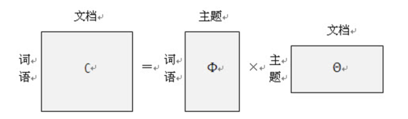

==== 第一次思考
.脑洞大开
====
[square]
* 训练的目标是什么? 如何抽象这个问题?
====

为了回答这个问题，首先想下我们有什么，我们有一个矩阵，\(M*N\)的矩阵，\(N\)是一个向量，元素\(N_{i}\)表示第\(i\)篇文章的长度(词个数)。
我们希望通过训练让计算机帮我们自动获得预料库中每篇文章的主题，`如何表征一篇文章的主题？文章的主题不是显示存在的，是隐藏在文章的所有词背后的隐变量。` +
假定主题个数\(K=5\)，分别为 `爱情、武侠、教育、音乐、体育` ，如果可以统计出文章对应这5个主题的概率就可以了，怎么统计？一个很直观的想法就是统计出文章的所有\(N_{i}\)个词对应主题的个数。 +

例如：我们有两篇文章，第一篇文章为：“小龙女教杨过武功，后来爱上了杨过”；第二篇文章为：“学习英语重在培养语感，多听英文歌曲可以培养语感”。 +
如何进行统计呢？每篇文章的词是已知，但是主题我们并不知道，只知道个数，假定我们已知每个主题对应的词分布，比如：
--
* 爱情：爱、爱上
* 武侠：小龙女、杨过、武功、教
* 教育：教、学习、英语、语感、培养、英文
* 音乐：歌曲、听
* 体育：篮球、足球、运动·
--
那统计后的结果大致为：

image::images/article_topic_alloc.png[title="文章主题分布",width="50%", height="55%"]
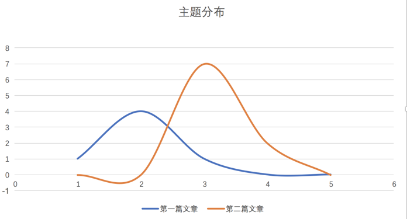

统计的过程比较简单，对文章进行分词，然后按照主题进行统计，上图可以看出第一篇文章的主题是武侠，第二篇文章的主题是教育，对于平滑后的分布图，可以看出最高点就是文章对应的主题，这里假设每个文章只有一个主题。
而平滑主题分布图中的最高点实际就是对应主题分布的 `期望`。对于上面的两张图的横坐标，我采用了两种形式表示，第一幅图是明文的主题，第二幅图是主题的编号，而实际计算机训练时是按照第二副图进行的，它并不知道主题具体是什么。 +

事情进展的很顺利，看上去主题发现是很简单的问题，只不过在上面的描述中我们有一个假定条件：`假定我们已知每个主题对应的词分布` 。如果这个分布已知，事情就会像上面那么简单顺利，因此问题的关键就转换为如何求解这个分布！

**[关键点01]** +

`如何求解主题对应的词分布？`

==== 第二次思考
通过第一次的思考，我们终于把要解决的问题想清楚了，没错，就是要求解所有\(K\)个主题对应的词分布。 +
.脑洞大开
====
[square]
* 如何求解所有主题对应的词分布？
====
一个很大胆的想法就是，如果我们看到的不是每篇文章都写满了词，而是每篇文章中写满了词和对应主题编号，形如：[word:topic]，那么我们就可以统计出每个主题对应的词(统计每个主题下的词频即可)，当然也可以统计出每篇文章的主题分布。 +
悲剧的是，开始训练时，我们对主题一无所知，只知道主题的个数\(K\)，还是拍脑袋定的！！！ +

那么，再来一个大胆的想法：`能不能我随便给每个词指定一个主题，然后通过不断迭代，最终所有词都可以收敛到它本应该对应的主题上呢？` +
直觉告诉我们，这是有可能的，就像随机梯度下下降算法，不管我们初始位置选哪里，而且尽管每次我们都随机的挑选一个样本来更新参数，最后仍然可以收敛，关键在于如何定义损失，在这里就是如何找到一个合理的方向让算法迭代到收敛，毕竟每篇文章不是胡乱编写的，它背后是隐藏这一个明确主题的！ +

**[关键点02]** +
`能不能我随便给每个词指定一个主题，然后通过不断迭代，最终所有词都可以收敛到它本应该对应的主题上呢？`

如果你之前了解过相关知识，我相信你应该能想到答案了，没错，马尔可夫链的平稳分布就具有这个特点：`不管初始状态是什么，经过有限次的迭代，最终收敛到一个稳定的分布`。我不敢假设所有人都有这个先验的知识，如果你不知道，那就让我来讲个故事，把马氏链引出来吧。 +

社会学家经常把人按照其经济状态分成3类：下层、中层和上层，我们用1、2、3分别代表这三个阶层。社会学家们发现决定一个人的收入阶层的最重要因素就是其父母的收入阶层。如果一个人的收入属于下层类别，那么他的孩子属于下层输入的概率为0.65，
属于中层收入的概率是0.28，属于上层收入的概率是0.07。事实上，从父代到子代，收入阶层变化的转移概率如下： +

image::images/transfer_prob.png[title="收入阶层的转换概率",width="50%", height="55%"]
使用矩阵的表达方式，转换概率矩阵记为：

image::images/transfer_matrix.png[title="转换概率矩阵",width="30%", height="35%"]

假定当前一代人处于下层、中层和上层的人的比例是概率分布向量\(\pi_{0}=[\pi_{0}(1),\pi_{0}(2),\pi_{0}(3)]\),那么他们子女的分布比例将是\(\pi_{1}=\pi_{0}P\),他们孙子代的分布比例将是\(\pi_{2}=\pi_{1}P=\pi_{0}P^{2},...\),
第\(n\)代子孙的收入分布比例将是\(\pi_{n}=\pi_{n-1}P=\pi_{0}P^{n}\)。 +

假设初始概率分布为\(\pi_{0} = [0.21, 0.68, 0. 11]\)，则我们可以计算前\(n\)代人的分布状态如下： +

image::images/alloc_example.png[title="前n代人的分布状态",width="30%", height="35%"]

我们发现从第7代人开始，这个分布就稳定不变了，这个是偶然吗？我们换一个初始概率分布\(\pi_{0}=[0.75, 0.15, 0.1]\)试试看，继续计算前n代人的分布状况如下： +

image::images/alloc_example2.png[title="前n代人的分布状态",width="30%", height="35%"]

我们发现到第9代的时候，分布又收敛了。最奇怪的是，两次给定不同的初始概率分布，最终都收敛到概率分布\(\pi=[0.286, 0.489, 0.225]\)，也就是说 `收敛的行为和初始概率分布无关`。走到这一步，你一定会惊叹： +
** 发现上帝了，我们的问题可以求解了！ **

===== 一个重大的发现
为了突出惊叹，我们就另起一个小节吧，先把重大的发现记录下来： +
`概率分布收敛的行为和初始概率分布无关` +
继续聊上面的例子，如果最终的分布同初始分布无关，那就说明主要是由状态转移矩阵\(P\)决定的，让我们计算下\(P^{n}\) +

image::images/pn.png[width="50%", height="55%"]

我们发现当\(n\)足够大的时候，这个\(p^n\)矩阵的每一行都稳定的收敛到\(\pi=[0.286, 0.489, 0.225]\)这个概率分布。自然的这个收敛现象并不是马氏链独有的，
而是绝大多数马氏链的共同行为，关于马氏链的收敛性我们有个漂亮的定理。 +

在继续下去之前，我们需要重新更新下我们的问题：**找到一个转移矩阵，使得我们随机指定每个词的主题，经过\(n\)轮迭代，最终所有词的主题分布会收敛到稳定分布，即合理分布。** +

**定理01:** 如果一个非周期马氏链具有转移概率矩阵\(P\),且它的任何两个状态都是联通的，那么\(\lim_{n \to \infty }P_{ij}^{n}\)存在且与\(i\)无关，记\(\lim_{n \to \infty }P_{ij}^{n}=\pi (j)\),我们有： +
====
* \(\lim_{n \to \infty }P^{n}=[\pi_{1} \pi_{2} ...\pi_{j}...]\) +
* \(\pi (j) = \sum_{i=0}^{\infty }\pi(i)P_{ij}\) +
* \(\pi\)是方程\(\pi P=\pi\)唯一非负解,其中\(\pi=[\pi_{1}, \pi_{2},...,\pi_{j},..]\)，\(\sum_{i=0}^{\infty }\pi(i)=1\) +
====
则\(\pi\)称为马氏链的平稳分布。 +
这个马氏链的收敛定理非常重要，`所有的MCMC(Markov Chain Monte Carlo)方法都是以这个定理作为理论基础的`。 定理的证明比较复杂，一般的随机过程的课本中也不给出证明，
我们就不纠结于此了，直接用这个定理就好了。下面对于这个定理的内容做一些解释说明： +
--
* 该定理中马氏链的状态不要求有限，可以是无穷多个
* 定理中的 `非周期` 概念，我们不打算解释，因为我们遇到的绝大多数马氏链都是非周期的
* 两个状态\(i,j\)是联通的，并不是指\(i\)可以一步就转移到\(j\)，而是指有限步联通，马氏链的任意两个状态是联通的含义是指存在一个\(n\)，使得矩阵\(P^{n}\)中任何一个元素的数值都大于零。
* 由于马氏链的收敛行为，假定\(n\)步后收敛，则\(x_{n}, x_{n+1},...\)都是平稳分布\(\pi_{x}\)的样本。
--

上面这些其实都不重要，重要的是你要想到：`我们的目标是一个概率分布，如果我们可以构造一个转移矩阵，使得马氏链的平稳分布刚好就是求解的分布，那么我们从任何一个初始状态出发，沿着马氏链转移，如果第n步收敛，则我们就得到了所求分布对应的样本`。 +

这个绝妙的想法在1953年被 `Metropolis` 想到了，`Metropolis` 考虑了物理学中常见的玻尔兹曼分布的采样问题，首次提出了基于马氏链的蒙特卡洛方法，即 `Metropolis` 算法,`Metropolis` 算法是一个普适的采样方法，并启发了一系列 `MCMC` 方法，
所以人们把它视为随机模拟技术腾飞的起点。`Metropolis` 算法也被选为二十世纪十大最重要的算法之一。 +

===== Metropolis Hastings算法
收下我们的小心思，想想我们的问题走到哪里了： +
**我们最初是要求解每篇文章主题的概率分布，可以通过统计每个词对应主题的个数来近似估计，但是每个词对应主题我们也不知道，于是我们希望随便给每个词指定一个主题，通过迭代收敛到稳定的分布，即每个词应该对应的主题编号上，后来我们神奇地发现马氏链的平稳分布的性质可以应用于我们的问题求解中，关键在于如何获得这个转移矩阵！** +

好，略轻思路，我们继续，我们目前关注的问题仍然是如何获得这个神奇的 `转移矩阵`。 +

接下来我们要介绍的 `MCMC` 算法是 `Metropolis` 算法的一个改进变种，即常用的 `Metropolis Hastings` 算法。由上节的例子和定理我们看到了，马氏链的收敛性质主要是由转移矩阵 `P` 决定的，
所以基于马氏链做采样的关键问题是如何构造转移矩阵 `P` ，使得平稳分布刚好是我们想要的分布\(p(x)\)。如何做到这一点呢？我们主要用到下面的定理。 +

**定理02(细致平稳条件)** 如果非周期马氏链的转移矩阵 `P` 和分布\(\pi(x)\)满足： +
[stem]
++++
\pi(x)P_{ij} = \pi_{j}P_{j} \hspace{1cm} for \hspace{0.1cm} all \hspace{0.1cm} i, j \hspace{2cm} (5.1)
++++
则\(\pi_{x}\)是马氏链的平稳分布，上式被称为 `细致平稳条件(detail balance condition)` 。证明也非常简洁: +
[stem]
++++
\sum_{i=0}^{\infty }\pi(i)P_{ij}=\sum_{i=0}^{\infty }\pi(j)P_{ji}=\pi(j)\sum_{i=0}^{\infty }P_{ji}=\pi(j) \\
\Rightarrow \pi P=\pi \hspace{3cm}
++++

假设我们已经有一个转移矩阵为 `Q` 马氏链( \(p(i,j)\)表示从状态\(i\)转移为状态\(j\)的概率)，显然通常情况下 +
[stem]
++++
p(i)q(i,j)\neq p(j)q(j,i)
++++
也就是细致平稳条件不成立，所以\(p(x)\)不太可能是这个马氏链的平稳分布。我们可否对马氏链做一个改造，使得细致平稳条件成立呢？譬如我们引入\(\alpha(i,j)\)，我们希望： +
[stem]
++++
p(i)q(i,j)\alpha (i,j)= p(j)q(j,i)\alpha (j,i) \hspace{2cm} (5.3)
++++
取什么样的\(\alpha(i,j)\)以上等式能成立呢？最简单的，按照对称性，我们可以取： +
[stem]
++++
\alpha (i,j)=p(j)q(j,i) \hspace{3cm} \alpha (j,i)=p(i)q(i,j)
++++
于是公式(5.3)就成立了，所以有 +
[stem]
++++
\overset{p(i)\underbrace{q(i,j)\alpha (i,j)}= }{Q^{'}(i,j)}\overset{p(j)\underbrace{q(j,i)\alpha (j,i)} }{Q^{'}(j,i)} \hspace{2cm} (5.4)
++++
于是我们就把原来具有转移矩阵\(Q\)的一个普通的马氏链，改造成了具有转移矩阵\(Q^{'}\)的马氏链，而 \(Q^{'}\) 恰好满足细致平稳条件，由此马氏链\(Q^{'}\)的平稳分布就是\(p(x)\)！ +

暂停一下，让我们来思考两个问题 +
--
* 我们为何要找满足细致平稳条件的转移矩阵？
* p(x)我们并没有改变，为何改变转移矩阵后就成了平稳分布了？
--

第二个问题比较容易，因为平稳分布就是相对于转移矩阵的，不管p(x)初始状态是什么，转移矩阵都是使得p(x)最终收敛到平稳分布。 `那为何p(x)就是平稳分布呢？` +

这个问题和第一个问题是等价的，首先我们的目的是为了找到转移矩阵使得不论初始状态为何，都可以最后收敛到稳定分布。首先，这个转移矩阵不好找；其次，这个转移矩阵不止一个。
因此我们只需要找到一个就可以了，我们寻找的思路是从平稳分布和转移矩阵的确定关系出发，发现所有的平稳分布和转移矩阵都满足细致平稳条件，因此我们只要找到满足细致平稳条件的分布和转移矩阵，
那么这个分布就是平稳分布，因为满足平稳分布的定义。 +

在改造\(Q\)的过程中，我们引入了\(\alpha(i,j)\)称为接受率，物理意义可以理解为在原来的马氏链上，从状态\(i\)以\(q(i,j)\)的概率跳转到状态\(j\)的时候，我们以\(\alpha(i,j)\)的概率接受这个转移，
于是得到新的马氏链\(Q^{'}\)的转移矩阵为\(q(i,j)\alpha(i,j)\)。 +

image::images/markov_transfer_accept.png[title="马氏链转移和接受概率",width="50%", height="55%"]

把以上的过程整理一下，我们就可以得到如下的用于采样的概率分布\(p(x)\)的算法： +

image::images/hastings_algorithm.png[title="MCMC采样算法",width="50%", height="55%"]

以上过程不仅适应于离散的情形，对于分布是连续的，以上算法仍然有效。以上的 `MCMC` 算法已经能很漂亮的工作了，不过它有一个小问题：马氏链在状态转移过程中的接受率\(\alpha(i,j)\)可能偏小，
这样采样过程中马氏链容易原地踏步，拒绝大量的跳转，这使得马氏链 `遍历所有的状态空间` 要花费太长的时间，收敛到平稳分布\(p(x)\)的速度太慢，有没有办法提高接受率呢？ +

可以假设我们的接受率\(\alpha(i,j)=0.1\),\(\alpha(j,i)=0.2\)，此时满足细致平稳条件，于是： +
[stem]
++++
p(i)q(i,j) \times 0.1 = p(j)q(j,i) \times 0.2
++++
上式两边扩大五倍，可以改写为： +
[stem]
++++
p(i)q(i,j) \times 0.5 = p(j)q(j,i) \times 1
++++
看，我们提高了接受率，而细致平稳条件并没有打破！这启发我们可以把细致平稳条件中的接受率同比例放大，使得两个数中的最大一个数放大到1，这样我们就提高了采样的跳转接受率，所以我们可以取 +
[stem]
++++
\alpha (i,j)=min\left \{ \frac{p(j)q(j,i)}{p(j)q(i,j)},1 \right \}
++++

经过如上改动，我们就得到了最常见的 `Metropolis-Hastings` 算法，算法伪代码如下： +

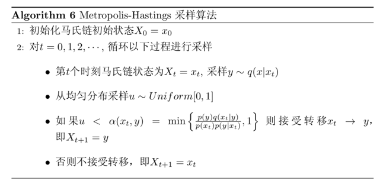

**至此，我们已经得到了一个解决方案，即不论我们给文档中的每个词初始化哪个主题编号，只要找到转移矩阵，我们都可以在迭代有限步后收敛到主题和词的稳定分布**，伟大的 `Metropolis-Hastings` 算法就是我们的救世主，
而且它还告诉我们如何选取这样的转移矩阵，只是有一点瑕疵，这个转移矩阵虽然进行了优化，接受率仍然是个概率值，如果接受率为100%，那该多好，算法的收敛速度将达到最快。 +

真的还可以再优化吗？ 科学家们为了发表论文可真没闲着，因为100%接受率的采样方法真的找到了，掌声欢迎 `Gibbs Sampling` 算法华丽登场 。 +

===== Gibbs Sampling 算法
`Metropolis-Hastings` 算法由于存在接受率的问题，因此对于高维空间的采样效率并不高，能否找到一个转移矩阵\(Q\)使得接受率\(alpha=1\)呢？ +

首先看下二维情况，假设有一个概率分布\(p(x,y)\)，考察\(x\)坐标相同的两个点\(A(x_{1}, y_{1})\)，\(B(x_{2}, y_{1})\)，我们发现： +
[stem]
++++
p(x_{1}, y_{1})p(y_{2}|x_{1}) = p(x_{1})p(y_{1}|x_{1})p(y_{2}|x_{1}) \\
p(x_{1}, y_{2})p(y_{1}|x_{1}) = p(x_{1})p(y_{2}|x_{1})p(y_{1}|x_{1})
++++
上面两公式相等，所以我们得到 +
[stem]
++++
p(x_{1}, y_{1})p(y_{2}|x_{1}) = p(x_{1}, y_{2})p(y_{1}|x_{1}) \hspace{2cm} (5.4)
++++
即 +
[stem]
++++
p(A)p(y_{2}|x_{1}) = p(B)p(y_{1}|x_{1})
++++
基于以上等式，我们发现在\(x=x_{1}\)这条平行于\(y\)轴的直线上，如果使用条件分布\(p(y|x_{1})\)作为任何两个点之间的转移概率，那么任意两个点之间的转移满足细致平稳条件。
同样的，如果我们在\(y=y_{1}\)这条直线上任意取两个点\(A(x_{1}, y_{1})\)，\(C(x_{2}, y_{1})\)，也有如下等式： +
[stem]
++++
p(A)p(x_{2}|y_{1}) = p(C)p(x_{1}|y_{1})
++++
于是我们可以如下构造平面上任意两点的之间的转移概率矩阵\(Q\)： +

[stem]
++++
Q(A \rightarrow B) = p(y_{B} | x_{1}) \hspace{3cm} if \hspace{0.5cm} x_{A}=x_{B}=x_{1} \\
Q(A \rightarrow C) = p(y_{C} | x_{1}) \hspace{3cm} if \hspace{0.5cm} x_{A}=x_{C}=x_{1} \\
Q(A \rightarrow D) = 0 \hspace{5cm} other
++++

有了如上的转移矩阵\(Q\)，我们很容易验证对于平面上的任意两点\(X\),\(Y\)，满足细致平稳条件： +
[stem]
++++
p(X)Q(X \rightarrow Y) = p(Y)Q(Y \rightarrow X)
++++

于是，这个二维空间的马氏链收敛到平稳分布\(p(x,y)\)，而这个算法就是 `Gibbs Sampling` 算法，由物理学家 `Gibbs` 首次提出。 +

image::images/gibbs_algorithm.png[title="Gibbs Sampling算法",width="50%", height="55%"]

如图所示，马氏链的转移只是轮换的沿着坐标轴做转移，于是得到样本\((x_{0}, y_{0}), (x_{0},y_{1}), (x_{1}, y_{1}), (x_{1}, y_{2}), ...\)，
马氏链收敛后，最终得到的样本就是\(p(x,y)\)的样本。补充说明下，教科书上的 `Gibbs Sampling` 算法大都是坐标轮转算法，但其实这不是强制要求的。最一般的情况是，
在任意\(t\)时刻，可以在\(x\)轴和\(y\)轴之间随机的选一个坐标轴，然后按照条件概率做转移，马氏链也是一样收敛的。轮换两个坐标只是一种方便的形式。 +

以上的过程，我们很容易推广到高维的情况，对于\(n\)维空间，概率分布\(p(x_{1},x_{2},x_{3},...,x_{n})\)可以如下定义转移矩阵： +
--
* 如果当前状态为\(x_{1}, x_{2}, ..., x_{n}\)，马氏链转移的过程中，只能沿着坐标轴做转移。沿着\(x_{i}\)这根坐标轴做转移的时候，转移概率由条件概率\(p(x_{i}|x_{1},...,x_{i-1},x_{i+1},..,x_{n} )\)定义；
* 其他无法沿着单根坐标轴进行的跳转，转移概率都设置为0。
--

于是，我们可以把二维的 `Gibbs Sampling` 算法从采样二维的\(p(x,y)\)推广到采样\(n\)维的\(p(x_{1}, x_{2}, ..., x_{n})\)。以上算法收敛后，得到的就是概率分布\(p(x_{1}, x_{2}, ..., x_{n})\)的样本，
在通常的算法实现中，坐标轮转都是一个确定性的过程，也就是说在给定时刻\(t\)，在一根固定的坐标轴上转移的概率是1. 高维算法的伪代码如下： +

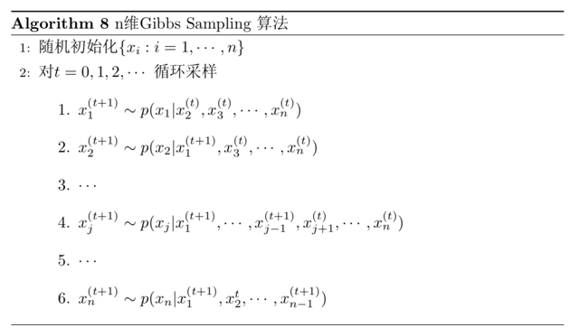

==== 第三次思考
看到这里希望大家的思路还是清晰的，让我们再一起思考下： +

.脑洞大开
====
[square]
* 我们已经知道通过坐标轮转的方式，即 `Gibbs Sampling` 算法，可以让我们开始时任意指定文章中任意词对应的主题(即主题对应的词分布),经过迭代都可以收敛到平稳状态，也就是得到我们想要的topic-word分布
* 那么，具体到我们的问题中，该如何应用 `坐标轮转大法`, 是几维空间，坐标轴是什么？如何做到只沿着一个坐标轴轮转？
====
在自然语言处理中，我们经常将词映射到高维空间，因此这里一个很自然的想法就是：同样将词作为高维空间的维度，我们迭代第\(i\)个词时，坐标轮转法就意味着：在迭代过程中，固定当前词不变，
考虑条件概率分布\(p(z_{i}=k|\vec{z}_{\neg i},\vec{w} )\),这个条件概率的含义是在已知除了第\(i\)个词意外所有词的主题分布和可观察到的所有词的前提下，第\(i\)个词等于第\(k\)个主题的概率，公式中有一个符号：\(\neg \) 表示逻辑关系 `非`。 +

**理解上面的思维转换过程是非常重要的！！！** 其实大家只要对照前面讲的Gibbs采样的样本结果还是很容易理解的，每次更新一个坐标，保持其他坐标轴值不变，也就是每次只更新一个词的主题编号，条件是已知其他词的主题编号。 +

如果知道了条件概率分布\(p(z_{i}=k|\vec{z}_{\neg i},\vec{w} )\)，只需要对每个词按照概率抽样对应的主题编号就可以了。问题终于抽象为了一个数学问题，即求解公式(5.5)的值： +
[stem]
++++
p(z_{i}=k|\vec{z}_{\neg i},\vec{w}) \hspace{3cm} (5.5)
++++
似乎没什么思路，一个大胆的想法就是既然条件概率不好求，是不是可以求出联合概率分布，然后利用贝叶斯公式间接求解？ 这个方法很老套，但不妨试试。既然要计算联合概率分布，首先想到的是 `概率图模型`，把这些变量之间的关系都画出来,瞬间写出联合概率分布. +

=== 文本建模
关于上节的结论，我还想再多说一句，其实大家从很自然角度去想公式(5.5)，你会发现，它其实就是在说：文本中的某个词的主题分布，是由它周围(或者说文档中其他)词共同决定的，这个很好理解，毕竟文档中所有的词都是在描述同样的事情。既然这个概率公式的解释如此自然，
我们就从文本自然产生的过程出发，来考虑其联合概率分布。 +

==== 文档是如何产生的

我们可以看看日常生活中的人是如何构思文章的。如果我们要写一篇文章，往往是要先确定写哪几个主题。譬如构思一篇自然语言处理相关的文章，可能40%会谈论语言学、30%谈论概率统计、20%谈论计算机、还有10%谈论其他主题： +
--
* 说到语言学，我们容易想到的词汇：语法、句子、乔姆斯基、主语...
* 谈到概率统计，我们容易想到一下词：概率、模型、均值、方差、证明、独立、马尔可夫链...
* 谈论计算机，我们容易想到的词是：内存、硬盘、编程、二进制、对象、算法、复杂度...
--
我们之所以立刻想到这些词，是因为这些词在对应的主题下出现的概率很高。我们可以很自然的看到，一篇文章通常是由多个主题构成，而每一个主题大概可以用与该主题相关的频率高的一些词来描述。 +

以上的直观想法由 `Hoffmn` 于1999年给出的 `PLSA(Probabilistic Latent Semantic Analysis)` 模型中首先进行了明确的数学化，`Hoffmn` 认为一篇文档可以有多个主题\(Topic\)混合而成，而每个主题都是词汇上的概率分布，
文章中的每个词都是由一个固定的\(Topic\)生成的。 +

==== PLSA模型

统计学被人们描述为猜测上帝的游戏，人类产生的说有的预料文本我们都可以看成是一个伟大的上帝在天堂中抛掷骰子生成的，我们观察到的都是上帝玩这个游戏的结果，所以在文本建模中，我们希望猜测出上帝是如何玩这个游戏的，
具体一点，最核心的两个问题是： +
--
* 上帝都有什么样的骰子
* 上帝是如何抛掷这些骰子的
--
`Hoffmn` 认为上帝是按照如下的游戏规则来生成文本的。 +

image::images/plsa_holy.png[title="游戏：PLSA主题模型",width="50%", height="55%"]

以上 `PLSA` 模型的文档生成的过程可以图形化的表示为： +

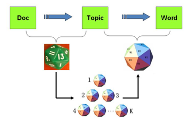

我们可以发现，按照上面的游戏规则，文档和文档之间是独立可交换的，同一个文档内的词也是独立可交换的，这是一个典型的词袋 `bag-of-words` 模型。
游戏中的\(K\)个 `topic-word` 骰子，我们可以记为\(\vec{\varphi_{1}}, ... \vec{\varphi_{K}}\),
对于包含\(M\)篇文档的预料 \( C=(d_{1}, d_{2},..., d_{M}) \)中的每篇文档\(d_{m}\)，都会有一个特定的 `doc-topic` 骰子\(\vec{\theta_{m}}\),
所以对应的骰子记为\(\vec{\varphi_{1}}, ... \vec{\varphi_{M}}\),为了方便，我们假设每个词\(w\)都是一个编号，对应到 `topic-word` 骰子的面。
于是在 `PLSA` 模型中，第\(m\)篇文档\(d_{m}\)中的每个词的生成概率为： +

[stem]
++++
p(w|d_{m})=\sum_{z=1}^{K}p(w|z)p(z|d_{m})=\sum_{z=1}^{K}\varphi _{zw}\theta _{mz} \hspace{2cm} (5.6)
++++
所以整篇文章的生成概率为: +
[stem]
++++
p(\vec{w}|d_{m})=\prod_{i=1}^{n}\sum_{z=1}^{K}p(w_{i}|z)p(z|d_{m})=\prod_{i=1}^{n}\sum_{z=1}^{K}\varphi _{zw_{i}}\theta _{mz} \hspace{1cm} (5.7)
++++

由于文本之间相互独立，我们也容易写出整个预料的生成概率。求解 `PLSA` 这个主题模型的过程中，模型参数容易求解，可以使用著名的 `EM` 算法进行求得局部最优解，由于该模型的解并不是本章节的重点，
有兴趣的同学可以参考 `Hoffmn` 的原始论文，此处略。

==== LDA模型
对于 `PLSA` 模型，贝叶斯学派显然是有意见的，`doc-topic` 骰子\(\vec{\theta_{m}}\)和 `topic-word` 骰子\(\vec{\varphi _{k}}\)都是模型中的参数，参数都是随机变量，怎么能没有先验分布呢？
于是对于 `PLSA` 模型的贝叶斯改造，我们可以在如下两个骰子参数前加上先验概率。 +

应该增加什么样的先验分布呢？ 假定先验概率为\(X\)分布，在似然函数为多项分布的情况下，观察到一定的数据后，得到的后验概率\(Y\),然后后验概率\(Y\)会作为下一次观察前的先验概率，
因此我们希望先验概率分布和后验概率分布相同，即\(X=Y\)，在似然函数为多项分布的情况下，什么样的分布满足先验分布和后验分布相同呢？

===== 二项分布
在数学上定义，在指定似然函数下，先验分布和后验分布相同时，先验分布就叫做似然函数的共轭分布，一个容易让人误解的概念就是：共轭先验是先验概率相对于似然函数而言的。
那么究竟什么分布和多项分布共轭？ +

问题简化下，我们知道多项分布是二项分布在高维度上的推广，我们先研究二项分布的共轭先验分布！ +

假定上帝和我们做一个游戏：游戏的规则很简单，上帝由一个魔盒，上面有个按钮，你每按一下按钮，就会均匀的输出一个[0~1]之间的随机数，上帝现在按了10下，手上有10个数，
你猜第7大的数是什么。你该如何猜呢？ +

从数学角度描述这个游戏如下： +

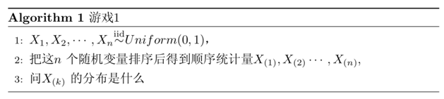

对于上面的游戏而言\(n=10, k=7\)，如果我们能求出\(X_{(7)}\)的分布的概率密度，那么用概率密度的极值点去做猜测就是最好的策略。那么对于一般的情形，\(X_{(k)}\)的分布是什么呢？
我们尝试计算\(X_{(k)}\)在一个区间\([x, x+\Delta x]\)的概率，也就是如下的概率值： +
[stem]
++++
p(x\leqslant X_{(k)}\leqslant x+\Delta x) = ?
++++

把[0,1]区间分成三段\([0,x),[x,x+\Delta x], (x+\Delta x, 1]\)，我们先考虑简单的情形，假定n个数字中只有一个落在区间\([x,x+\Delta x]\)内，则因为该区间是第\(k\)大的，
则\([0,x)\)应该有\(k-1\)个数，\((x+ \Delta x,1]\)之间应该有\(n-k\)个数，我们将符合上述要求的事件记为\(E\)： +

image::images/thing_E.png[title="事件E",width="50%", height="55%"]

则有： +

\begin{align}
P(E) & = \prod_{i=1}^{n}P(X_{i}) \\
& = x^{k-1}(1-x-\Delta x)^{n-k} \Delta x \\
& = x^{k-1} (1-x)^{n-k} \Delta x + o(\Delta x)
\end{align}

其中\(o(\Delta x)\)表示\(\Delta x\)的高阶无穷小。显然，由于不同的排列组合，即\(n\)个数中有一个数落在\([x,x+\Delta x]\)区间的有\(n\)种取法，
余下\(n-1\)个数落在\([0,x)\)的有\(C_{n-1}^{k-1}\)种组合，所以和事件\(E\)等价的事件一共有 \(nC_{n-1}^{k-1}\)个。 +

刚才我们假定了在\([x,x+\Delta x]\)区间只有一个数的情况，再考虑稍微复杂点的情况，假设有两个数落在了区间\([x,x+\Delta x]\),事件记为\(E^{'}\),则有 +
[stem]
++++
P(E^{'})=x^{k-2}(1-x-\Delta x)^{n-k}(\Delta x)^{2}=o(\Delta x)
++++
从以上的分析可以很容易看出，只要落在\([x,x+\Delta x]\)内的数字超过一个，则对应事件的概率就是\(\Delta x\)，于是： +

\begin{align}
P(x\leq X_{(k)}\leq x+\Delta x) & = nC_{n-1}^{k-1}P(E)+o(\Delta x) \\
& = nC_{n-1}^{k-1} x^{k-1} (1-x)^{n-k} \Delta x + o(\Delta x)
\end{align}

所以，可以得到\(X_{(k)}\)的概率密度函数为： +

\begin{align}
f(x) & = \lim_{\Delta x \to0 }\frac{P(x\leq X_{(k)} \leq x+\Delta x)}{\Delta x} \\
& = nC_{n-1}^{k-1} x^{k-1} (1-x)^{n-k} \\
& = \frac{n!}{(k-1)!(n-k)!}x^{k-1} (1-x)^{n-k} \hspace{0.5cm} x\in [0,1]
\end{align}

这面的公式中有阶乘，因此可以用 `Gamma` 函数来表示，我们可以把\(f(x)\)表达为： +

[stem]
++++
f(x) = \frac{\Gamma (n+1)}{\Gamma (k) \Gamma(n-k+1)} x^{k-1} (1-x)^{n-k}  \hspace{2cm} (5.8)
++++

考虑到可能有同学不了解 `Gamma` 函数，我们接下来会补充介绍一下，了解的同学可以跳过下面一个小节。

===== 神奇的 `Gamma` 函数

学高数的时候，我们都学过如下一个长相有点奇特的 `Gamma` 函数 +

[stem]
++++
\Gamma (x) = \int_{0}^{\infty } t^{x-1} e^{-t} dt
++++
通过分布积分，我们可以求得 +

\begin{align}
\Gamma (x) & = \int_{0}^{\infty } t^{x-1} e^{-t} dt \\
& =\frac{1}{x} \int_{0}^{\infty} e^{-t} d t^{x} \\
& =\frac{1}{x} [ (e^{-t} t^{x}) \mid_{0}^{\infty} -\int_{0}^{\infty} t^{x} d e^{-t} ] \\
& = \frac{1}{x}[0 - e^{-t} (-1) \int_{0}^{\infty} t^{x} e^{-t} dt] \\
& = \frac{1}{x} \int_{0}^{\infty} t^{x} e^{-t} dt \\
& = \frac{1}{x} \Gamma(x+1)
\end{align}

所以推导出了如下的递归性质 +
[stem]
++++
\Gamma(x+1) = x \Gamma(x)
++++

看到上式，你一定会想到 `斐波那契数列` ，它可以表示为数的阶乘的形式！ 于是很容易证明， `Gamma` 函数可以当成是阶乘在实数集上的扩展，
具有如下性质： +
[stem]
++++
\Gamma(n) = (n-1)!
++++

===== `Beta` 函数
让我们再回到公式(5.8)，我们令\(\alpha=k, \beta=n-k+1\)，于是我们得到 +
[stem]
++++
f(x) = \frac{\Gamma(\alpha+\beta)}{\Gamma(\alpha) \Gamma(\beta)} x^{\alpha -1} (1-x)^{\beta - 1} \hspace{1cm} (5.9)
++++
这个函数，就是一般意义上的 `Beta` 分布，上面的例子中\(n=10, k=7\)，所以我们按照如下密度分布的峰值去猜测才是最有把握的。 +
[stem]
++++
f(x) = \frac{10!}{6!3!} x^{6} (1-x)^{3} \hspace{0.5cm} x\in [0,1]
++++

然而即便如此，我们能做到一次猜中的概率仍然很低，因为我们掌握到的信息量是在是太少了，如果上帝仁慈了点，告诉了我们一些信息，
那么我的对 `手头上第7大的数是多少` 这件事会得到怎样的后验概率分布呢？ 首先已知的是：在没有任何知识的情况下，这个概率分布为 `Beta` 分布. +

[stem]
++++
先验分布 + 数据的知识 = 后验分布(?)
++++
以上是贝叶斯分析过程的简单直观的表述，假定上帝给我们的信息为：**上帝按了5下这个机器，你就得到了5个[0,1]之间的随机数，然后上帝告诉你这5个数中的每个数，以及和第7个数相比，谁大谁小，然后再让你猜上帝手头上第7大的数是多少。** +

上帝的第二个游戏，数学上形式化一下，就是 +

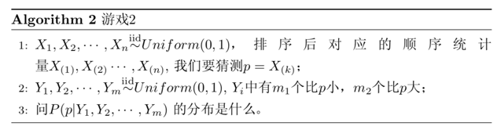

我看网上很多人质疑 `Richjin` 给出的这几个例子，我觉得质疑者多半是没有看懂这些例子背后的含义。让我们仔细阅读上面的游戏规则，
实际上这个就是一个典型的探索先验分布、似然函数以及后验分布关系的例子，千万别忘了走到这一步我们的目的是什么： `在似然函数为多项分布的时候，什么样的分布满足先验分布和后验分布共轭，为了简化问题，我们将多项分布退化到二项分布来研究这个问题。` +

好，上面又啰嗦的梳理了下我们的思路，让我们继续考虑第2个游戏。由于\(p=X_{(k)}\)在\(X_{1}, X_{2}, ..., X_{n}\)中是第\(k\)大的数，利用\(Y_{i}\)的信息，
我们很容易得到\(p\)在\(X_{1}, X_{2}, ..., X_{n}, Y_{1}, Y_{2},..., Y_{m}\) 这\((m+n)\)个独立同分布的随机变量中是第\(k+m_{1}\)个，于是按照第1个游戏的方式，我们可以得到\(p=X_{k}\)的概率密度函数是 +
[stem]
++++
Beta(p|k+m_{1}, n-k+1+m_{2})
++++
讲到这里，我们把以上的过程再整理如下：
--
 * \(p=X_{k}\)是我们猜测的参数，我们推导出\(p\)的分布为\(f(p)=Beta(p|k,n-k+1)\)称为\(p\)的先验分布；
 * 数据\(Y_{i}\)中有\(m_{1}\)个比\(p\)大，\(m_{2}\)个比\(p\)小，\(Y_{i}\)相当于做了\(m\)次伯努利实验，所以\(m_{i}\)服从二项分布\(B(m,p)\);
 * 在给定来自数据提供的\((m_{1}, m_{2})\)的知识后，\(p\)的后验分布变为了\(f(p|m_{1},m_{2})=Beta(p|k+m_{1}, n-k+1+m_{2})\)
--
以上总结可以写成如下公式 +
[stem]
++++
Beta(p|k,n-k+1) + BinomCount(m_{1}, m_{2}) = Beta(p|k+m_{1}, n-k+1+m_{2})
++++
其中\((m_{1}, m_{2})\)对应的是二项分布\(B(m_{1}+m_{2}, p )\)的计数，更为一般的，对于非负实数\(\alpha, \beta\)，我们有如下关系 +
[stem]
++++
Beta(p|\alpha,\beta) = BinomCount(m_{1}, m_{2}) = Beta(p| \alpha+m_{1}, \beta+m+{2})
++++
这个式子描述的就是 `Beta-Binomial共轭`，此处共轭的意思就是：**_数据符合二项分布的时候，参数的先验分布和后验分布都能保持 `Beta` 分布的形式_。** +

而我们从以上过程可以看到，`Beta` 分布的参数\(\alpha,\beta\)都可以理解为物理计数，这两个参数经常被称为伪计数\((pseudo-count)\)，基于以上逻辑，
我们也可以把 `Beta` 分布写成如下的公式来理解 +
[stem]
++++
Beta(p|1,1) + BinomCount(\alpha - 1, \beta - 1) = Beta(p|\alpha , \beta) \hspace{1cm} (5.10)
++++

其中 `Beta(p|1,1)` 恰好就是均匀分布 `Uniform(0, 1)` 。 +

对于公式(5.10)，我们其实可以从贝叶斯的角度来进行推导和理解。假设有一个不均匀的硬币抛出正面的概率\(p\)，抛\(m\)次后出现正面和反面的次数分别为\(m_{1}, m_{2}\)，
那么按传统的频率学派观点，\(p\)的估计值应该为\(\hat{p}=\frac{m_{1}}{m_{1}+m_{2}}\),而从贝叶斯学派角度来看，开始对硬币的不均匀性一无所知，所以应该假设
\(p~Uniform(0,1)\)，于是有了二项分布的计数(m_{1}, m_{2})之后，按照贝叶斯公式计算\(p\)的后验概率 +

\begin{align}
P(p|m_{1}, m_{2}) & = \frac{P(p)\cdot P(m_{1}, m_{2}|p)}{P(m_{1}, m_{2})} \\
& = \frac{1 \cdot P(m_{1}, m_{2}|p)}{\int_{0}^{1}P(m_{1}, m_{2} |t)dt} \\
& = \frac{C_{m}^{m_{1}} p^{m_{1}} (1-p)^{m_{2}}}{ \int_{0}^{1} C_{m}^{m_{1} } t^{m_{1}} (1-t)^{m_{2}} dt}\\
& = \frac{p^{m_{1}} (1-p)^{m_{2}}}{ \int_{0}^{1} t^{m_{1}} (1-t)^{m_{2}} dt}
\end{align}

计算得到的后验概率正好是\(Beta(p|m_{1} + 1, m_{2} + 1)\)。 +

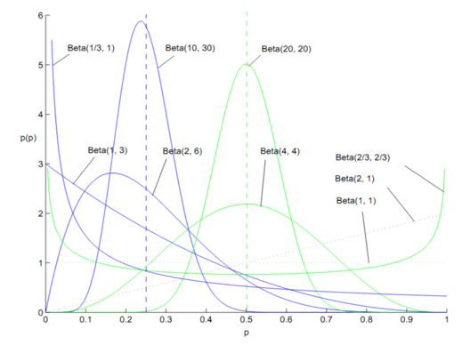

`Beta` 分布的概率密度我们把它画成图，会发现它是百变星君，而均匀分布也是特殊的 `Beta` 分布，由于 `Beta` 分布能够拟合如此之多的形状，因此它在统计数据拟合和贝叶斯分析中被广泛使用。 +

===== 第四次思考
这一次大家不用脑洞大开，我们一起来思考下面几个问题。 +

[IMPORTANT]
.核心概念
====
. 如何更直观的理解伪计数，因为似乎后验概率相对于先验概率就是改了这个东西而已
. 如何直观理解似然函数
====

首先，举例说明什么是似然函数，以二项分布的最大似然估计为例，假设投硬币实验中，进行了\(N\)次独立试验，\(n\)次朝上，\(N-n\)次朝下，假设朝上的概率为\(p\)，请使用最大似然估计这个参数\(p\)。 +

在这个\(N\)次的独立试验中，结果是服从参数为\(p\)的二项分布，因此对参数的求解，可以使用最大似然函数来做点估计，使用对数似然函数作为目标函数 +

[stem]
++++
f(n|p) = log(p^{n} (1-p)^{N-n}) \\
h(p) = log(p^{n} (1-p)^{N-n}) \hspace{1cm} (5.11) \\
\frac{\partial h(p)}{\partial p} = \frac{n}{p} - \frac{N-n}{1-p} = 0 \Rightarrow p = \frac{n}{N}
++++
公式(5.11)是一个关于参数的函数，就是似然函数，令似然函数导数为0，求出的结果就是参数的点估计。 +

这种估计方式是典型的频率学派的思想，结果全部由观察到的数据决定，也种方法在观察数据较少时，往往会有很大问题。 比如我们就某学校门口，通过观察通过校门的男女生人数来估计学校里男女比例。
如果观察到2两个都是女生，按照上面的计算公式得到的结论就会是学校里女生占比100%，这显然是不对的，那我们就来思考这个问题。 +

假设观察到的男生和女生的个数分别为\(N_{B}=1\)和\(N_{G}=4\)，频率学派的计算公式就是 +
[stem]
++++
P_{B} = \frac{N_{B}}{N_{B}+N_{G}} = 0.2 \hspace{1cm}
P_{G} = \frac{N_{G}}{N_{B}+N_{G}} = 0.8
++++

如果修正这个公式，使得在观察学生的数量较少时仍然不会太离谱，我们假定男生和女生的比例为\(1:1\)，给出如下公式 +

[stem]
++++
P_{B} = \frac{N_{B}+5}{N_{B}+N_{G}+10} = 0.4 \hspace{1cm}
P_{G} = \frac{N_{G}+5}{N_{B}+N_{G}+10} = 0.6
++++

增加了一点先验的知识，使得结果在观察数据量不大的时候，不会太离谱，此时先验的知识会有比较高的权重，当观察的数据量很大时，先验的知识影响力就变得微乎其微。而公式中的5和10就是先验分布的 `伪计数`。 +

务必要理解这个 `伪计数` 的含义，我们这么做的目的是为了让参数的点估计结果在观察数据量很小的时候仍然可以得到一个不太离谱的数，相当于给要计算的参数增加了先验知识，这里假设参数的先验概率符合均匀分布.
当数据量较少时，其实就是证据不足时我们仍然相信我们的先验概率，只不过根据观察到的证据稍微修正先验知识。
**_贝叶斯理论的核心就是如何根据观察到的数据更新先验知识，参数真正的分布是什么，只有上帝知道，我们永远无法得知，我们只有通过不断地观察学习，来更新我们的认知，使得我们的认知更接近真理！_** +

下面再来学术性的分析下先验概率和后验概率的关系，投掷一个非均匀硬币，可以使用参数为\(\theta\)的伯努利模型，\(\theta\)为正面朝上的概率，那么结果\(x\)的分布形式为 +
[stem]
++++
p(x|\theta) = \theta^{x} \cdot (1-\theta)^{1-x} \hspace{1cm} x={0,1}
++++
这其实是一个关于参数\(\theta\)的函数，因此叫做似然函数。我们已经知道了两点分布和二项分布的共轭先验是 `Beta` 分布，它具有两个参数\(\alpha, \beta\)，`Beta` 分布的形式为 +
[stem]
++++
p(\theta |\alpha ,\beta ) = \left\{\begin{matrix}
\frac{1}{B(\alpha ,\beta )} \theta ^{\alpha -1} (1-\theta)^{\beta - 1}, \theta\in [0,1] \\
0 \hspace{3.2cm} ,other
\end{matrix}\right.
++++
有了先验概率和似然函数，使用贝叶斯公式计算下后验概率 +

\begin{align}
p(\theta|x) & = \frac{p(x|\theta) \cdot p(\theta)}{p(x)} \\
& \propto p(x|\theta) \cdot p(\theta) \\
& = (\theta^{x} \cdot (1-\theta)^{1-x}) \cdot (\frac{1}{B(\alpha ,\beta )} \theta ^{\alpha -1} (1-\theta)^{\beta - 1}) \\
& \propto \theta^{x} \cdot (1-\theta)^{1-x} \cdot \theta^{\alpha-1} \cdot (1-\theta)^{\beta - 1} \\
& = \theta^{(x+\alpha)-1} (1-\theta)^{(1-x+\beta) - 1}
\end{align}

我们发现后验概率的分布和先验概率的分布完全一样，即伯努利分布的共轭先验是 `Beta` 分布。 +

参数\(\alpha, \beta\)是决定参数\(theta\)的参数，常称为超参数。在后验概率的最终表达式中，参数\(\alpha, \beta\)和\(x\)一起作为参数\(\theta\)的指数--后验概率的参数为\((x+\alpha, 1-x+\beta)\)。
而这个指数的实际意义是：投币过程中，正面朝上的次数。参数\(\alpha, \beta\)先验的给出了在没有任何试验的情况下，硬币朝上的概率分布，因此参数\(\alpha, \beta\)被称为 `伪计数` 。

===== `Dirichlet` 分布
多项分布是二项分布在高维空间的推广，多项分布的先验分布也是 `Beta` 分布在高维空间的推广，它就是 `Dirichlet 分布`。 +

此时此刻你一定要🙏感谢上帝，我们终于绕回来了，毕竟我们在说 `LDA` 模型，毕竟那个 `D` 代表的就是 `Dirichlet` ，我们走了两万五千里长征终于切入正题了。关于 `Dirichlet 分布` 也可以通过 `Rickjin` 的 `LDA数学八卦` 的游戏示例推导出相关结论，
但本节我们就免去那些繁琐的推导，毕竟它是二项分布在高维空间的推广，那就以对比推广的形式给出结论。 +

首先，再看下 `Beta分布` +
[stem]
++++
f(x) = \left\{\begin{matrix}
\frac{1}{B(\alpha, \beta)} x^{\alpha-1} (1-x)^{\beta - 1} , x\in [0,1]\\
0 \hspace{3cm} ,other
\end{matrix}\right.
++++

其中 +
[stem]
++++
B(\alpha, \beta) = \frac{\Gamma(\alpha) \Gamma(\beta)}{\Gamma(\alpha + \beta)}
++++

对应的 `Dirichlet` 分布为 +
[stem]
++++
f(\vec{p}|\vec{\alpha }) = \left\{\begin{matrix}
\frac{1}{\Delta(\vec{\alpha })} \prod_{k=1}^{K} p_{k}^{\alpha_{k}-1} ,P_{k} \in [0,1]\\
0 \hspace{2cm} ,other
\end{matrix}\right.
++++
简记为 +
[stem]
++++
Dir(\vec{p}|\vec{\alpha } ) = \frac{1}{\Delta (\vec{\alpha })} \prod_{k=1}^{K} p_{k}^{\alpha_{k} - 1}
++++
其中 +
[stem]
++++
\Delta(\vec{\alpha }) = \frac{\prod_{k=1}^{K} \Gamma (\alpha _{k})} {\Gamma (\sum_{k=1}^{K} \alpha _{k})}
++++

对 `Dirichlet` 分布求积分，我们还可以得到一个\(\Delta (\vec{\alpha})\)的积分形式 +

\begin{align}
& \int Dir(\vec{p} \mid \vec{\alpha})  =  1 \\
& \Rightarrow \frac{1}{\Delta(\vec{\alpha})}\int p_{k}^{ \alpha^{k} - 1} dp_{k}= 1 \\
& \Rightarrow \Delta(\vec{\alpha})= \int \prod_{k=1}^{K} p_{k}^{ \alpha^{k} -1} dp_{k} \hspace{1cm} (5.12)
\end{align}

有了后验概率，我们应该如何估计我们的参数呢？合理的方式是使用后验分布的极大值点，或者是参数在后验分布中的平均值，本文中，我们取平均值作为参数的估计值。 `抽样分布的数学期望等于总体参数的真值`. +

让我们来看下 `Beta/Dirichlet 分布` 的数学期望到底是什么？ 如果\(p ~ Beta(t|\alpha, \beta)\)，则 +

\begin{align}
E(p) & = \int_{0}^{1} t \cdot Beta(t|\alpha, \beta) dt \\
& = \int_{0}^{1} t \cdot \frac{\Gamma(\alpha + \beta)}{\Gamma(\alpha) \Gamma(\beta)} t^{\alpha - 1} (1-t)^{\beta - 1}dt \\
& = \frac{ \Gamma(\alpha + \beta) }{ \Gamma(\alpha) \Gamma(\beta)} t^{\alpha} (1-t)^{\beta -1} dt \hspace{1cm}(5.13)
\end{align}

上式右边的积分对应概率分布\(Beta(t| \alpha + 1, \beta)\)，对于这个分布，我们有 +
[stem]
++++
\int_{0}^{1}\frac{ \Gamma(\alpha + \beta + 1) }{ \Gamma(\alpha+1) \Gamma(\beta)} t^{\alpha} (1-t)^{\beta -1} dt = 1
++++
代入公式(5.12)，可以得到 +
\begin{align}
E(p) & = \frac{\Gamma(\alpha + \beta)}{\Gamma(\alpha) \Gamma(\beta)} \cdot \frac{ \Gamma(\alpha+1) \Gamma(\beta) }{ \Gamma(\alpha + \beta + 1) }  \\
& = \frac{ \Gamma(\alpha + \beta) }{ \Gamma(\alpha + \beta + 1) } \cdot \frac{ \Gamma(\alpha +1 ) }{\Gamma(\alpha)} \\
& = \frac{\alpha}{\alpha + \beta}
\end{align}
这说明，对于 `Beta分布` 的随机变量，其均值可以用\(\frac{\alpha}{\alpha + \beta}\)来估计。同理， `Dirichlet分布` 也有类似的结论，如果\(\vec{p}\sim Dir(\vec{t} \mid\vec{\alpha })\),
同样可以证明 +
[stem]
++++
E(\vec{p}) = \left ( \frac{\alpha _{1}}{ \sum_{i=1}^{K} \alpha _{i} },  \frac{\alpha _{2}}{ \sum_{i=1}^{K} \alpha _{i} },...,\frac{\alpha _{K}}{ \sum_{i=1}^{K} \alpha _{i} } \right ) \hspace{1cm} (5.14)
++++
以上两个结论非常重要，因为我们在后面的 `LDA` 数学推导中需要使用这个结论。简单想下为何后面会遇到，因为我们的条件概率是由贝叶斯公式来求解的，贝叶斯公式中有积分的情况，而高维空间的积分是不好求解的，但是我们知道随机变量和概率密度的积分就是期望！
哇塞，感觉到一把利剑在手，有么有？ 不懂没关系，后面还会讲解。 +

差点忘了我们要干嘛，有了多项分布的先验分布是 `Dirichlet分布` ，我们的目的是求在已知似然函数为多项分布的情况后验概率分布的参数会怎么更新，仍然对比二项分布来看 +
[stem]
++++
Beta(p \mid \alpha, \beta) + BinomCount(m_{1}, m_{2}) = Beta(p \mid \alpha + m_{1}, \beta + m_{2}) \hspace{1cm} (5.15)
++++
来对比看下多项分布 +
[stem]
++++
Dir(\vec{p} \mid \vec{k}) + MultCount(\vec{m}) = Dir(\vec{p} \mid \vec{k} + \vec{m}) \hspace{5.5cm} (5.16)
++++
公式(5.16)非常重要，其中\(k\)为伪计数，\(m\)为观察到的属于\(p_{k}\)的个数。

===== `LDA` 模型
已经接近终点了，让我们做下来思索下走过的路，有没有迷路呢？ +

====
--
* 我们从最开始了了解到如果想知道一篇文章的主题，那么如果知道每个词对应的主题就好了，也就是需要知道每个主题对应的词分布；
* 然后我们希望给每个词随机赋值一个主题编号，通过迭代的方式，最后可以收敛到主题对应的词分布，当然这个前提不管我们开始给每个词赋值了什么主题编号，都不影响最后的结果；
* 神奇的事情发生了，我们发现马氏链的平稳分布就具有这个特点，怎么才能结合上呢？
* 我们研究了马氏链，发现获得平稳分布的关键在于转换矩阵，转换矩阵可能有很多，我们只需要找到一个就可以了，于是我们取巧，根据对称性发现了 `Metropolis Hastings 算法`;
* `Metropolis Hastings 算法` 有个缺陷就是在状态转移时有接受率的限制，接受率较低的话会导致很难遍历完所有马氏链的状态，算法收敛速度很慢，有没有接受率为100%的算法呢；
* 神奇的事情又发生了，沿着坐标轴进行转移时，发现接受率100%，我们无意中发现了 `Gibbs Sampling 算法`,这个算法的核心是坐标轮转，如何结合到我们的问题场景下呢；
* 我们发现将文档看作一个由词构成的高维空间，在更新每个词的主题时，只需要依据其他词的主题分布，固定其他词不变，只改变当前词的做法就是坐标轮转大法；
* 我们发现这个更新规则是个条件概率，不好求解，于是我们想到了贝叶斯公式，想到了全概率公式来求解的方法，那就开始研究这些变量之间的关系，以便获取变量间的全概率公式；
* 通过将所有变量的关系进行梳理，我们发现本文的生成就是一个上帝掷骰子的过程，写文章时其实首先要确定主题，然后根据主题写选择词汇，这个主题是个隐变量；
* 文章到主题是多项分布，主题到词汇也是多项分布，多项分布的参数模型可以认为是上帝手里的骰子，而既然是参数，是变量，贝叶斯学派是不会放任它太随意了，让这两个多项分布的参数都来个先验分布吧；
* 选择什么样的先验分布合适呢？贝叶斯学派关注的是在观察数据的基础上，是如何更新先验知识的，换句话说，先验分布加上观察数据变成后验分布，其实又是下一次观察的先验分布，因此我们希望找到先验和后验分布类型相同的分布；
* 为了简化问题，我们避开了直接研究多项分布的先验分布问题，因为那是高维空间的，不好抽象和理解；我们从多项分布的特例，即二项分布出发；
* 通过和上帝玩了几个游戏，我们神奇的发现：二项分布的共轭先验分布 `Beta分布`，于是我们顺势就将二项分布推广到了高维空间，发现多项分布的共轭先验分布是 `Dirichlet分布`;
* 既然知道了先验分布是 `Dirichlet分布`，返回去求解条件概率时会用到全概率公式，既然有高维积分的形式，那就看看是不是这个分布的期望比较好求呢？
* 神奇的事情又又又发生了， `Beta分布` 和 `Dirichlet分布` 的期望值都是如此的简洁，不得不感慨 `数学之美啊` ！
--
====

上面重新梳理了下思路，让我们按照上面的思路继续解决问题，下面让我们用 `概率图模型` 表示 `LDA` 模型的物理过程，如图所示。 +

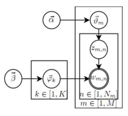

这个概率图模型可以分解为两个主要的物理过程： +
====
--
* \(\vec{\alpha }\rightarrow \vec{\theta }\rightarrow z_{m,n}\),这个过程表示生成第\(m\)篇文档的时候，先从第一个坛子中抽了一个 `doc-topic` 骰子\(\vec{\theta }\),然后投掷这个骰子生成了文档中第\(n\)个词的主题编号\(z_{m,n}\)；
* \(\vec{\beta }\rightarrow \vec{\varphi_{k}} \rightarrow w_{m,n} \mid k=z_{m,n}\),这个过程表示用如下动作生成语料中第\(m\)篇文档的第\(n\)个词：在上帝手头的\(K\)个 `topic-word` 骰子\(\vec{\varphi_{k}}\)中，挑选编号为\(k=z_{m,n}\)的那个骰子进行投掷，然后生成单词\(w_{m,n}\)；
--
====
大家都说理解 `LDA` 最重要的就是理解上面这两个物理过程，其实这两个物理过程还是很好理解的。首先我们来看下文章中的主题和词的联合分布 +
[stem]
++++
p(\vec{w}, \vec{z} \mid \vec{\alpha }, \vec{\beta })  = p(\vec{w} \mid \vec{z}, \vec{\beta }) p(\vec{z} \mid \vec{\alpha }) \hspace{1cm} (5.17)
++++
公式第一项因子是给定主题采样词的过程；后面的因子计算，\(n_{z}^{(t)}\)表示词\(t\)被观察到分配给主题\(z\)的次数， \(n_{m}^{(k)}\)表示主题\(k\)分配给文档\(m\)的次数。 +

计算第一个因子如下 +

\begin{align}
p(\vec{w} \mid \vec{z}, \vec{ \beta } ) & = \int p(\vec{w} \mid \vec{z}, \Phi ) \cdot p(\Phi  \mid \vec{\beta }) d\Phi  \\
& = \int \prod_{z=1}^{K} \cdot \frac{1}{\Delta(\vec{\beta})} \prod_{t=1}^{V} \varphi_{ z,t }^{n_{ z }^{(t)} + \beta_{t} -1} d\vec{\varphi _{z}} \\
& = \hspace{0.2cm} (continue...)
\end{align}

这一步推导依据公式(5.16)，后面的概率是由参数\(\beta\)控制的 `Dirichlet分布`，前面的概率是多项分布，多项分布乘以先验 `Dirichlet分布` 得到的结果仍然为 `Dirichlet分布`,
其中\(\Phi\)为词分布，\(\vec{\varphi_{z}}\)为主题为\(z\)的词分布，因为共有\(K\)个主题，所以对主题向量\(\vec{z}\)中的每个主题对应的词分布\(\vec{\varphi_{z}}\)求积分.
根据公式(5.16)后验 `Dirichlet分布` 可以表示为归一化因子和参数的乘积，其中参数的伪计数由原来的伪计数\(\beta_{t}-1\)基础上增加观察量\(n_{z}^{(t)}\) 表示词\(t\)被分配为主题\(z\)的次数。 +
[stem]
++++
=\prod_{z=1}^{K} \frac{\Delta (\vec{n_{z}} + \vec{\beta })}{\Delta (\vec{\beta })} \hspace{0.2cm} (5.18)
++++

上一步推导依据公式(5.12)，将积分转换为归一化因子即可,其中 +
[stem]
++++
\vec{n_{z}}=\left \{ n_{z}^{t} \right \}_{t=1}^{V}
++++

同理，计算公式(5.17)联合分布的第二个因子 +

\begin{align}
p(\vec{z} \mid \vec{\alpha }) & = \int p(\vec{z} \mid \Theta ) p(\Theta \mid \vec{\alpha }) d\Theta  \\
& = \int \prod_{m=1}^{M} \frac{1}{\Delta(\vec{\alpha})} \prod_{k=1}^{K} \theta_{ m,k }^{ n_{m}^{ (k) } +\alpha_{k}-1} d\vec{\theta_{m}} \\
& = \prod_{m=1}^{M}\frac{ \Delta (\vec{n_{m}} + \vec{\alpha}) }{ \Delta(\vec{\alpha}) } \hspace{1cm}, \vec{n_{m}}=\left \{ n_{m}^{(k)} \right \}_{k=1}^{K} \hspace{1cm}(5.19)
\end{align}

主题分布和词分布的计算思路完全相同，不再赘述。 +

将公式(5.18)和(5.19)代入第\(i\)个词主题编号的概率公式得到： +

\begin{align}
p(z_{i} & = k \mid \vec{z_{ \neg i }}, \vec{w}) = \frac{p( \vec{w}, \vec{z} )}{p( \vec{w}, \vec{z_{\neg i}} )} = \frac{p( \vec{w} \mid \vec{z} )}{p(\vec{w_{ \neg i} } \mid \vec{z_{\neg i}} ) p(w_{i})} \cdot \frac{p(\vec{z})}{p(\vec{z_{\neg i}})} \\
& = \propto \frac{ \Delta (\vec{n_{z}} + \vec{\beta}) }{\Delta( \vec{n_{z, \neg i}} + \vec{\beta} )} \cdot \frac{ \Delta( \vec{n_{m}} + \vec{\alpha} ) }{ \Delta ( \vec{n_{m, \neg i}} + \vec{\alpha}) } \\
& = \frac{\Gamma (n_{k}^{(t)} + \beta_{t}) \Gamma( \sum_{t=1}^{V} n_{k, \neg i}^{(t)} + \beta_{t}  )}{ \Gamma( n_{k, \neg i}^{(t)} + \beta_{t}) \Gamma( \sum_{t=1}^{V} n_{k}^{(t)} + \beta_{t}   )  } \cdot \frac{ \Gamma( n_{m}^{(k)} + \alpha_{k}) \Gamma(\sum_{k=1}^{K} n_{m, \neg i}^{(k)} + \alpha_{k}) }{ \Gamma(n_{m, \neg i}^{(k)} + \alpha_{k}) \Gamma(\sum_{k=1}^{K} n_{m}^{(k)} + \alpha_{k}) } \\
& = \frac{n_{k, \neg i}^{(t)} + \beta_{t} }{\sum_{t=1}^{V} n_{k, \neg i}^{(t)} + \beta_{t}} \cdot \frac{ n_{m, \neg i}^{(k)} + \alpha_{k}}{ [\sum_{k=1}^{K} n_{m, \neg i}^{(k)} + \alpha_{k}]-1}  \hspace{1cm} (5.20)\\
& \propto \frac{n_{k, \neg i}^{(t)} + \beta_{t} }{\sum_{t=1}^{V} n_{k, \neg i}^{(t)} + \beta_{t}} \cdot (n_{m, \neg i}^{(k)} + \alpha_{k})
\end{align}

上面是邹博老师的推导，感觉这么推导结果不是那么美啊，还是看看 `Rickjin` 的积分转为期望的推导 +

\begin{align}
p(z_{i} = k \mid \vec{z_{\neg i }}, \vec{w}) & \propto p(z_{i}=k, w_{i}=t \mid \vec{z_{ \neg i }, \vec{ w_{ \neg i } }}) \\
& = \int p(z_{i} = k, w_{i} = t, \vec{\theta_{m}}, \vec{\varphi_{k}} \mid \vec{z_{ \neg i}}, \vec{w_{\neg i}}) d\vec{\theta_{m} }d\vec{\varphi_{k}} \\
& = \int p(z_{i} = k \mid \vec{\theta_{m}}) p( \vec{\theta_{m}} \mid \vec{z_{ \neg i}}, \vec{ w_{\neg i} } ) \cdot p(w_{i} = t \mid \vec{\varphi_{k}} ) p(\vec{\varphi_{k}} \mid \vec{z_{\neg i}}, \vec{w_{\neg i}}) d\vec{\theta_{m}} d\vec{\varphi_{k}} \\
& = \int p(z_{i} = k \mid \vec{\theta_{m}}) Dir(\vec{\theta_{m}} \mid \vec{n_{m, \neg i}} + \vec{\alpha})d\vec{\theta_{m}} \cdot p(w_{i} = t \mid \vec{\varphi_{k}}) Dir(\vec{\varphi_{k}} \mid \vec{n_{k, \neg i}} + \vec{\beta}) d\vec{\varphi_{k}} \\
& = \int \theta_{mk} Dir(\vec{\theta_{m}} \mid \vec{n_{m, \neg i}} + \vec{\alpha})d\vec{\theta_{m}}  \cdot \int \varphi_{kt}Dir(\vec{\varphi_{k}} \mid \vec{n_{k, \neg i}} + \vec{\beta}) d\vec{\varphi_{k}} \\
& = E(\theta_{mk}) \cdot E(\varphi_{kt}) \\
& = \hat{\theta_{mk}} \cdot \hat{\varphi_{kt}} \\
& = \frac{ n_{m, \neg i}^{(k)} + \alpha_{k}}{\sum_{k=1}^{K} n_{m, \neg i}^{(k)} + \alpha_{k}} \cdot \frac{n_{k, \neg i}^{(t)} + \beta_{t} }{\sum_{t=1}^{V} n_{k, \neg i}^{(t)} + \beta_{t}} \hspace{1cm} (5.20)
\end{align}

公式(5.20)就是 `LDA模型` 的 `Gibbs Sampling` 公式，这个概率其实是\(doc -> topic -> word\)的路径概率，由于\(topic\)有\(K\)个，所以 `Gibbs Sampling` 公式的物理意义就是在这\(K\)条路径中进行采样。 +

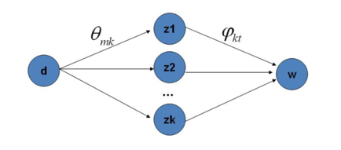

===== 模型训练和推演
有了 `LDA` 模型，当然我们的目标有两个 +
====
--
* 估计模型中的参数\(\vec{\varphi^{1}}, ..., \vec{\varphi^{K}}\) 和 \(\vec{\theta^{1}}, ..., \vec{\theta^{M}}\)
* 对新来的一篇文档，我们能够计算这篇文档的主题分布
--
====
训练的过程就是通过 `Gibbs Sampling` 获取预料中的\((z, w)\)样本，而模型中的所有参数都可以基于最终采样得到的样本进行估计，训练的流程为 +

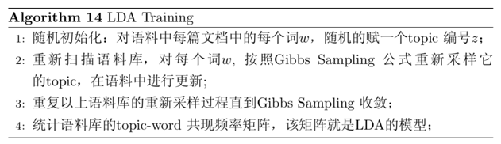

由这个 `topic-word` 频率矩阵我们可以计算每一个\(p(word|topic)\)概率，从而算出模型的参数，通常在 `LDA` 模型训练的过程中，我们是取 `Gibbs Sampling` 收敛之后的\(n\)个迭代的结果进行平均来做参数估计，这样模型质量更高。 +

有了模型，对于新来的文档，我们如何做主题语义分布的计算呢？基本上推理和训练的过程完全类似。对于新的文档，我们只要认为 `Gibbs Sampling` 公式中的\(\vec{\varphi_{k,t}}\)部分是稳定不变的，是由训练预料得到的模型提供的，
所以采样的过程中我们只要估计该文档的\(topic\)分布就好了。 +

image::images/inference.png[title="LDA推演过程",width="50%", height="55%"]

==== 变分EM算法求解pLSA模型

由于后面会有独立的章节介绍EM算法，因此本节我们介绍其基本原理，在不影响pLSA算法正常运算逻辑基础上尽可能简化介绍。 +

===== EM算法
EM算法(`Expectation Maximization algorithm`),又称期望最大算法，其基本思想是：首先随机选取一个值去初始化待估计的值\(\theta^{0}\)，然后不断迭代寻找更优\( \theta^{n+1}\)的使得其似然函数比原来的要大。
即通过不断迭代更新，提高似然函数的概率值，使得最大似然函数值取极值点的参数就是最优化参数。 +

所以EM算法的一般步骤为： +
====
--
* 随机选取或者根据先验知识初始化\(\theta^{0}\);
* 不断迭代下述两步：
** 给出当前的参数估计\(\theta^{n}\)，计算似然函数\(L(\theta)\)的下界\(Q(\theta; \theta^{n})\);
** 重新估计参数\(\theta\)，即求\(\theta^{n+1}\),使得\( \theta^{n+1} = \underset{\theta}{argmax} \hspace{0.1cm} Q(\theta; \theta^{n})\);
* 上述第二步后，如果\(L(\theta)\) (即\(Q(\theta; \theta^{n})\))收敛，则退出算法，否则继续回到第二步。
--
====

下面给出推导公式，假设有训练集\(\left \{ x^{1}, x^{2}, ... , x^{m} \right \}\),包含\(m\)个独立样本，希望从中找到该数组的模型\(p(x,z)\)的参数。其中\(z\)是隐变量，
然后通过极大似然估计建立目标函数(对数似然函数) +

\begin{align}
l(\theta) & = \sum_{i=1}^{m}log \hspace{0.1cm} p(x;\theta) \\
& = \sum_{i=1}^{m} log\hspace{0.1cm}\sum_{z}^{}p(x;z;\theta)
\end{align}

这里\(z\)是隐变量，要找到参数的估计很难，我们的策略是建立\(l(\theta)\)的下界，并且求该下界的最大值；重复这个过程，直到收敛到局部最大值。 +

令\(Q_{i}\)为\(z\)的某一个分布，\(Q_{i} \geq 0\)，根据 `Jenssen` 不等式，有 +

\begin{align}
\sum_{i=0}^{m} log\hspace{0.1cm}p(x^{i} ; \theta) & = \sum_{i=0}^{m} log\sum_{z^{0} }^{ z^{m} }p(x^{i} ; z^{i}; \theta) \\
& = \sum_{i=0}^{m} log\sum_{z^{0} }^{ z^{m} } Q_{i}(z^{i}) \frac{p(x^{i} ; z^{i}; \theta)}{Q_{i}(z^{i})} \\
& \geq \sum_{i=0}^{m} \sum_{z^{0} }^{ z^{m}} Q_{i}(z^{i}) log  \frac{p(x^{i} ; z^{i}; \theta)}{Q_{i}(z^{i})}
\end{align}

要理解上面不等式的转换很简单，将\(Q_{i}(z^{i})\)看作 `Jenssen` 不等式中的平衡因子，且\(\sum_{i=0}^{m} Q_{i}(z^{i})=1\)，我们要寻找的下界就是不等式取等号，
若要让 `Jenssen` 不等式，则必须让两个点重合，点的值为固定常量，即满足 +
[stem]
++++
\frac{ p(x^{i} ; z^{i}; \theta)}{Q_{i}(z^{i})}=C
++++

所以可得 +
\begin{align}
Q_{i}(z^{i}) & = \frac{p(x^{i} , z^{i} ; \theta)}{ \sum_{i=0}^{m} p(x^{i} , z^{i} ; \theta) } \\
& =  \frac{p(x^{i} , z^{i} ; \theta)}{ p(x^{i}  ; \theta) } \\
& =  p(z^{i} \mid x^{i} ; \theta)
\end{align}

最后得导EM算法的正题框架 +

image::images/em.png[title="EM算法伪代码",width="50%", height="55%"]

===== 求解pLSA算法
首先尝试从矩阵的角度来描述两个待估计的变量\(p(w_{j} \mid z_{k})\)和\(p(z_{k} \mid d_{i})\)。 +

假定用\(\phi_{k}\)表示词表\(V\)在主题\(z_{k}\)上一个多项分布，则\(\phi_{k}\)可以表示为一个向量，每个元素\(\phi_{k,j}\)表示词项\(w_{j}\)在主题\(z_{k}\)上的概率，即 +
[stem]
++++
p(w_{j} \mid z_{k})= \phi_{k,j}, \hspace{1cm} \sum_{w_{j}\in V}\phi_{k,j} = 1
++++

用\(\theta_{i}\)表示主题\(Z\)在文档\(d_{i}\)上的一个多项分布，则\(\theta_{i}\)也可以表示为一个向量，每个元素\(\theta_{i,k}\)表示主题\(z_{k}\)出现在文档\(d_{i}\)中的概率，即 +
[stem]
++++
p(z_{k} \mid d_{i})= \theta_{i,k}, \hspace{1cm} \sum_{z_{i}\in Z}\theta_{i,k} = 1
++++

这样巧妙的把\(p(w_{j} \mid z_{k})\)和\(p(z_{k} \mid d_{i})\)转换为了两个矩阵，换言之我们最终要求解的参数是两个矩阵 +
[stem]
++++
\Phi =\left \{ \phi_{1},...,\phi_{K} \right \}, \hspace{1cm} z_{k}\in Z \\
\Theta=\left \{ \theta_{1},...,\theta_{M} \right \}, \hspace{1cm} d_{i}\in D
++++

由于每篇文章的词和词之间是相互独立的，所以整篇文章\(N\)个词的分布为 +
[stem]
++++
p(W \mid d_{i}) = \prod_{j=1}^{N}p(d_{i}, w_{j})^{ n(d_{i}, w_{j})}
++++

而由于文章和文章之间也是相互独立的，所以整个预料的词分布为 +
[stem]
++++
p(W \mid D) =\prod_{i=0}^{M} \prod_{j=1}^{N}p(d_{i}, w_{j})^{ n(d_{i}, w_{j})}
++++

其中\(n(d_{i}, w_{j})\)表示词项\(w_{j}\)在文档\(d_{i}\)中的词频，\(n(d_{i})\)表示文档\(d_{i}\)中词的总数,显然\(n(d_{i}) = \sum_{w_{j} \in V}n(d_{i}, w_{j})\)。
从而得到整个语料库的词分布的对数似然函数 +
\begin{align}
l(\Phi,\Theta) & = \sum_{i=1}^{M} \sum_{j=1}^{N}n(d_{i}, w_{j})log\hspace{0.1cm}p(d_{i}, w_{j}) \\
& = \sum_{i=1}^{M}n(d_{i})(logp(d_{i}) + \sum_{j=1}^{N} \frac{n(d_{i},w_{j})}{n(d_{i})}) log\sum_{k=1}^{K}p(w_{j} \mid z_{k}) p(z_{k}, d_{i}) \\
& = \sum_{i=1}^{M}n(d_{i})(logp(d_{i}) + \sum_{j=1}^{N} \frac{n(d_{i},w_{j})}{n(d_{i})}) log\sum_{k=1}^{K}\phi_{k,j}\theta_{i,k}
\end{align}

现在，我们的工作就是最大化这个对数似然函数，求解参数\(\phi_{k,j}\)和\(\theta_{i,k}\)，对于这种隐含变量的最大似然估计，可以使用EM算法，典型的EM算法分成两步，先E后M。 +
====
* E-step:假定参数已知，计算此时隐变量的后验概率，利用贝叶斯公式，可得 +
\begin{align}
p(z_{k} \mid d_{i}, w_{j}) & = \frac{p(z_{k}, d_{i}, w_{j})}{\sum_{l=1}^{K} p(z_{l}, d_{i}, w_{j})} \\
& = \frac{ p(w_{j} \mid d_{i}, z_{k}) p(z_{k} \mid d_{i}) p(d_{i}) }{\sum_{l=1}^{K} p(w_{j} \mid d_{i}, z_{l}) p(z_{l} \mid d_{i}) p(d_{i})} \\
& = \frac{ p(w_{j} \mid z_{k}) p(z_{k} \mid d_{i})}{\sum_{l=1}^{K} p(w_{j} \mid z_{l}) p(z_{l} \mid d_{i})} \\
& = \frac{ \phi_{k,j} \theta_{i,k} }{\sum_{l=1}^{K}\phi_{l,j} \theta_{i,l}}
\end{align}
* M-step:这样隐变量的乘积可以用后验概率表示，将其代入似然函数，最大化对数似然，求解相应参数。
====

由于文档长度\(p(d_{i}) \propto n(d_{i})\)可单独计算，去掉它不影响最大似然函数，此外，根据 `E-step` 结果，将\(\phi_{k.j} \theta_{i,k}=\) \(p(z_{k} \mid d_{i}, w_{j})\sum_{l=1}^{K}\phi_{l,j}\theta_{i,l}\)带入似然函数,得到: +
[stem]
++++
l=\sum_{i=1}^{M}\sum_{j=1}^{N}n(d_{i}, w_{j})\sum_{k=1}^{K}p(z_{k} \mid d_{i}, w_{j}) \hspace{0.1cm} log( \phi_{k,j}, \theta_{i,k} )  \hspace{1cm}(5.21)
++++

这是一个多元函数求极值问题，并且有如下的约束条件: +
[stem]
++++
\sum_{j=1}^{N}\phi_{k,j} = 1 \\
\sum_{k=1}^{K}\theta_{i,k} = 1
++++

一般这种带约束条件的极值问题，常用的方法便是拉格朗日乘法，即通过引入拉格朗日乘子将目标函数和约束条件融合到一起，转化为无约束条件的优化问题。 +
[stem]
++++
H = L^{c} + \sum_{k=1}^{K}\gamma_{k}(1-\sum_{j=1}^{N} \phi_{k,j})  + \sum_{i=1}^{M}\rho_{i}(1-\sum_{k=1}^{K}\theta_{i,k})
++++

分别对\(\phi_{k,j}\)和\(\theta_{i,k}\)求导，令导数为0，得到 +

\begin{align}
\phi_{k,j} & = \frac{ \sum_{i=1}^{M} n(d_{i}, w_{j}) p(z_{k} \mid d_{i}, w_{j}) }{\sum_{j=1}^{M} \sum_{i=1}^{N} n(d_{i}, w_{j}) p(z_{k} \mid d_{i}, w_{j})} \\
\theta_{i,k} & = \frac{ \sum_{j=1}^{N} n(d_{i}, w_{j}) p(z_{k} \mid d_{i}, w_{j}) }{n(d_{i})}
\end{align}

=== 终篇

走到这里的人，我相信你们一定被 `LDA` 模型深深的吸引，这也是我为何要花费大量时间编写这个章节的原因，LDA原始论文中是基于变分 `EM` 算法进行参数公式推导，当然对应的模型实现也可以采用变分法，本章我们对基于 `Gibbs Sampling` 的 `LDA` 模型进行了详细描述，整章的编写花费了大概两天的时间，是在太累了，
后续有时间再将变分法补上(已经补上)。
