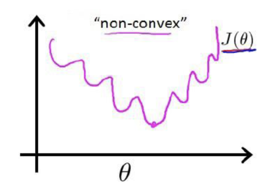

== 线性回归与逻辑回归

=== 线性回归

==== 概念

线形回归主要研究一个变量(\(y\))关于另一些变量(\(X\))的具体依赖关系的。例如，房价问题，假设我们只考虑房屋的面积和卧室的个数，问题就可以具体解释为：我们希望得到这样一个线形模型，使得给它一个房子的面积和卧室个数，它就可以准确的评估出房价。 +

假设房价为\(y\)，房屋面积为\(x_{1}\)，卧室个数为\(x_{2}\)，那么线形模型就可以表示为： +

[stem]
++++

y=\theta _{0}x_{0}+\theta _{1}x_{1}+\theta _{2}x_{2}=\sum_{i=0}^{i=2}\theta _{i}x_{i}\hspace{2cm}(2.1)

++++

其中\(\theta \)为要学习的参数，这里\(x_{0}=1\)，对于一般问题，公式通常写成： +

[stem]
++++
h_{\theta }(x) = \sum_{i=0}^{m}\theta ^{i}x^{i}=\Theta ^{T}X\hspace{4cm} (2.2)
++++

我们用\(x^{i}\)表示第\(i\)个特征，\( y^{i} \)表示\(x^{i}\)对应的房价，从而定义损失函数\( J(\theta)\)，一个很自然的想法就是用所有样本预测值和真实值的平方差和作为损失函数：

[stem]
++++
J(\theta )=\frac{1}{2}\sum_{i=0}^{m}(h_{\theta}(x^{i})-y^{i})^{2}\hspace{3.5cm}(2.3)
++++

我们的目标就是找出使损失函数最小的参数值，就得到了拟合训练集的最佳参数，至于为什么使用该函数会取得很好的效果，后面会有解释，这种通过最小化误差的平方和来求解最佳参数的方法又称为 `最小二乘法或最小平方误差`。 +

求一个函数的最小值，最简单的方法是对函数求导，令导数为0，直接解出参数，这种方法叫 `解正规方程组`，方法简单直接，却有很多限制，比如未知数（即参数）个数大于方程组个数（即训练样本）时，无法求解，该方法我们将在后面单独讲述。 +

==== 梯度下降
这里我们重点介绍 `梯度下降（Gradient Descent）` 来求参数，即通过不断调整参数的值，使得损失函数值不断减小，迭代收敛至满足损失误差允许的范围，一个直观的更新规则为： +

[stem]
++++
\theta_{j} = \theta_{j} + \delta \hspace{6cm}(2.4)
++++
关键就在于每次迭代如何求解\(\delta\)，确定\(\delta\)是什么的过程不是一个数学上严格的推断（即没有标准答案），而是一种猜想（也正是因为没有标准答案所以更新参数的方法除了梯度下降，还有牛顿法、拟牛顿法等），我们要做的就是如何让猜想尽可能的合理。 +

首先介绍梯度的概念，我们中学学过的导数即梯度，反映的是 `参数往正向的变化量趋向于0时的其函数值变化量的极限`，比如梯度为5，表示参数往梯度方向增加一点点时，其函数值也增加一点点，但不一定是5；再比如梯度为-5，参数往梯度方向增加一点点的时候，其函数值会将少一点点。而我们的目的是让函数值不断减小，因此不管梯度是正还是负，我们只要将参数往梯度相反的方向增加一点点，函数值就会减小，则更新规则就可以变成: +

[stem]
++++
\theta_{j} = \theta_{j} + \delta = \theta_{j} - \frac{\partial }{\partial \theta _{j}}J(\theta) \hspace{2.5cm}(2.5)
++++

此时的\(\delta\)不再是未知数，而是损失函数的负梯度。至此，我们仅确定了没步迭代更新的方向，而每次更新多少合适呢？这个值确实很难给出，不妨引入步长因子\(\alpha\)作为超参数，那么最终的更新规则就变为: +

[stem]
++++
\theta_{j} = \theta_{j}-\alpha \frac{\partial }{\partial \theta _{j}}J(\theta) \hspace{4.2cm}(2.6)
++++

.关于梯度下降
====
关于如何理解更新规则的最终形势，大家经常讲到的一个故事场景：想想一下你站在山腰（任意初始位置）上，目标是走到山谷（最小值），你将如何走才能尽快的到达山谷？沿着最陡峭的方向迈一大步！这个最陡峭的方向就是副梯度方向，而你迈得一大步就是步长，一直这样走下去，你会走到谷底。 +
====

言归正传，根据公式(2.6)发现：问题的关键就在于如何求解损失函数即公式(2.3)的梯度，下面给出求解过程（假定只有一个训练样本）： +

\begin{align}
\frac{\partial}{\partial \theta_{j}}J(\theta) & = \frac{\partial}{\partial \theta_{j}} \frac{1}{2}(h_{\theta}(x)-y)^{2} \\
& = (h_{\theta}(x)-y)\frac{\partial}{\partial \theta_{j}}h_{\theta}(x) \\
& = x_{j}(h_{\theta}(x)-y) \hspace{3cm} (2.7)
\end{align}

将公式(2.7)带入公式(2.4)得到：
[stem]
++++
\theta_{j} = \theta_{j} - x_{j}(h_{\theta}(x)-y) \hspace{3.5cm} (2.8)
++++

公式(2.7)是针对只有一个训练样本的情况，考虑到所有 `m` 个样本时，更新规则就变为： +

[stem]
++++
\theta_{j} = \theta_{j} - x_{j}^{i}\sum_{i=0}^{m}(h_{\theta}(x^{i})-y^{i}) \hspace{2.5cm} (2.9)
++++

运用这种规则直到收敛，就是批梯度下降算法 `BGD（Batch Gradient Descent）`，判断收敛的方法主要包括：一是,两次迭代后参数的变化量；二是,两次迭代后损失函数的变化量。 +
规则中的\(\alpha\)为步长因子，又称为学习率，需要在实践中调整，过小会导致算法收敛的很慢，过大会导致算法很容易越过最优点，或在最优点附近震荡。 +

==== 梯度下降的局限性

梯度下降算法会导致 `局部极小值` 的产生，可以通过随机初始化，寻找多个最优点来解决该问题，在所有最优点中选择最小的作为最终的最终结果。对于本例中的线形回归问题，不会存在局部极值的问题，因为本问题的随时函数是凸二次函数。 +

根据公式(2.9)的更新规则，每次迭代更新都需要遍历所有样本，当样本量很大时算法运行速度就会变成龟速。 +

一种比较好的解决方案就是每次更新时我们只选用一个样本，由于一个样本的梯度方向是随机的，不是全局梯度方向，因此该方法又称为随机梯度下降 `SGD（Stochastic Gradient Descent）`； `BGD` 每次使用的样本过多，`SGD` 每次使用的样本又过少，每次更新时我们还可以随机选择一小批样本进行更新，这种方法叫做小批量梯度下降 `Mini-Batch Gradient Descent(MBGD)`。 +

.扩展问题
====

[square]

* 线形回归的损失函数为什么要选用最小二乘损失（`L2损失`），如何概率解释 ?

* 如何解决模型在训练集上过拟合问题 ?

* 如何从贝叶斯角度深入理解正则化,为什么说L1正则化等价于参数的先验概率分布满足拉普拉斯分布？L2正则化等价于参数的先验概率分布满足高斯分布 ?

====

==== 深度思考

====
1、先来看下第一个问题：`最小二乘法的概率解释`，即为什么选择平方函数作为目标函数会使得效果比较好(并非一定是)!

* 假设1:对每一个样本\((x^{i}, y^{i})\)，模型预测结果和真实结果的关系可以写成： +

[stem]
++++
y^{i} = \theta^{T}x^{i} + \epsilon^{i} \hspace{2cm} (1)
++++

其中，\(\epsilon^{i}\)表示模型的误差。 +

* 假设2:误差\(\epsilon^{i}\)服从正态分布，即 +

[stem]
++++
\epsilon \sim N(0, \sigma^{2})  \hspace{2cm} (2)
++++

假设1只是一种表示形式，那么假设二为何会成立呢？这是因为影响误差的因素有很多，这些因素都是随机分布，根据中心极限定理，即 `许多随机变量的和趋向于正态分布` ，我们可以得到假设二，那么 +

[stem]
++++
p(\epsilon^{i}) = \frac{1}{\sqrt{2\pi }\sigma}exp(-\frac{(\epsilon^{i})^{2}}{2\sigma^{2}}) \hspace{1cm}(3)
++++

这也表示，当给定参数\(\theta\)和\(x\)时，目标值\(y\)也服从正态分布. +
[stem]
++++
p(y^{(i)} \mid x^{(i)};\theta) = \frac{1}{\sqrt{2\pi }\sigma}exp(-\frac{(\theta^{T}x^{(i)}-y^{(i)})^{2}}{2\sigma^{2}}) \hspace{1cm} (4)
++++
* 假设3:对于各个样本的误差\(\epsilon^{i}\)是独立同分布的随机变量，这样，我们可以得到似然函数 +

\begin{align}
l(\theta) & = P(Y \mid X; \theta ) \\
& = \prod_{i=1}^{m} p(y^{(i)} \mid x^{(i)};\theta) =\prod_{i=1}^{m} \frac{1}{\sqrt{2\pi }\sigma}exp(-\frac{(\theta^{T} x^{(i)} -y^{(i)} )^{2} }{2\sigma^{2}})  \hspace{1cm} (5)
\end{align}

似然函数什么意义呢？表示是在参数\(\theta\)下，数据集出现的概率，似然函数同概率的概念很相似，不同之处在于似然函数把\(\theta\)作为变量，找到使得数据集出现的概率最大时的参数，就是最大似然估计。 +

对于公式(5)的右端取对数，我们发现可以将似然函数最大化的问题转化为使得平方和最小的问题： +

\begin{align}
L(\theta) & = log \hspace{0.1cm} l(\theta) = log\prod_{i=1}^{m} \frac{1}{\sqrt{2\pi }\sigma}exp(-\frac{(\theta^{T} x^{(i)} -y^{(i)} )^{2} }{2\sigma^{2}}) \\
& = -mlog\sqrt{2\pi }\sigma-\frac{1}{2\sigma^{2} }\sum_{i=1}^{m}( \theta^{T} x^{i} -y^{i}) ^{2} \\
\Rightarrow  \hspace{1cm} & max(L(\theta)) \propto min( \frac{1}{2}\sum_{i=1}^{m} (\theta^{T} x^{i} -y^{i} )^{2} )
\end{align}
====

====
2、 再来看下第二个问题，其实可以简单解释为：过拟合是经验风险最小化策略带来泛化能力较差的问题，解决方法就常用的就是加正则化项，即

* 采用结构风险最小化的模型选择策略
* 除此之外，结合具体业务，可能还需要把精力放在训练样本的选择上，比如所选样本在某个特征上与真实数据的分布严重不一致，也可能会造成过拟合的问题
* 交叉验证可以解决过拟合问题，这也是一种非常重要的模型选择策略
* 具体到不同类型模型，还有提前终止、dropout、调整网络结构等.
====

====
3、第三个问题可以参考第一章的思考题，这里我们可以简单给出结果形式 +

* 首先什么是拉普拉斯分布，当先验概率满足拉普拉斯分布就是:

[stem]
++++
p(w_{i}) = N(w_{i} \mid \mu , b) = \frac{1}{2b} e^{-\frac{|w_{i}-\mu|}{b}}
++++

损失函数取后验概率的负值，可以得到 +

\begin{align}
w^{*} & = \underset{w}{argmin}-log\sum_{i=1}^{m}p(D_{i} \mid w)-log \hspace{0.1cm} p(w) \\
& = \underset{w}{argmin}-log\sum_{i=1}^{m}p(D_{i} \mid w)-\sum_{j=1}^{n}log \hspace{0.1cm} p(w_{j}) \\
& = \underset{w}{argmin}-log\sum_{i=1}^{m}p(D_{i} \mid w) + \sum_{j=1}^{n}\frac{1}{b}|w_{j} - \mu| \\
& = \underset{w}{argmin}-log\sum_{i=1}^{m}p(D_{i} \mid w) + \lambda \sum_{j=1}^{n}|w_{j}| \hspace{1cm} (\mu = 0, b = \frac{1}{\lambda})
\end{align}

我们看到目标函数的最后一样刚好就是 `L1` 正则化项，我们从假设参数先验分布为拉普拉斯分布，直接推出了 `L1` 正则化项，所以 `L1` 正则化等价于参数的先验分布满足拉普拉斯分布。
同理，让我么看下参数先验分布为高斯分布的情况 +

* 当参数的先验概率满足高斯分布时,相当于:

[stem]
++++
p(w_{i}) = N(w_{i} \mid \mu, \sigma^{2})=\frac{1}{\sqrt{2\pi }\sigma}exp(-\frac{(w_{i}-\mu)^{2}}{2\sigma^{2}})
++++
所以，最优参数为 +

\begin{align}
w^{*} & = \underset{w}{argmin}-log\sum_{i=1}^{m}p(D_{i} \mid w)-log \hspace{0.1cm} p(w) \\
& = \underset{w}{argmin}-log\sum_{i=1}^{m}p(D_{i} \mid w)-\sum_{j=1}^{n}log \hspace{0.1cm} p(w_{j}) \\
& = \underset{w}{argmin}-log\sum_{i=1}^{m}p(D_{i} \mid w) + \sum_{j=1}^{n} \frac{1}{\sigma^{2}}(w_{j} - \mu)^{2} \\
& = \underset{w}{argmin}-log\sum_{i=1}^{m}p(D_{i} \mid w) +\lambda \sum_{j=1}^{n} (w_{j})^{2} \hspace{1cm}  (\mu = 0, \sigma = \sqrt{\frac{1}{\lambda}})
\end{align}

对比下式 +

[stem]
++++
w^{*} = \underset{w}{argmin}\sum_{i}L(y_{i}, f(x_{i}; w)) + \lambda\Omega (w)
++++

可以看出，似然函数部分对应损失函数(经验风险),而先验概率对应于正则化项，因此 `L2` 正则化等价于模型参数的先验概率满足正态分布。

====

=== 逻辑回归
==== 揭开面纱

这一节将介绍在工业界应用最广，又最简单、最容易理解的神器 `逻辑回归(Logistic Regression)`，问题的背景：假设我们需要解决一个二分类问题，比如给你一辆ofo小黄车，判定该车是好车还是坏车。 +

首先，我们期望学到一个什么样的模型？最简单的需求就是把一批车辆的数据丢给模型，模型返回 `0` 或者 `1` 表示好和坏；更近一步，我们希望模型能返回给我们一个 `0~1` 之间的概率值，这样我们可以根据模型输出的概率值选择坏的概率很大的丢给师傅去修理，选择好的概率很大的推荐给用户骑行。 +

那么，首先明确了学习模型的输入和输出，输入是车辆的各种维度的信息（比如，昨天发生了几个正常单、报修单、报修部位、报修后是否又有正常骑行等等），输出是一个 `0～1` 之间的概率值。问题就变成了如何将输入转为输出。 +

==== Sigmoid函数

输入空间显然是实数空间，输出空间为 `0～1` ，而 `sigmoid` 刚好就是可以完成这种归一化的函数： +

[stem]
++++
h(z)=\frac{1}{1+e^{-z}} \hspace{6cm} (2.10)
++++

而我们的输入可以表示为多个特征加权和的形式： +

[stem]
++++
z = \theta^{T} x \hspace{7.5cm} (2.11)
++++

有了这个映射函数，对于一个样例，我们就可以得到它分类的概率值： +

\begin{align}
p(y=1|x;\theta) & = h_{\theta}(x) \\
p(y=0|x;\theta) & = 1 - h_{\theta}(x)
\end{align}

将上面两个公式联合起来可以写成： +

[stem]
++++
p(y|x;\theta) = [h_{\theta}(x)]^{y} [1-h_{\theta}(x)]^{1-y} \hspace{2cm} (2.12)
++++

这样我们就可以得到在整个数据集上的似然函数: +

\begin{align}
l(\theta) & = p(Y|X;\theta) \\
& = \prod_{i=1}^{m} p(y^{i}; x^{i}; \theta ) \\
& = \prod_{i=1}^{m} [p_{\theta} (x^{i}) ]^{ y^{i} } [(1-h_{\theta} (x^{i})) ]^{1- y^{i} }\hspace{1cm}(2.13)
\end{align}

对似然函数取对数，可以得到： +

[stem]
++++
L(\theta) = log(l(\theta)) = \sum_{i=1}^{m}[y^{i} logh_{\theta}(x^{i}) + (1 - y^{i}) log(1-h_{\theta}(x^{i}))] \hspace{0.5cm}(2.14)
++++

为了简化其间，我们先只考虑一个样本的情况，则：

[stem]
++++
L(\theta) = ylogh_{\theta}(x) + (1-y)log(1-h_{\theta}(x)) \hspace{1cm} (2.15)
++++

==== 参数更新
公式(2.15)是二分类问题的最大似然函数，那么我们应该怎样定义损失函数，然后应用梯度下降更新参数呢？首先，损失函数作为优化目标时，其函数值越小越好；而似然函数则刚好相反，其越大越好。所以一个很自然的想法就是取似然函数的负函数作为损失函数： +

[stem]
++++
J(\theta) = -L(\theta) = -ylogh_{\theta}(x) - (1-y)log(1-h_{\theta}(x)) \hspace{2cm} (2.16)
++++

对公式(2.16)应用梯度下降算法，更新规则为: +

[stem]
++++
\theta_{j} = \theta_{j} - \frac{\partial}{\partial \theta_{j}}J(\theta) \hspace{6cm} (2.17)
++++

求公式(2.16)的导数，公式中有一个复合函数\(h_{\theta}(x)\)，我们可以先求解它的导数，求解过程如下： +

\begin{align}
\frac{\partial}{\partial h_{\theta}(x_{j})} & = (\frac{1}{1+e^{-{ \theta^{T} } x}})^{'} \\
& = [(1 + e^{- \theta^{T} x})^{-1} ]^{'} \\
& = (-1) (1 + e^{- \theta^{T} x})^{-2} e^{- \theta^{T} x} (- x^{j} ) \\
& = x_{j} ·\frac{ e^{ \theta^{T} } x}{ (1 + e^{ \theta^{T} x} )^{2} } \\
& = x_{j} ·\frac{ 1+ e^{ \theta^{T} x} -1}{ (1 + e^{ \theta^{T} x} )^{2} } \\
& = x_{j}· [( h_{\theta}(x) )^{2} - h_{\theta}(x)] \\
& = x_{j}· h_{\theta}(x)(1 - h_{\theta}(x) ) \hspace{3cm} (2.18)
\end{align}

实际上，`sigmoid` 函数 `y=h(x)` 的导数就等于 `y(1-y)`。 +
然后求解损失函数\(J(\theta)\)的导数，利用公式(2.18)的结论，求解过程如下: +

\begin{align}
\frac{\partial}{\partial \theta_{j}}J(\theta) & = -[ ylogh_{\theta}(x) + (1-y)log(1-h_{\theta}(x)) ]^{'} \\
& = -[ \frac{y}{h_{\theta}(x)} h_{\theta}^{'}(x) + \frac{1-y}{1-h_{\theta}(x)} (-h_{\theta}^{'}(x) ] \\
& = -x_{j} [ \frac{y}{h_{\theta}(x)} h_{\theta}(x) (1-h_{\theta}(x)) - \frac{1-y}{1-h_{\theta}(x)} h_{\theta}(x)(1-h_{\theta}(x))] \\
& = -x_{j}[y(1-h_{\theta}(x))-(1-y)h_{\theta}(x)] \\
& = -x_{j}[y-yh_{\theta}(x)+yh_{\theta}(x)-h_{\theta}(x)] \\
& = x_{j}(h_{\theta}(x) - y) \hspace{6cm} (2.19)
\end{align}

导入公式(2.17),得到参数更新的规则为: +

[stem]
++++
\theta_{j} = \theta_{j} - \alpha · (h_{\theta}(x)-y)·x_{j} \hspace{3cm} (2.20)
++++

考虑多个样本的时候，规则就应该变成: +

[stem]
++++
\theta_{j} = \theta_{j} - \alpha · \sum_{i=1}^{m}(h_{\theta}(x^{i})-y^{i})·x_{j}^{i} \hspace{2cm} (2.21)
++++

.扩展问题
====
[square]
* 为什么二分类问题的模型会叫 `逻辑 _回归_` ?

* 损失函数不选用公式(2.16)的形式会怎样？比如，仍然采用最小二乘法。

* 转换函数还有别的选择吗？为什么要选择 `sigmoid` 函数？

* 回归问题通过一个非线性变换就变成了分类问题，从拟合数据转变为拟合决策边界，这是什么原因导致的？

* 如果损失函数就是 `L2` 损失，有什么办法可以求解？

* 最大似然估计和最小化损失函数、最大后验概率等是什么关系？

* 如何用逻辑回归解决多分类问题？
====

==== 深度思考

====
1、 先来看下第一题，为什么叫 `逻辑回归` ? +

* 简单点回答将 `logistic` 直译为中文就是了，其实这个模型的准确名字应该叫 `对数几率模型`，因为这个模型( `sigmoid函数`)可以由正负样本可能性比值的对数推出。

\begin{align}
f(x; \theta) & = ln\frac{p(y=1 \mid x)}{p(y=0 \mid x)} \\
 & = ln\frac{p(y=1 \mid x)}{1- p(y=1 \mid x)} \\
 & = \theta^{T} x
\end{align}

由上面公式可以推出 +

\begin{align}
\frac{p(y=1 \mid x)}{1- p(y=1 \mid x)} & = e^{ \theta^{T} x} \\
p(y=1 \mid x) & = (1-p(y=1 \mid x)) e^{ \theta^{T} x} \\
(1+e^{ \theta^{T} x}) p(y=1 \mid x) & = e^{ \theta^{T} x} \\
p(y=1 \mid x) & = \frac{e^{ \theta^{T} x} }{ 1+e^{ \theta^{T} x}} \\
& = \frac{1}{1 + e^{ -\theta^{T} x} }
\end{align}

====

====
2、逻辑回归的损失函数如果选择均方差损失会怎样呢 ？  +

* 均方差损失的函数形式为

[stem]
++++
J(\theta) = \frac{1}{m}\sum_{i=1}^{m} (h_{\theta}(x_{i})-y_{i}))^{2}
++++

在逻辑回归中我们的\(h_{\theta}(x)\)形式为: +
[stem]
++++
h_{\theta}(x) = \frac{1}{1 + e^{-\theta^{T} x}}
++++
代入损失函数，我们可以得到如下图的损失函数。 +

这样的损失函数，我们使用梯度下降，会很容易收敛到局部最小值，而不是全局最小值。
====

====
3、为什么要选择 `sigmoid` 函数作为损失函数 ？ 关于这个问题，你会在网上搜到很多解释和答案，但大部分都在说 `sigmoid` 函数的数学特性有多好，可以给出预测结果的概率解释等，其实都是在说为什么可以用而没有解释为什么必须用的问题。 +

* 说到底，源于指数分布簇所特有的最佳性质-最大熵理论，即指数分布簇的最大熵等价于其指数形式的最大似然界
* 二项式的最大熵解等价于二项式指数形式(`sigmoid`)的最大似然，多项式分布的最大熵等价于多项式分布指数形式(`softmax`)的最大似然
* 因此为什么要用 `sigmoid`，那是指数分布簇最大熵特性的必然性，这部分的解释，我们将在第7章 `EM` 模型给出。
====

====
4、这道题很简单，人工智能也好，机器学习也好，原理都是人让它干啥，它就干啥，而决策边界其实就是模型，它是什么完全是由人定义的损失函数决定的。
====
