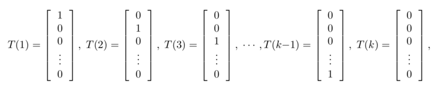

== 最大熵理论和多分类器

=== 最大熵原理

最大熵原理是概率学习的一个准则。最大熵原理认为：学习概率模型时，在所有可能的概率模型中，`熵最大的模型是最好的模型`. +

假设离散随机变量\(X\)的概率分布为\(P(X)\)，则其熵为: +

[stem]
++++
H(P) = - \sum_{x} P(x) log \hspace{0.2cm} P(x)
++++

同时熵满足下列等式: +

[stem]
++++
 0 \leq H(P) \leq log |X|
++++

其中\(|X|\)为\(X\)取值个数，当且仅当\(X\)的分布是均匀分布时右边的等号成立，也就是说 `\(X\)服从均匀分布是，熵最大`。 +

==== 最大熵模型的定义

假设分类模型为一个条件概率模型\(P(Y|X)\),\(X,Y\)分别为输入和输出的集合，给定一个训练数据集: +
[stem]
++++
T = {(x_{1}, y_{1}), (x_{2}, y_{2}), ..., (x_{N}, y_{N})}
++++

学习的目标就是用最大熵原理选择最好的分类模型。 +
首先考虑模型应该满足的条件，给定数据集我们可以计算其联合分布\(P(X,Y)\)的经验分布和边缘分布\(P(X)\)的经验分布，分别定义为: +

\begin{align}
\tilde{P}(X=x, Y=y) & = \frac{v(X=x, Y=y)}{N} \\
\tilde{P}(X=x) & = \frac{v(X=x)}{N}
\end{align}

其中\(v(...)\)表示出现次数，用特征函数\(f(x,y)\)表示输入\(x\)和输出\(y\)之间满足某一个事实。则可定义为: +

[stem]
++++
f(x,y) = \left\{\begin{matrix}
1, & x与y满足某一个事实\\
0, & 否则
\end{matrix}\right.
++++

特征函数关于联合经验分布的期望，用\(E_{\tilde{p}}(f)\)表示: +
[stem]
++++
E_{\tilde{p}}(f) = \sum_{x,y} \tilde{P} (x,y) f(x,y)
++++

特征函数关于边缘经验分布的期望，用\(E_{p}(f)\)表示: +
[stem]
++++
E_{p}(f) = \sum_{x,y} \tilde{P} (x) P(y | x) f(x,y)
++++

如果模型能够获得训练数据中的信息，那么就可以假设这两个期望值相等，即: +
[stem]
++++
E_{p}(f) = E_{\tilde{p}}(f)
++++

或者 +
[stem]
++++
\sum_{x,y} \tilde{P}(x) P(y|x) f(x,y) = \sum_{x,y}\tilde{P}(x,y)f(x,y) \hspace{1cm} (6.1)
++++

我们将公式(6.1)作为模型学习的约束条件，下面给出最大熵模型的定义 +
**最大熵模型**: 假定满足所有约束条件的模型集合为: +
[stem]
++++
L = \left \{P \in p | E_{P}(f_{i}) = E_{\tilde{P}}(f_{i}) \hspace{0.4cm} i=1,2,...,n \right \}
++++

定义在条件概率\(P(Y|X)\)上的条件熵为: +

[stem]
++++
H(P) = -\sum_{x,y} \tilde{P}(x) P(y|x) log \hspace{0.1cm}p(y|x)
++++

则模型集合\(L\)中条件熵最大的模型就是最大熵模型，其中对数为自然对数。 +

==== 最大熵模型的推导

最大熵模型的学习可以形式化为约束最优化问题，等价于如下约束: +

\begin{align}
\underset{p \in C}{max} \hspace{0.4cm} H(P) & = -\sum_{x,y}\tilde{P}(x) p(y|x) log \hspace{0.1cm}P(y|x) \\
s.t. \hspace{0.5cm} E_{p}(f_{i}) & = E_{\tilde{p}}(f_{i}), \hspace{0.4cm}i=1,2,...,N \\
\sum_{y} P(y|x) & = 1
\end{align}

求解上述最优化问题，所得到的解就是最大熵模型学习的解。这里将原始问题转换为对偶问题进行求解，推导如下: +
首先定义拉格朗日函数,\(L(P, w)\): +

\begin{align}
L(P,w) & = -H(P) + w_{0} (1-\sum_{y} P(y|x)) + \sum_{i=1}^{n} w_{i}(E_{\tilde{p}}(f_{i}) - E_{p}(f_{i})) \\
& = =\sum_{x,y}\tilde{P}(x)P(y|x)log \hspace{0.1cm} p(y|x) + w_{0}(1-\sum_{y} P(y|x)) \\
& + \sum_{i=1}^{n} w_{i} ( \sum_{x,y} \tilde{P}(x,y) f_{i}(x,y) - \sum_{x,y} \tilde{P}(x)P(y|x) f_{i}(x,y))
\end{align}

由于拉格朗日函数是关于\(P\)的凸函数，所以原始问题的解和对偶问题的解相同。 原始问题是最小最大问题，对偶问题是最大最小问题。 +
**(1)**首先求内部最小问题 +
[stem]
++++
L(P_{w}, w) = \underset{p \in C}{min} L(P,w)
++++

求\(L(P, w)\)对\(P(y|x)\)的偏导数 +

\begin{align}
\frac{\partial L(P, w)}{\partial P(y | x)} & = \sum_{x,y} \tilde{P}(x)(log\hspace{0.1cm}P(y|x) +1) - \sum_{y}w_{0} -sum_{x,y}(\tilde{P}(x) \sum_{i=1}^{n} w_{i}f_{i}(x,y)) \\
& = \sum_{x,y} \tilde{P}(x)(log\hspace{0.1cm}P(y|x) +1 -w_{0} - \sum_{i=1}^{n} w_{i} f_{i}(x,y))
\end{align}

令偏导为0，在\(\tilde{p}(x) > 0\)的情况下，解得: +

[stem]
++++
P_{w}(y|x) = exp(\sum_{i=1}^{n} w_{i} f_{i}(x,y) + w_{0} - 1) = \frac{exp(\sum_{i=1}^{n} w_{i}f_{i}(x,y))}{exp(1-w_{0})}
++++

又因为\(\sum_{y} P(y|x) = 1\)，得: +

[stem]
++++
P_{w}(y|x) = \frac{1}{Z_{w}(x)} exp(\sum_{i=1}^{n} w_{i}f_{i}(x,y))
++++

其中， +

[stem]
++++
Z_{w}(x) =\sum_{y} exp(\sum_{i=1}^{n} w_{i}f_{i}(x,y))
++++

被成为归一化因子. +
**(2)**最外层应用最优化算法求解，得到最优解\(w^{ * }\). +

==== 多分类器

应用最大熵模型解决多分类问题，此时的模型就是多分类模型，假设数据的分类种类共有\(K\)个，则模型为: +

[stem]
++++
P(y=k|x) = \frac{ e^{ \theta_{k}^{T} x } }{1 + \sum_{i=1}^{K-1} e^{\theta_{i}^{T} x}}
++++

上面的公式非常好理解，你可以认为先分别计算结果为\(y=i\)类的概率，不管每个类别输出的概率是什么，都给它归一化，然后就出来累加和为1的概率，而这个概率就是对应类型的概率。 +

由此可见，当逻辑回归是多分类器的一种特殊情况，其对应\(y=0\)的参数\(\theta\)为零向量。 +

**注意** +
相信大家已经注意到，为何有的时候归一化因子里就是个求和，而有的里面多了个1，其实这两种情况是等价的，首先大家考虑我们的问题是\(K\)分类问题，要求的是\(P(y = i| x\)),
我们真的需要求出\(K\)个概率值吗？ 其实不需要，因为这\(K\)个概率值和为1，所以我们其实只有\(K-1\)个概率值需要计算，对应着\(K-1\)个模型或者说\(K-1\)个参数向量，
但是我们仍然可以写成连加的形式，此时\(P(y=k |x\))这个模型的参数默认为零向量，即不需要学习这个模型，有了这个假设，不论我们要考虑的预测结果属于哪种类型，形式是一致的。 +

=== 指数分布簇

指数分布簇是指可以表示为指数形式的概率分布，指数分布的形式如下: +
[stem]
++++
p(y; \eta) = b(y) exp(\eta^{T} T(y) - a(\eta))  \hspace{1cm}(6.2)
++++

其中，\(\eta \)为分布的自然参数；\(T(y)\)为充分统计量，通常\(T(y) = y\),当参数\(a, b, T\)都固定的时候，就定义了一个以\(\eta \)为参数的函数簇。 +

实际上，大多数概率分布都可以表示为公式(6.2)的形式，比如: +
--
* 伯努利分布：对0、1问题建模
* 多项式分布：对\(K\)个离散结果的事件建模
* 泊松分布：对计数过程进行建模，比如网站访问量的计数问题，商店顾客数量等问题
* 伽马分布与指数分布：对有间隔的正数进行建模，比如公交车的到站时间问题
* \(\beta\)分布：对小数建模
* \(Dirichlet\)分布：对概率分布建模
* \(Wishart\)分布：协方差矩阵的分布
* 高斯分布
--

现在我们将高斯分布和伯努利分布表示为指数分布簇的形式. +

**(1).伯努利分布** +
伯努利分布是对0、1问题进行建模的分布，它可以用如下形式表示： +
[stem]
++++
P(y; \varphi) = \varphi^{y} (1-\varphi)^{1-y}, \hspace{0.2cm} y \in {0,1}
++++

这个形式，是不是很想逻辑回归，因为逻辑回归解决的问题就是0、1问题，所以形式是一样的。 +

\begin{align}
p(y; \varphi) & = \varphi^{y} (1-\varphi)^{1-y} \\
& = exp(log \hspace{0.1cm} \varphi^{y} (1-\varphi)^{1-y}) \\
& = exp(y\cdot log \hspace{0.1cm} \varphi + (1-y)\cdot log (1-\varphi)) \\
& = exp(y log \frac{\varphi}{1-\varphi} + log (1- \varphi))  \hspace{1cm} (6.3)
\end{align}

由公式(6.3)，我们将伯努利分布表示为公式(6.2)的形式:  其中: +

\begin{align}
b(y) & = 1 \\
T(y) & = y \\
\eta = log \frac{\varphi}{1-\varphi} & \Rightarrow \varphi = \frac{1}{1+e^{-\eta}} \\
a(\eta) & = -log(1-\varphi) = 1+e^{-\eta}
\end{align}

可以看出，\(\eta\)的形式跟逻辑回归的sigmoid函数一致，这里因为logistic模型对问题的前置概率估计是伯努利分布的缘故。 +

**(2).高斯分布** +
由高斯分布可以推导出线形模型，由线形模型的假设函数可知，高斯分布的方差与假设函数无关，因而为了简化计算，我们将方差设为1，即便不这样做，最后的结果也是方差作为一个系数而已，
高斯分布转换为指数分布簇形式的推导如下: +

\begin{align}
N(\mu, 1) & = \frac{1}{\sqrt{2\pi }}exp(-\frac{1}{2} (y-\mu)^{2}) \\
& = \frac{1}{\sqrt{2\pi }} exp(-\frac{1}{2} y^{2} -\frac{1}{2} \mu^{2} + \mu y ) \\
& = \frac{1}{\sqrt{2\pi }} exp(-\frac{1}{2} y^{2}) exp(\mu y - \frac{1}{2} \mu^{2}) \hspace{1cm} (6.4)
\end{align}

由公式(6.4)可知: +

\begin{align}
b(y) & = \frac{1}{\sqrt{2\pi }}exp(-\frac{1}{2} y^{2}) \\
T(y) & = y \\
\eta & = \mu \\
a(\eta) & = \frac{1}{2} \eta^{2}
\end{align}

推导的关键在于将指数内部的纯\(y\)项移到外面，纯非\(y\)项作为函数\(a\)，混杂项为\(\mu^{T} T(y)\). +

说到这里，聪明的你应该发现了一些规律，一些很不错的想法，想总结下看看到底发生了什么，其实您想到的就是指数分布簇的性质，想让我们看看 `广义线形模型` 吧。 +

=== 广义线形模型

定义了指数分布簇后有什么用？我们可以通过指数分布簇引出 `广义线形模型` (Generalized Linear Model, GLM)。注意公式(6.3)和(6.4)中的\(\eta\)变量，在公式(6.3)中，
\(\eta\)与伯努利分布中的参数\(\varphi\)的关系是logistic函数，再通过推导可以得到逻辑回归；在公式(6.4)中,\(\eta\)与正态分布的参数\(\mu\)的关系是相等，我们可以推出最小二乘模型。 +

通过上节的两个例子，我们大致可以得出如下结论: __**\(\eta\)以不同形式的映射函数与其他概率分布函数中的参数发生联系，从而得到不同的模型.**__ +

广义线形模型正式将指数分布簇中的所有成员都作为线形模型的扩展，通过各种非线形的连接函数将线形函数映射到其他空间，从而大大扩大了线形模型可解决的问题。 +

下面看GLM的形式化定义，GLM有三个假设: +
--
* \(y|x;\theta ~ ExpFamily(\eta)\): 给定样本\(x\)与参数\(\theta\)，样本分类\(y\)服从指数分布簇中的某个分布；
* 给定一个\(x\)，我们需要的目标函数为\(h_{\theta}(x) = E[T(y) |x]\)
* \(\eta = \theta^{T}x\)
--

依据上面三个假设，我们可以推导出logistic模型与最小二乘模型。logistic模型的推导过程如下: +

\begin{align}
h_{\theta}(x) & = E[T(y) | x] \\
& = E[y|x] \\
& = p(y=1|x; \theta) \\
& = \varphi \\
& = \frac{1}{1 + e^{-\eta}} \\
& = \frac{1}{1 + e^{ -\theta^{T} x}}  \hspace{1cm} (6.5)
\end{align}

公式(6.5)就是逻辑回归模型，同样的对于最小二乘模型，推导过程如下: +

\begin{align}
h_{\theta}(x) & = E[T(y) | x] \\
& = E[y| x] \\
& = \mu \\
& = \eta \\
& = \theta^{T} x
\end{align}

其中，将\(\eta\)与原始概率分布中的参数联系起来的函数称为正则响应函数(canonical response function)，如\(\varphi = \frac{1}{1+ e^{-\eta}}\)和\(\mu = \eta\)都是正则响应函数，
正则响应函数的逆称为正则关联函数. +

__**所以，对于广义线性模型，需要决策的是选用什么样的分布，当选择高斯分布时，我们就得到了最小二乘法；当选择伯努利分布时，我们就得到了逻辑回归，这里所说的模型就是假设函数。**__ +

=== 广义线形模型应用-多项式分布

多项式分布推导出的GLM可以解决多分类的问题，是logistic模型的扩展，应用的问题比如邮件分类，预测病人疾病等。 +
多项式分布的目标值\(y \in {1,2,3,...,k}\)；其概率分布为: +

[stem]
++++
P(y=i) = \varphi_{i}
++++

因为\(\sum_{i} \varphi_{i} = 1\)，所以我们可以只保留\(k-1\)个参数，使得: +

[stem]
++++
\varphi_{k} = 1 - \sum_{i=1}^{k-1} \varphi_{i}
++++

为了使多项式分布能够写成指数分布簇的形式，我们首先定义\(T(y)\)，如下形式: +

这里我们引入指示函数\(I\)，使得: +

[stem]
++++
I(true) = 1, \hspace{0.4cm} I(false) = 0
++++

这样，\(T(y)\)向量中的某个元素还可以写成: +

[stem]
++++
T(y)_{i} = I(y=i)
++++

这个公式，可以理解为上图对应的0、1映射函数，只有\(y=i\)时为1，其他都为0，比如上图中的每个\(T(y)\)都有\(k-1\)个值，其中只有一个为1，其余全为0，而那个为1的位置刚好为\(y\)。
于是我们可以得到: +

\begin{align}
E[ T(y)_ {i} ] & = \sum_{y=1}^{k} T(y)_ {i} \varphi_{i} \\
& = \sum_{y=1}^{k} I(y=i) \varphi_{i} \\
& = \varphi_{i} \\
\sum_{i=1}^{k} I(y=i) & = 1
\end{align}

于是多项式分布转为指数分布簇的推导如下: +

\begin{align}
P(y; \varphi) & = \varphi_{1}^{ I{y=1} } \varphi_{2}^{ I(y=2) } ...\varphi_{k-1}^{ I(y=k-1)} \varphi_{k}^{ I(y=k)} \\
& = \varphi_{1}^{ I{y=1} } \varphi_{2}^{ I(y=2) } ...\varphi_{k-1}^{ I(y=k-1)} \varphi_{k}^{ 1 - \sum_{i=1}^{k-1} I(y=i) } \\
& = exp( log \varphi_{1}^{ I{y=1} } \varphi_{2}^{ I(y=2) } ...\varphi_{k-1}^{ I(y=k-1)} \varphi_{k}^{ 1 - \sum_{i=1}^{k-1} I(y=i) } ) \\
& = exp (\sum_{i=1}^{k-1} I(y=i) log \varphi_{i} + (1- \sum_{i=1}^{k-1} I(y=i)) log \varphi_{k}) \\
& = exp( \sum_{i=1}^{k-1} I(y=i) log (\frac{\varphi_{i}}{\varphi_{k}}) + log \varphi_{k} ) \\
& = exp( \sum_{i=1}^{k-1} T(y)_ {i} log (\frac{\varphi_{i}}{\varphi_{k}}) + log \varphi_{k} ) \\
& = exp( \eta^{T} T(y) - a(\eta) )  \hspace{2cm} (6.6)
\end{align}

我们发现，此时的\(T(y)\)已经不在等于\(y\)了，而是一个向量。公式(6.6)中最后一步的各个变量分别为: +

\begin{align}
\eta & = \begin{bmatrix}
log \hspace{0.1cm} \varphi_{1} / \varphi_{k}\\
log \hspace{0.1cm} \varphi_{2} / \varphi_{k}\\
\vdots \\
log \hspace{0.1cm} \varphi_{k-1} / \varphi_{k}
\end{bmatrix} \\
b(y) & = 1 \\
a(\eta) & = -log\varphi_{k}
\end{align}

由\(\eta\)表达式可知: +

[stem]
++++
\eta_{i}  = log \frac{\varphi_{i}}{\varphi_{k}}  \Rightarrow \varphi_{i} = \varphi_{k} \cdot e^{\eta_{i}} \hspace{1cm} (6.7)
++++

为了方便表示，再定义: +

[stem]
++++
\eta_{k} = log \hspace{0.1cm} \frac{\varphi_{k}}{\varphi_{k}} = 0
++++

于是，我们可以得到: +
[stem]
++++
\sum_{j=1}^{k} \varphi_{i} = \sum_{j=1}^{k} \varphi_{k} e^{\eta_{i}} = 1 \Rightarrow \varphi_{k} = \frac{1}{\sum_{j=1}^{k} e^{\eta_{i}}} \hspace{1cm} (6.8)
++++

代入公式(6.7)得到: +
[stem]
++++
\varphi_{i} = \frac{e^{\eta_{i}}}{\sum_{j=1}^{k} e^{\eta_{i}} } =  \frac{e^{\eta_{i}}}{1+\sum_{j=1}^{k-1} e^{\eta_{i}} }  \hspace{1cm}(6.9)
++++

从而我们就得到了连接函数，有了连接函数后，就可以把多项式分布的概率表达出来，即将公式(6.8)代入公式\(P(y=i) = \varphi_{i}\): +
[stem]
++++
P(y=i) = \varphi_{i} = \frac{e^{\eta_{i}}}{1+\sum_{j=1}^{k} e^{\eta_{j}}} = \frac{e^{\theta_{i}^{T} x}}{1+\sum_{j=1}^{k} e^{ \theta_{j}^{T}x}} \hspace{1cm}(6.9)
++++

注意，上式中的每个参数\(\eta_{i}\)都是一个可用线形向量\(\theta_{i}^{T} x\)表示出来的，因而这里的\(\theta\)其实是一个二维矩阵。 +
于是，我们可以得到假设函数\(h\)如下: +
[stem]
++++
h_{\theta}(x) = E[T(y) | x; \theta] = E\begin{bmatrix}
I(y=1) & \\
I(y=2) & |x; \theta \\
\vdots  &  \\
I(y=k-1) &
\end{bmatrix}
= \begin{bmatrix}
\varphi_{1}\\
\varphi_{2}\\
\vdots \\
\varphi_{k-1}
\end{bmatrix} \hspace{1cm} (6.10)
++++

将公式(6.10)代入公式(6.9)即可。那么如何根据假设函数求参数\(\theta\)，当然还是最大似然估计的方法，最大化似然函数: +

[stem]
++++
l(\theta) = \prod_{i=1}^{m} p(y^{i} | x^{i}; \theta) = \prod_{i=1}^{m} \prod_{j=1}^{k} \varphi_{j}^{ I(y^{i} = j)} \hspace{1cm} (6.11)
++++

对公式(6.11)取对数，得到如下最大似然函数: +
[stem]
++++
L(\theta) = \sum_{i=1}^{m} \sum_{j=1}^{k} I(y^{i} = j) log \hspace{0.1cm}\varphi_{j} \hspace{1cm} (6.12)
++++

然后将公式(6.9)代入公式(6.12)即可得到最大似然函数的对数，然后使用梯度下降或者牛顿迭代法就可以求解参数\(\theta\)。使用假设函数对新的样例进行预测，即可完成多分类任务。
这种多分类问题的解法被称为 `Softmax Regression`。 +
