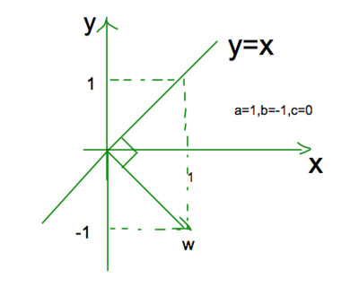

== 支持向量机

=== 开门见山
首先，支持向量机是一个二分类问题，说到二分类大家一定会想到我们之前提过的逻辑回归，其实二分类的方法还有很多，机器学习的目的就是为了找到一个决策边界，
使得样本数据可以很好地按照其类别被决策边界划分到两侧，来看个二维空间的分类图示: +

image::images/svm_seperate.png[title="二维空间的分类问题",width="30%", height="35%"]

图上的 `H1,H2,H3` 都是决策边界，大家可以直观的感觉到这三个决策边界中最好的一个是 `H3`，为什么？ 因为 `H1` 不能将两类样本点很好的分开， `H2` 可以很好的分开，
但是这个分割线离某些样本点太近了，差点不能分开。 +

上述的描述，都是很直观的判断，没有任何理论假设。那么我们重点看下 `H2` 和 `H3` 这两条决策边界，假设给出的样本就是我们全部的训练集，那么两条决策边界都可以达到0%损失，
也就是全部正确分类，大家想想逻辑回归迭代收敛的条件，是不是就意味着我们找到了最优解，走到了梦寐以求的山谷！没错，这两条决策边界都满足逻辑回归最优解的要求。也就是说，
如果逻辑回归最后收敛在了 `H2` 这条决策边界上，算法就会停止迭代，我们找到了最优模型。但是很显然，这个仍然不是最佳的，因为直觉告诉我们，它真的是差点就分错，这个差点其实就有很大的概率，
当预测一个新样本时，被错误分类的概率会更大，其实这句话描述的就是模型的 `泛化能力` 差。 +

而 `H3` 我们直观的认为，当它预测一个新样本时，被错误分类的概率会小些，即 `泛化能力` 好！这就是支持向量机(SVM)和其他分类模型最本质的差异，SVM的目标是找到像 `H3` 这样，
人为感觉泛化能力最强的分类器，为什么加个 `人为` ,因为我们无法获取真实样本的分布，所以一切都是近似！ 好了，下面就让我们来将这个目标进行数学化描述: +

很容易发现，这个人为感觉泛化能力最强的分类器，具有这样的特点：这个决策边界和离它最近的样本的距离最大，白话说就是尽可能的将两类样本分的越开越好。因此SVM就是间隔最大的线性分类器！
所以它牛哄哄了那么多年，因为它是最优分类器。 +

越火研究的人就越多，越容易发展到新的高度，SVM不仅可以解决线性可分的问题，也可以通过引入惩罚因子解决近似线性可分的问题，当然将核技术应用于SVM，使得SVM可以解决线性不可分的问题，
谈到SVM一个经常被说到的话：高斯核可以将样本点映射到无穷维！这个后面我们会详细说明为什么，这里就感受下它的牛气就行了。 +

=== 高维空间

这个题目有点大，其实这里只是想介绍高维空间的少许基本概念，为后面SVM的推导做基础储备。 +

==== 超平面的表示

首先，为什么要研究高维空间，其实这个问题很容易理解。机器学习的核心是数据，而数据都是由特征向量表示，如果我们将数据想象成空间中的点，那么特征的总数就是这个高维空间的总数，
一个特征代表了高维空间的一个维度。 +

在二维平面上，一个线性分类器的决策边界是一条直线，在高维空间上就是个超平面。那么如何表示这个超平面呢？先来研究下二维平面的情况，我们都知道二维平面上的线性决策面就是直线，
假设二维平面上的两个维度分别为\(x\)和\(y\),那么任意一条直线可以表示为如下形势: +

[stem]
++++
ax + by + c = 0
++++

也许上面的形势你不太习惯，那再变换下形势就可以写成 +

[stem]
++++
y = -\frac{a}{b}x -\frac{c}{b}
++++

这个形式是我们初中所学的基本形式，其中\(-\frac{a}{b}\)为直线的斜率，而\(-\frac{c}{b}\)为直线的截距。聪明的你，一定会想办法把这条直线和我们的机器学习模型对比结合起来，
比如，你会想到变量\(x\)和\(y\)就相当于数据中的两个特征，而\(a\)和\(b\)相当于特征对应的权重，初中学习的数学告诉我们\(x\)和\(y\)是变量，而\(a\)和\(b\)一般为常量，
而机器学习刚好相反，机器学习的目的是为了学到这条直线，因此未知数就是\(a\)和\(b\)，我们把未知数用向量表示，令\(\vec{w} = (\vec{a}, \vec{b})\)，向量\(\vec{w}\)叫做法向量。
来看下法向量和斜率之间的关系，下图假设a=1, b=-1, c=0，于是得到一条斜率为1的直线。 +

很容易发现，斜率的方向是和直线平行的，而法向量刚好和直线垂直，这个结论同样适应于高维空间，即高维空间的超平面的法向量和平面也是垂直的，如果我们将\(x\)和\(y\)也统一成一个变量的不同下标，
则直线可以写成\(\vec{w} \cdot \vec{x} + c = 0\)，为了方便向量的箭头省略掉，将截距\(c\)换成\(b\)，则得到超平面的法向量表示。 +

[stem]
++++
w \cdot x + b = 0
++++

==== 点到平面距离
因为SVM是间隔最大的线形分类器，中间涉及到间隔的概念，因此势必会计算样本点到决策超平面的距离计算，这里我们利用向量点积运算的定义，给出点到平面的距离,向量的点积定义为: +

[stem]
++++
\vec{a} \cdot \vec{b} = |\vec{a}| \cdot |\vec{b}| \cdot cos\theta
++++

其中，\theta为两个向量的夹角，为了求解空间中的任意一点\(x_{0}\)到超平面的距离，我们可以在超平面上任取一点\(x_{1}\)，则向量\(\vec{x_{0} - x_{1}}\)在法向量上的投影就是点\(x_{0}\)到超平面的距离，
如下图所示，其实比较直观。 +

image::images/distance.png[title="点到平面的距离",width="30%", height="35%"]

由上图，我们可以看到点到平面的距离\(L\)其实就是线段\(x_{0}x_{1}\)乘以\(cos\theta\)，刚好是向量点积的两项。于是得到点到平面的距离公式: +

\begin{align}
w \cdot (x_{0} - x_{1}) & = |w| \dot |x_{0} - x_{1} | \cdot cos\theta \\
& = L \cdot | w | \\
\Leftrightarrow  L & = \frac{w \cdot (x_{0} - x_{1})}{|w|} \\
& = \frac{w\cdot x_{0} - w\cdot x_{1}}{|w|} \\
& = \frac{w x_{0}  + b}{|w|}
\end{align}

因为\(x_{1}\)是平面\(w\cdot x + b = 0\)上的点，所以\(-w \cdot x_{1} = b\)，记录下我们的成果，点到平面的距离为: +

[stem]
++++
L = \frac{w\cdot x_{0} + b}{|w|} \hspace{2cm} (4.1)
++++

根据公式(4.1)，我们发现一个很有趣的地方，SVM的目的就是要求解超平面，也就是参数\(w\)和\(b\)，方法涉及优化点到平面的距离，但是上面的距离公式却告诉我们，
不管你的参数求的结果是多少，比如\(w=\)10,\(b=\)15，假设此时计算的\(L=\)100(为了简化问题,这里假设了维度为1),那么我们都可以等比例放大\(w\)和\(b\)使得距离同比例变大，放大10倍，则距离变为1000，
距离虽然等比里变大了，超平面却没有发生变化，因为放大倍数可以约掉。 +

上面的问题其实在告诉我们，同一个平面其法向量和截距的结果可以有无数多个，等比例缩放的解都是可行解。换句话说，因为这个特性使得点到平面的距离可以取任意值(除了0),那不妨我们就固定距离，
这这种约束条件下求得的参数将会是唯一的，想缩放已经不可能了，距离约束了，有点像结果的归一化问题，为了简化计算，后面我们就将这个可以取任意值的距离设为1，即: +

[stem]
++++
w \cdot {x_{0}} + b = 1 \hspace{2cm} (4.2) \\
L = \frac{1}{||w||} \hspace{3cm} (4.3)
++++

刚距离中维度为1，所以绝对值和二范式相等，高维空间一般都用二范式表示向量的模(所有分量的平方和再开根号)，我们的优化目标就是最大化间隔，即 +

[stem]
++++
\underset{w,b}{max}\frac{1}{||w||}
++++

再来看下约束条件有哪些，我们假设二分类的结果\(y_{i}\)取值为1和-1，假设正样本为1，负样本为-1，我们希望所有正样本都满足\(w\cdot x_{i+} + b \geqslant 1\),所有负样本都满足\(w\cdot x_{i-} + b \leq -1\),
这两个约束条件可以写成如下一个约束条件： +
[stem]
++++
s.t. \hspace{1cm} y_{i}(w\cdot x_{i} + b)  - 1 \geq 0
++++

我们将最大化问题转为最小化问题，就变为凸优化问题，于是我们得到了下面的线形可分支持向量机学习的最优化问题: +

\begin{align}
& \underset{w,b}{min} \hspace{1cm} \frac{1}{2}||w||^{2}  \hspace{4cm} (4.4) \\
& s.t. \hspace{1cm} y_{i}(w\cdot x_{i} + b)  - 1 \geq 0 \hspace{1cm} (4.5)
\end{align}

这是个典型的凸二次优化问题，凸优化问题是指约束最优化问题，这种问题一般会通过引入拉格朗日乘子，转为一个优化函数的形式。 +

=== 问题优化

==== 理解对偶问题
凸优化问题的约束条件一般限定包括\(=0\)和\(\leq 0\)，因为\(geq 0\)可以很容易转换为\(\leq 0\)的问题，所以上节的支持向量机学习的最优化问题应该写成: +

\begin{align}
& \underset{w,b}{min} \hspace{1cm} \frac{1}{2}||w||^{2}  \hspace{4cm} (4.6) \\
& s.t. \hspace{1cm} 1 - y_{i}(w\cdot x_{i} + b) \leq 0 \hspace{1cm} (4.7)
\end{align}

根据上述约束条件，对每一个不等式约束引入拉格朗日乘子\(\alpha_{i} \geq 0\)，得到拉格朗日函数: +
[stem]
++++
L(w, b, \alpha) = \frac{1}{2}||w||^{2}+\sum_{i=1}^{N}\alpha_{i}[1-y_{i}(w\cdot x_{i} + b)]  \hspace{1cm} (4.8)
++++

先不考虑我们原问题是最大问题还是最小化问题，首先这种变换必须是等价的才有意义，也就是公式(4.8)必须满足公式(4.6)和(4.7)的约束条件，先来看下(4.7)的不等式约束 +

**分析:**公式(4.7)的约束是小于等于0，我们假设给拉格朗日函数附加最小化约束，即\(min \hspace{0.1cm} L(w, b, \alpha)\),显然\(1-y_{i}(w\cdot x_{i} + b)\)为负时会使得无最小值存在，
因此不能满足(4.7)的要求，那么反过来，如果给拉格朗日函数附加最大化约束呢，即\(max \hspace{0.1cm} L(w, b, \alpha)\),我们发现当\(1-y_{i}(w\cdot x_{i} + b)\)想要大于0时(即违背公式(4.7)约束),我们可以取\(\alpha_{i} = 0\),
而当\(1-y_{i}(w\cdot x_{i} + b)\)小于0时，取\(\alpha_{i} > 0\)即可，刚好满足公式(4.7)的约束条件。 +

因此为了满足公式(4.7)的约束条件，拉格朗日函数必须附加最小化约束条件，即: +
[stem]
++++
max \hspace{1cm} L(w, b, \alpha)
++++

再考虑公式(4.6)的约束，这个比较简单，因为是等式约束，所以将最小化约束条件加在朗格朗日函数前就可以了，即得到朗格朗日与原问题完全等价的函数约束形式: +
[stem]
++++
\underset{\alpha}{max} \hspace{0.1cm}\underset{w, b}{min} L(w, b, \alpha) \hspace{1cm} (4.9)
++++

通过朗格朗日变换，我们发现原始问题是一个最小最大值问题，这个问题不好直接求解，是否转换为对偶问题后方便求解呢？ +

这里先简单说下什么是对偶问题，比如这里原问题是一个最小最大值问题，对偶问题就是最大最小值问题，因此公式(4.9)的对偶问题形式就是: +

[stem]
++++
\underset{\alpha}{min} \hspace{0.1cm}\underset{w, b}{max} L(w, b, \alpha) \hspace{1cm} (4.10)
++++

假设原问题的最优解为\(p^{*} \)，对偶问题的最优解为\( q^{ * } \)，那么一个很显然的结论是: \(q^{ * } \leq p^{ * }\),这个结论不需要什么证明，看下这两个问题的负号关系就知道了，
一个是最大值里取最小的，另一个是在最小值里取最大的，显然这个不等式是成立的。但是，问题来了，什么情况下取等号呢？ 取不到等号，显然对偶问题和原始问题不等价！ +

==== 等价性证明
由上节可知，对偶问题和原始问题的关系 +

[stem]
++++
d^{ * } \leq q^{ * }
++++

我们把上面的不等式约束叫做 `弱对偶性质`,顺其自然，我们可以引入一个重要的概念：`对偶间隔`，即\(q^{ * } - d^{ * }\),因此对偶间隔肯定大于或等于0，那么有没有可能在某种情况下，对偶间隔消失呢？
也就是对偶问题的最优解与原始问题的最优解相等呢？ +

下面介绍一个让对偶间隔消失的充分条件，`Slater条件`: +
====
存在\(x\)满足： +
\(g_{i}(x) < 0, i=1, 2, .., m\) +
\(h_{i}(x) = 0, i=1, 2, ...,p\) +
====
\(h_{i}(x)\)大家暂时可以不用管，这是一个等式约束问题，SVM问题中，只有不等式约束，所以第二个条件可以认为已满足，`Slater条件` 即是说存在\(x\)，使不等式约束中的"小于等于号"要严格取到"小于号"。 +

可以证明对于凸优化问题(QP问题)，如果 `Slater条件` 满足，则 +
[stem]
++++
d^{ * } = p^{ * }
++++
这种情况称为"强对偶性质",如果对偶问题存在最优点\(\alpha^{*}\)，并且对应的最优值 \(d^{ * } = \theta(\alpha^{ * })\)等于\(p^{ * }\),这时会发生什么？来看下对偶问题的推导过程: +

\begin{align}
\theta(\theta(\alpha)) & = \underset{x}{inf} (L(x, \alpha)) \\
& = \underset{x}{inf} (f(x) + \sum_{i=1}^{N}\alpha_{i}g_{i}(x)) \\
& \leq f(x^{*}) + \sum_{i=1}^{N} \alpha_{i} g_{i}( x^{ * } ) \\
& \leq f( x^{ * } ) \\
& = p^{ * }
\end{align}

在对偶间隔消失的情况下，上面的所有不等式都严格取等号，根据上面两个不等式处取等号，我们可以得出下面两个结论 +

====
* 第一个不等式处取等，会使得原始问题的最优点\(x^{*}\)是使\(L(x, \alpha^{ * })\)取最小值的点。
* 第二个不等式处取等，说明

[stem]
++++
\sum_{i=1}^{N}\alpha_{i}g_{i}( x^{ * } ) = 0
++++

由于我们限制了每个\(\alpha_{i} \geq 0\),所以上式每一项都是非负的，这样我们又可以得到一个结论 +

[stem]
++++
\alpha_{i} g_{i}(x^{ * }) = 0, \hspace{0.5cm} \forall i
++++

因为\(g_{i}(x)\)为我们的不等式约束，所以也就是说，要么拉格朗日乘子为0，要么不等式为0；这句话再往深里说就是，不等式约束不为0的样本点对应的朗格朗日乘子都为0，
也就是不等式约束不起作用，对训练模型没有帮助，而不等式为0的点，不等式约束才成立。而使得不等式为0的点都是满足下式的点: +

[stem]
++++
y_{i}(w \cdot x_{i} + b) = 1·
++++

而满足上面等式的点都是 `支持向量` ，因此在模型训练是我们只需要关注那些支持向量就可以了，这也是支持向量机名称的由来。
====

=== 对偶问题求解
根据拉格朗日对偶性，原始问题的对偶问题是极大极小值问题: +

[stem]
++++
\underset{\alpha}{max} \underset{w, b}{min} L(w, b, \alpha)
++++

所以为了得到对偶问题的解，我们需要先求\(L(w,b,\alpha)\)对\(w, b\)的极小值，再求对\(\alpha\)的极大值。 +

==== 推导和结论

**(1).求\(\underset{w,b}{ min }L(w,b,\alpha) \)** +

将拉格朗日函数分别对\(w,b\)求导，令导数为0. +

\begin{align}
\frac{\partial }{\partial w}L(w,b,\alpha) & = w - \sum_{i=1}^{N}\alpha_{i}y_{i}x_{i} = 0 \\
\frac{\partial}{\partial b} L(w, b, \alpha) & = \sum_{i=1}^{N}\alpha_{i}y_{i} = 0 \\
等价于 \hspace{2cm} \\
w & = \sum_{i=1}^{N}\alpha_{i}y_{i}x_{i} \hspace{1cm}(4.11) \\
\sum_{i=1}^{N}\alpha_{i}y_{i} & = 0 \hspace{3cm}(4.12)
\end{align}

将公式(4.11)代入拉格朗日函数，并利用公式(4.12)可以得到: +

\begin{align}
L(w, b, \alpha) & = \frac{1}{2} ||w||^{2} + \sum_{i=1}^{N} \alpha_{i} [1-y_{i} (w \cdot x_{i} + b) ] \\
& = \frac{1}{2} \sum_{i=1}^{N} \sum_{j=1}^{N} \alpha_{i} \alpha_{j} y_{i} y_{j} (x_{i} \cdot x_{j}) - \sum_{i=1}^{N}[ 1 - y_{i}( (\sum_{j=1}^{N} \alpha_{j}y_{j}x_{j} ) \cdot x_{j} +b )  \\
& = -\frac{1}{2} \sum_{i=1}^{N} \sum_{j=1}^{N} \alpha_{i} \alpha_{j} y_{i} y_{j} (x_{i} \cdot x_{j}) + \sum_{i=1}^{N}\alpha_{i}
\end{align}
即 +

[stem]
++++
\underset{w, b}{min} L(w, b, \alpha) = -\frac{1}{2} \sum_{i=1}^{N} \sum_{j=1}^{N} \alpha_{i} \alpha_{j} y_{i} y_{j} (x_{i} \cdot x_{j}) + \sum_{i=1}^{N}\alpha_{i}
++++

**(2)求\(\underset{w, b}{min} L(w, b, \alpha)\)对\(\alpha\)的极大值，即是对偶问题** +

\begin{align}
& \underset{\alpha}{max} \hspace{0.1cm} -\frac{1}{2} \sum_{i=1}^{N} \sum_{j=1}^{N} \alpha_{i} \alpha_{j} y_{i} y_{j} (x_{i} \cdot x_{j}) + \sum_{i=1}^{N}\alpha_{i} \hspace{1cm} (4.13) \\
& s.t. \hspace{0.5cm} \sum_{i=1}^{N} \alpha_{i} y_{i} = 0 \\
& \hspace{1.5cm} \alpha_{i} \geq 0, \hspace{1cm} i=1,2,...,N
\end{align}

将公式(4.13)的极大值问题转换为极小值，就得到下面与之等价的对偶最优化问题: +

\begin{align}
& \underset{\alpha}{min} \hspace{0.1cm} \frac{1}{2} \sum_{i=1}^{N} \sum_{j=1}^{N} \alpha_{i} \alpha_{j} y_{i} y_{j} (x_{i} \cdot x_{j}) - \sum_{i=1}^{N}\alpha_{i} \hspace{1cm} (4.14) \\
& s.t. \hspace{0.5cm} \sum_{i=1}^{N} \alpha_{i} y_{i} = 0 \hspace{5.4cm} (4.15) \\
& \hspace{1.5cm} \alpha_{i} \geq 0, \hspace{1cm} i=1,2,...,N \hspace{1.9cm} (4.16)
\end{align}

==== SMO算法
