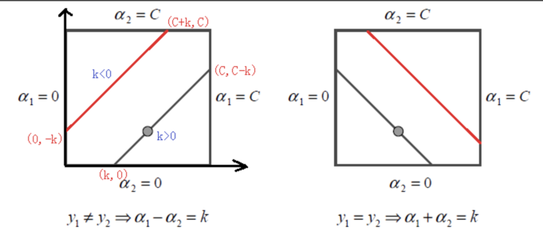
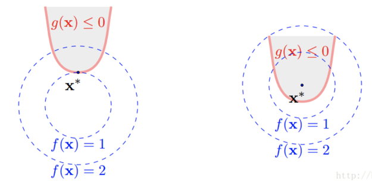

== 支持向量机

=== 开门见山
首先，支持向量机是一个二分类问题，说到二分类大家一定会想到我们之前提过的逻辑回归，其实二分类的方法还有很多，机器学习的目的就是为了找到一个决策边界，
使得样本数据可以很好地按照其类别被决策边界划分到两侧，来看个二维空间的分类图示: +

image::images/svm_seperate.png[title="二维空间的分类问题",width="30%", height="35%"]

图上的 `H1,H2,H3` 都是决策边界，大家可以直观的感觉到这三个决策边界中最好的一个是 `H3`，为什么？ 因为 `H1` 不能将两类样本点很好的分开， `H2` 可以很好的分开，
但是这个分割线离某些样本点太近了，差点不能分开。 +

上述的描述，都是很直观的判断，没有任何理论假设。那么我们重点看下 `H2` 和 `H3` 这两条决策边界，假设给出的样本就是我们全部的训练集，那么两条决策边界都可以达到0%损失，
也就是全部正确分类，大家想想逻辑回归迭代收敛的条件，是不是就意味着我们找到了最优解，走到了梦寐以求的山谷！没错，这两条决策边界都满足逻辑回归最优解的要求。也就是说，
如果逻辑回归最后收敛在了 `H2` 这条决策边界上，算法就会停止迭代，我们找到了最优模型。但是很显然，这个仍然不是最佳的，因为直觉告诉我们，它真的是差点就分错，这个差点其实就有很大的概率，
当预测一个新样本时，被错误分类的概率会更大，其实这句话描述的就是模型的 `泛化能力` 差。 +

而 `H3` 我们直观的认为，当它预测一个新样本时，被错误分类的概率会小些，即 `泛化能力` 好！这就是支持向量机(SVM)和其他分类模型最本质的差异，SVM的目标是找到像 `H3` 这样，
人为感觉泛化能力最强的分类器，为什么加个 `人为` ,因为我们无法获取真实样本的分布，所以一切都是近似！ 好了，下面就让我们来将这个目标进行数学化描述: +

很容易发现，这个人为感觉泛化能力最强的分类器，具有这样的特点：这个决策边界和离它最近的样本的距离最大，白话说就是尽可能的将两类样本分的越开越好。因此SVM就是间隔最大的线性分类器！
所以它牛哄哄了那么多年，因为它是最优分类器。 +

越火研究的人就越多，越容易发展到新的高度，SVM不仅可以解决线性可分的问题，也可以通过引入惩罚因子解决近似线性可分的问题，当然将核技术应用于SVM，使得SVM可以解决线性不可分的问题，
谈到SVM一个经常被说到的话：高斯核可以将样本点映射到无穷维！这个后面我们会详细说明为什么，这里就感受下它的牛气就行了。 +

=== 高维空间

这个题目有点大，其实这里只是想介绍高维空间的少许基本概念，为后面SVM的推导做基础储备。 +

==== 超平面的表示

首先，为什么要研究高维空间，其实这个问题很容易理解。机器学习的核心是数据，而数据都是由特征向量表示，如果我们将数据想象成空间中的点，那么特征的总数就是这个高维空间的总数，
一个特征代表了高维空间的一个维度。 +

在二维平面上，一个线性分类器的决策边界是一条直线，在高维空间上就是个超平面。那么如何表示这个超平面呢？先来研究下二维平面的情况，我们都知道二维平面上的线性决策面就是直线，
假设二维平面上的两个维度分别为\(x\)和\(y\),那么任意一条直线可以表示为如下形势: +

[stem]
++++
ax + by + c = 0
++++

也许上面的形势你不太习惯，那再变换下形势就可以写成 +

[stem]
++++
y = -\frac{a}{b}x -\frac{c}{b}
++++

这个形式是我们初中所学的基本形式，其中\(-\frac{a}{b}\)为直线的斜率，而\(-\frac{c}{b}\)为直线的截距。聪明的你，一定会想办法把这条直线和我们的机器学习模型对比结合起来，
比如，你会想到变量\(x\)和\(y\)就相当于数据中的两个特征，而\(a\)和\(b\)相当于特征对应的权重，初中学习的数学告诉我们\(x\)和\(y\)是变量，而\(a\)和\(b\)一般为常量，
而机器学习刚好相反，机器学习的目的是为了学到这条直线，因此未知数就是\(a\)和\(b\)，我们把未知数用向量表示，令\(\vec{w} = (\vec{a}, \vec{b})\)，向量\(\vec{w}\)叫做法向量。
来看下法向量和斜率之间的关系，下图假设a=1, b=-1, c=0，于是得到一条斜率为1的直线。 +

image::images/2D_w.png[title="二维空间直线和法向量的关系",width="30%", height="35%"]

很容易发现，斜率的方向是和直线平行的，而法向量刚好和直线垂直，这个结论同样适应于高维空间，即高维空间的超平面的法向量和平面也是垂直的，如果我们将\(x\)和\(y\)也统一成一个变量的不同下标，
则直线可以写成\(\vec{w} \cdot \vec{x} + c = 0\)，为了方便向量的箭头省略掉，将截距\(c\)换成\(b\)，则得到超平面的法向量表示。 +

[stem]
++++
w \cdot x + b = 0
++++

==== 点到平面距离
因为SVM是间隔最大的线形分类器，中间涉及到间隔的概念，因此势必会计算样本点到决策超平面的距离计算，这里我们利用向量点积运算的定义，给出点到平面的距离,向量的点积定义为: +

[stem]
++++
\vec{a} \cdot \vec{b} = |\vec{a}| \cdot |\vec{b}| \cdot cos\theta
++++

其中，\theta为两个向量的夹角，为了求解空间中的任意一点\(x_{0}\)到超平面的距离，我们可以在超平面上任取一点\(x_{1}\)，则向量\(\vec{x_{0} - x_{1}}\)在法向量上的投影就是点\(x_{0}\)到超平面的距离，
如下图所示，其实比较直观。 +

image::images/distance.png[title="点到平面的距离",width="30%", height="35%"]

由上图，我们可以看到点到平面的距离\(L\)其实就是线段\(x_{0}x_{1}\)乘以\(cos\theta\)，刚好是向量点积的两项。于是得到点到平面的距离公式: +

\begin{align}
w \cdot (x_{0} - x_{1}) & = |w| \dot |x_{0} - x_{1} | \cdot cos\theta \\
& = L \cdot | w | \\
\Leftrightarrow  L & = \frac{w \cdot (x_{0} - x_{1})}{|w|} \\
& = \frac{w\cdot x_{0} - w\cdot x_{1}}{|w|} \\
& = \frac{w x_{0}  + b}{|w|}
\end{align}

因为\(x_{1}\)是平面\(w\cdot x + b = 0\)上的点，所以\(-w \cdot x_{1} = b\)，记录下我们的成果，点到平面的距离为: +

[stem]
++++
L = \frac{w\cdot x_{0} + b}{|w|} \hspace{2cm} (4.1)
++++

根据公式(4.1)，我们发现一个很有趣的地方，SVM的目的就是要求解超平面，也就是参数\(w\)和\(b\)，方法涉及优化点到平面的距离，但是上面的距离公式却告诉我们，
不管你的参数求的结果是多少，比如\(w=\)10,\(b=\)15，假设此时计算的\(L=\)100(为了简化问题,这里假设了维度为1),那么我们都可以等比例放大\(w\)和\(b\)使得距离同比例变大，放大10倍，则距离变为1000，
距离虽然等比里变大了，超平面却没有发生变化，因为放大倍数可以约掉。 +

上面的问题其实在告诉我们，同一个平面其法向量和截距的结果可以有无数多个，等比例缩放的解都是可行解。换句话说，因为这个特性使得点到平面的距离可以取任意值(除了0),那不妨我们就固定距离，
这种约束条件下求得的参数将会是唯一的，想缩放已经不可能了，距离约束了，有点像结果的归一化问题，为了简化计算，后面我们就将这个可以取任意值的距离设为1，即: +

[stem]
++++
w \cdot {x_{0}} + b = 1 \hspace{2cm} (4.2) \\
L = \frac{1}{||w||} \hspace{3cm} (4.3)
++++

刚距离中维度为1，所以绝对值和二范式相等，高维空间一般都用二范式表示向量的模(所有分量的平方和再开根号)，我们的优化目标就是最大化间隔，即 +

[stem]
++++
\underset{w,b}{max}\frac{1}{||w||}
++++

再来看下约束条件有哪些，我们假设二分类的结果\(y_{i}\)取值为1和-1，假设正样本为1，负样本为-1，我们希望所有正样本都满足\(w\cdot x_{i+} + b \geqslant 1\),所有负样本都满足\(w\cdot x_{i-} + b \leq -1\),
这两个约束条件可以写成如下一个约束条件： +
[stem]
++++
s.t. \hspace{1cm} y_{i}(w\cdot x_{i} + b)  - 1 \geq 0
++++

我们将最大化问题转为最小化问题，就变为凸优化问题，于是我们得到了下面的线形可分支持向量机学习的最优化问题: +

\begin{align}
& \underset{w,b}{min} \hspace{1cm} \frac{1}{2}||w||^{2}  \hspace{4cm} (4.4) \\
& s.t. \hspace{1cm} y_{i}(w\cdot x_{i} + b)  - 1 \geq 0 \hspace{1cm} (4.5)
\end{align}

这是个典型的凸二次优化问题，凸优化问题是指约束最优化问题，这种问题一般会通过引入拉格朗日乘子，转为一个优化函数的形式。 +

=== 问题优化

==== 理解对偶问题
凸优化问题的约束条件一般限定包括\(=0\)和\(\leq 0\)，因为\(\geq 0\)可以很容易转换为\(\leq 0\)的问题，所以上节的支持向量机学习的最优化问题应该写成: +

\begin{align}
& \underset{w,b}{min} \hspace{1cm} \frac{1}{2}||w||^{2}  \hspace{4cm} (4.6) \\
& s.t. \hspace{1cm} 1 - y_{i}(w\cdot x_{i} + b) \leq 0 \hspace{1cm} (4.7)
\end{align}

根据上述约束条件，对每一个不等式约束引入拉格朗日乘子\(\alpha_{i} \geq 0\)，得到拉格朗日函数: +
[stem]
++++
L(w, b, \alpha) = \frac{1}{2}||w||^{2}+\sum_{i=1}^{N}\alpha_{i}[1-y_{i}(w\cdot x_{i} + b)]  \hspace{1cm} (4.8)
++++

先不考虑我们原问题是最大问题还是最小化问题，首先这种变换必须是等价的才有意义，也就是公式(4.8)必须满足公式(4.6)和(4.7)的约束条件，先来看下(4.7)的不等式约束 +

**分析:**公式(4.7)的约束是小于等于0，我们假设给拉格朗日函数附加最小化约束，即\(min \hspace{0.1cm} L(w, b, \alpha)\),显然\(1-y_{i}(w\cdot x_{i} + b)\)为负时会使得无最小值存在，
因此不能满足(4.7)的要求，那么反过来，如果给拉格朗日函数附加最大化约束呢，即\(max \hspace{0.1cm} L(w, b, \alpha)\),我们发现当\(1-y_{i}(w\cdot x_{i} + b)\)想要大于0时(即违背公式(4.7)约束),我们可以取\(\alpha_{i} = 0\),
而当\(1-y_{i}(w\cdot x_{i} + b)\)小于0时，取\(\alpha_{i} > 0\)即可，刚好满足公式(4.7)的约束条件。 +

因此为了满足公式(4.7)的约束条件，拉格朗日函数必须附加最大化约束条件，即: +
[stem]
++++
max \hspace{0.1cm} L(w, b, \alpha)
++++

再考虑公式(4.6)的约束，这个比较简单，因为是等式约束，所以将最小化约束条件加在朗格朗日函数前就可以了，即得到朗格朗日与原问题完全等价的函数约束形式: +
[stem]
++++
\underset{\alpha}{min} \hspace{0.1cm}\underset{w, b}{max} L(w, b, \alpha) \hspace{1cm} (4.9)
++++

通过朗格朗日变换，我们发现原始问题是一个最小最大值问题，这个问题不好直接求解，是否转换为对偶问题后方便求解呢？ +

这里先简单说下什么是对偶问题，比如这里原问题是一个最小最大值问题，对偶问题就是最大最小值问题，因此公式(4.9)的对偶问题形式就是: +

[stem]
++++
\underset{\alpha}{max} \hspace{0.1cm}\underset{w, b}{min} L(w, b, \alpha) \hspace{1cm} (4.10)
++++

假设原问题的最优解为\(p^{*} \)，对偶问题的最优解为\( q^{ * } \)，那么一个很显然的结论是: \(q^{ * } \leq p^{ * }\),这个结论不需要什么证明，看下这两个问题的负号关系就知道了，
一个是最大值里取最小的，另一个是在最小值里取最大的，显然这个不等式是成立的。但是，问题来了，什么情况下取等号呢？ 取不到等号，显然对偶问题和原始问题不等价！ +

==== 等价性证明
由上节可知，对偶问题和原始问题的关系 +

[stem]
++++
d^{ * } \leq q^{ * }
++++

我们把上面的不等式约束叫做 `弱对偶性质`,顺其自然，我们可以引入一个重要的概念：`对偶间隔`，即\(q^{ * } - d^{ * }\),因此对偶间隔肯定大于或等于0，那么有没有可能在某种情况下，对偶间隔消失呢？
也就是对偶问题的最优解与原始问题的最优解相等呢？ +

下面介绍一个让对偶间隔消失的充分条件，`Slater条件`: +
====
存在\(x\)满足： +
\(g_{i}(x) < 0, i=1, 2, .., m\) +
\(h_{i}(x) = 0, i=1, 2, ...,p\) +
====
\(h_{i}(x)\)大家暂时可以不用管，这是一个等式约束问题，SVM问题中，只有不等式约束，所以第二个条件可以认为已满足，`Slater条件` 即是说存在\(x\)，使不等式约束中的"小于等于号"要严格取到"小于号"。 +

可以证明对于凸优化问题(QP问题)，如果 `Slater条件` 满足，则 +
[stem]
++++
d^{ * } = p^{ * }
++++
这种情况称为"强对偶性质",如果对偶问题存在最优点\(\alpha^{*}\)，并且对应的最优值 \(d^{ * } = \theta(\alpha^{ * })\)等于\(p^{ * }\),这时会发生什么？来看下对偶问题的推导过程: +

\begin{align}
\theta(\theta(\alpha)) & = \underset{x}{inf} (L(x, \alpha)) \\
& = \underset{x}{inf} (f(x) + \sum_{i=1}^{N}\alpha_{i}g_{i}(x)) \\
& \leq f(x^{*}) + \sum_{i=1}^{N} \alpha_{i} g_{i}( x^{ * } ) \\
& \leq f( x^{ * } ) \\
& = p^{ * }
\end{align}

在对偶间隔消失的情况下，上面的所有不等式都严格取等号，根据上面两个不等式处取等号，我们可以得出下面两个结论 +

====
* 第一个不等式处取等，会使得原始问题的最优点\(x^{*}\)是使\(L(x, \alpha^{ * })\)取最小值的点。
* 第二个不等式处取等，说明

[stem]
++++
\sum_{i=1}^{N}\alpha_{i}g_{i}( x^{ * } ) = 0
++++

由于我们限制了每个\(\alpha_{i} \geq 0\),所以上式每一项都是非负的，这样我们又可以得到一个结论 +

[stem]
++++
\alpha_{i} g_{i}(x^{ * }) = 0, \hspace{0.5cm} \forall i
++++

因为\(g_{i}(x)\)为我们的不等式约束，所以也就是说，要么拉格朗日乘子为0，要么不等式为0；这句话再往深里说就是，不等式约束不为0的样本点对应的朗格朗日乘子都为0，
也就是不等式约束不起作用，对训练模型没有帮助，而不等式为0的点，不等式约束才成立。而使得不等式为0的点都是满足下式的点: +

[stem]
++++
y_{i}(w \cdot x_{i} + b) = 1·
++++

而满足上面等式的点都是 `支持向量` ，因此在模型训练是我们只需要关注那些支持向量就可以了，这也是支持向量机名称的由来。
====

=== 对偶问题求解
根据拉格朗日对偶性，原始问题的对偶问题是极大极小值问题: +

[stem]
++++
\underset{\alpha}{max} \underset{w, b}{min} L(w, b, \alpha)
++++

所以为了得到对偶问题的解，我们需要先求\(L(w,b,\alpha)\)对\(w, b\)的极小值，再求对\(\alpha\)的极大值。 +

==== 推导和结论

**(1).求\(\underset{w,b}{ min }L(w,b,\alpha) \)** +

将拉格朗日函数分别对\(w,b\)求导，令导数为0. +

\begin{align}
\frac{\partial }{\partial w}L(w,b,\alpha) & = w - \sum_{i=1}^{N}\alpha_{i}y_{i}x_{i} = 0 \\
\frac{\partial}{\partial b} L(w, b, \alpha) & = \sum_{i=1}^{N}\alpha_{i}y_{i} = 0 \\
等价于 \hspace{2cm} \\
w & = \sum_{i=1}^{N}\alpha_{i}y_{i}x_{i} \hspace{1cm}(4.11) \\
\sum_{i=1}^{N}\alpha_{i}y_{i} & = 0 \hspace{3cm}(4.12)
\end{align}

将公式(4.11)代入拉格朗日函数，并利用公式(4.12)可以得到: +

\begin{align}
L(w, b, \alpha) & = \frac{1}{2} ||w||^{2} + \sum_{i=1}^{N} \alpha_{i} [1-y_{i} (w \cdot x_{i} + b) ] \\
& = \frac{1}{2} \sum_{i=1}^{N} \sum_{j=1}^{N} \alpha_{i} \alpha_{j} y_{i} y_{j} (x_{i} \cdot x_{j}) - \sum_{i=1}^{N} \alpha_{i} [ 1 - y_{i}( (\sum_{j=1}^{N} \alpha_{j}y_{j}x_{j} ) \cdot x_{j} +b )  \\
& = -\frac{1}{2} \sum_{i=1}^{N} \sum_{j=1}^{N} \alpha_{i} \alpha_{j} y_{i} y_{j} (x_{i} \cdot x_{j}) + \sum_{i=1}^{N}\alpha_{i}
\end{align}
即 +

[stem]
++++
\underset{w, b}{min} L(w, b, \alpha) = -\frac{1}{2} \sum_{i=1}^{N} \sum_{j=1}^{N} \alpha_{i} \alpha_{j} y_{i} y_{j} (x_{i} \cdot x_{j}) + \sum_{i=1}^{N}\alpha_{i}
++++

**(2)求\(\underset{w, b}{min} L(w, b, \alpha)\)对\(\alpha\)的极大值，即是对偶问题** +

\begin{align}
& \underset{\alpha}{max} \hspace{0.1cm} -\frac{1}{2} \sum_{i=1}^{N} \sum_{j=1}^{N} \alpha_{i} \alpha_{j} y_{i} y_{j} (x_{i} \cdot x_{j}) + \sum_{i=1}^{N}\alpha_{i} \hspace{1cm} (4.13) \\
& s.t. \hspace{0.5cm} \sum_{i=1}^{N} \alpha_{i} y_{i} = 0 \\
& \hspace{1.5cm} \alpha_{i} \geq 0, \hspace{1cm} i=1,2,...,N
\end{align}

将公式(4.13)的极大值问题转换为极小值，就得到下面与之等价的对偶最优化问题: +

\begin{align}
& \underset{\alpha}{min} \hspace{0.1cm} \frac{1}{2} \sum_{i=1}^{N} \sum_{j=1}^{N} \alpha_{i} \alpha_{j} y_{i} y_{j} (x_{i} \cdot x_{j}) - \sum_{i=1}^{N}\alpha_{i} \hspace{1cm} (4.14) \\
& s.t. \hspace{0.5cm} \sum_{i=1}^{N} \alpha_{i} y_{i} = 0 \hspace{5.4cm} (4.15) \\
& \hspace{1.5cm} \alpha_{i} \geq 0, \hspace{1cm} i=1,2,...,N \hspace{1.9cm} (4.16)
\end{align}

推到这里，接下来怎么求解？ 这么多未知数! +

==== SMO算法

SMO算法和坐标上升类似，坐标上升法是指当有两个变量需要求解时，可以先固定一个变量不变，求另一个变量的最优化值，并更新另一个变量，然后下一轮再用同样的方法更新上一轮作为常量的变量值。
SMO算法和坐标上升法的差异主要体现在两点： +

--
* 由于SVM的限制条件\(\sum_{i} \alpha_{i}y_{i} = 0\)，所以不能只使用一个坐标，改为同时更新两个坐标
* 采用启发式方法，找到每次更新的坐标，而不是按顺序更新
--

第一点很好理解，因为有等式的限制，假设共有\(N\)个样本，就对应有\(N\)个朗格朗日乘子，这\(N\)维空间的自由度实际只有\(N-1\),因为当\(N-1\)个变量已知时，最后一个变量的值是固定的；
所以SMO同时更新两个变量相当于同时更新一个; +

第二点，有点类似梯度下降，目的都是为了让算法收敛的更快，SMO算法是基于SVM特有KKT条件限制框架下的优化算法，因此可以根据约束条件选择收敛速度最快的样本进行更新，后面具体会介绍。 +

下面开始正式介绍 `SMO算法`，又叫序列最小最优化(Sequential Minimal Optimization)算法，该算法是要解决上节提到的如下优化问题: +

\begin{align}
& \underset{\alpha}{min} \hspace{0.1cm} \frac{1}{2} \sum_{i=1}^{N} \sum_{j=1}^{N} \alpha_{i} \alpha_{j} y_{i} y_{j} (x_{i} \cdot x_{j}) - \sum_{i=1}^{N}\alpha_{i} \hspace{1cm} (4.17) \\
& s.t. \hspace{0.5cm} \sum_{i=1}^{N} \alpha_{i} y_{i} = 0 \hspace{5.4cm} (4.18) \\
& 0 \leq \alpha_{i} \geq C, \hspace{1cm} i=1,2,...,N \hspace{1.9cm} (4.19)
\end{align}

这里需要说明下公式(4.19)和之前提到的约束条件稍有变化，主要原因是考虑到后面要介绍的软间隔分类器，因为SMO算法可以同时应用于软间隔和硬间隔分类器，为了不失一般性，
我们这里就直接兼顾两种条件下的优化问题，只是稍微改动，其实对介绍算法本身没什么影响。 +

===== SMO算法思想

SMO算法是一种启发式算法，基本思想是： +

--
* 如果所有变量的解都满足此最优化问题的\(KKT\)条件，那么这个最优化问题的解就得到了。因为\(KKT\)条件是该最优化问题的充分必要条件。
* 否则选择两个变量，固定其他变量，针对这两个变量构建一个二次规划问题，这个二次规划问题关于这两个变量的解应该更接近原始二次规划问题的解，因为这会使原始二次规划问题的目标函数值变小。
* 更重要的，这时子问题可以通过解析方法求解，说白话就是在固定其他参数以后，这就是一个单变量二次规划问题，显然有闭式解，不必再调用数值优化算法，所以快。
* 每次迭代的子问题有两个变量，一个是违反\(KKT\)条件最严重的那一个，另一个由约束条件自动确定，如此SMO算法将原始问题不断分解为子问题并对子问题求解，进而达到求解原始问题的目的。
--

算法基本思想中提到，每次迭代都是两个变量中有一个是违反\(KKT\)条件最严重的那一个，这其实就是启发式方法的核心思想，我们可以这样理解这个观点：根据公式(4.17)原始问题是个最大化问题，而满足\(KKT\)条件的解是最优解，
也就是说只要参数\(\alpha_{i}\)中有一个参数不满足\(KKT\)条件，那么一轮迭代以后，目标函数的值就会变大(越大越好),\(KKT\)条件违反的程度越大，迭代后目标函数值增幅越大，优化效果越显著。 +

所以SMO算法中提到第一个变量就是违背\(KKT\)条件程度最大的变量，那么第二个变量应该选择使目标函数值增大最快的变量，关键在于如何找这个变量，SMO算法使用了启发式方法，即当第一个变量确定后，选择使两个变量对应样本之间差别最大的变量作为第二个变量，
直观上来说，更新两个差别很大的变量，比更新两个相似的变量会带给目标函数值更大的变化，关于怎么度量这个间隔，后面我们会提到可以使用偏差间隔，这里先略过。 +

为什么说，子问题的两个变量中只有一个自由变量，因为假设\(\alpha_{1}, \alpha_{2}\)为两个变量，其他参数\(\alpha_{3}, \alpha_{4},...,\alpha_{N}\)固定,那么由等式(4.18)约束可知 +

[stem]
++++
\alpha_{1} = -y_{1}\sum_{i=2}^{N}\alpha_{i}y_{i}
++++

所以如果\(\alpha_{2}\)确定，那么\(\alpha_{1}\)也随之确定，所以子问题中同时更新两个变量。 +

整个SMO算法包括两部分内容：求解两个变量二次规划的解析方法和选择变量的启发式方法。 +

===== 二次规划求解方法

不失一般性的，假设选择的两个变量分别为\(\alpha_{1}, \alpha_{2}\)，其他变量\(\alpha_{i}(i=3,4,...,N)\)是固定的，于是SMO的最优化问题的子问题可以写成 +

\begin{align}
\underset{\alpha_{1}, \alpha_{2}}{min} \hspace{0.2cm}W(\alpha_{1}, \alpha_{2}) & = \frac{1}{2}K_{11} \alpha_{1}^{2} + \frac{1}{2}K_{22} \alpha_{2}^{2} + y_{1}y_{2}K_{12}\alpha_{1} \alpha_{2} \\
& -(\alpha_{1} + \alpha_{2}) + y_{1} \alpha_{1} \sum_{i=3}^{N}y_{i} \alpha_{i}K_{i1} + y_{2} \alpha_{2} \sum_{i=3}^{N}y_{i} \alpha_{i}K_{i2}  \hspace{1cm}(4.20) \\
s.t. \hspace{1cm} & \alpha_{1}y_{1} + \alpha_{2}y_{2} = -\sum_{i=3}^{N}y_{i}\alpha_{i} = \varsigma \hspace{2cm} (4.21) \\
& 0 \leq \alpha_{i} \leq C, \hspace{0.5cm} i=1,2 \hspace{4cm} (4.22)
\end{align}

其中，\(K_{ij} = K(x_{i}, x_{j}), i,j=1,2,...,N\), \(varsigma\)是常数，目标函数式(4.20)中省略了不包含\(\alpha_{1}, \alpha_{2}\)的常数项。 +

为了求解两个变量的二次规划问题(4.20)~(4.22)，首先分析约束条件，然后在此约束条件下求极小。 +

由于只有两个变量\((\alpha_{1}, \alpha_{2})\),约束可以用二维空间中的图形表示，如下图所示. +

不等式约束(4.22)使得\((\alpha_{1}, \alpha_{2})\)在盒子\([0, C] times [0, C]\)内，而由于\(y_{i} \in {1, -1} \)，因此等式约束(4.21)使得\((\alpha_{1}, \alpha_{2})\)在平行于盒子的对角线的直线上，
因此要求的是目标函数在一条平行于对角线的线段上的最优值。这使得两个变量的最优化问题成为实质上的单变量的最优化问题，这里不妨考虑变量\(\alpha_{2}\)为变量。 +

先解释下上图中的一些数学关系，\(\alpha_{1}\)你可以理解为水平的横坐标，\(\alpha_{2}\)你可以理解为垂直的纵坐标，如果\(y_{1} \neq y_{2}\)，由于\(y_{i}\)只能取\((1, -1)\)，所以等式约束条件相当于两个变量的差值为常量，
这里定义这个常量为\(k\),如左图，又分为两种情况，当平行线为上面红色线段时，考虑下面的交点，此时的横坐标为0，纵坐标等于\(\alpha_{2} - \alpha_{1} = -k\)；再考虑上面的交点，纵坐标一定为\(C\)，
那么横坐标刚好等于\(\alpha_{1} = C+k\)。 +

其他的情况分析完全类似，假定下面的交点的纵坐标为\(L\)，上面交点纵坐标为\(H\)，问题的初始可行解为\(\alpha_{1}^{old}, \alpha_{2}^{old}\),最优解为 \(\alpha_{1}^{new}, \alpha_{2}^{new}\),并且假设在沿着约束方向未经剪辑时
的\(\alpha_{2}\)的最优解为\(\alpha_{new, unc}\)，则此时的变量\(\alpha_{2}\)满足: +

[stem]
++++
L \leq \alpha_{2}^{new} \leq H  \hspace{2cm}(4.23)
++++

并且由上面分析，如果\(y_{1} \neq y_{2}\)，则 +

[stem]
++++
L = max(0, \alpha_{2}^{old} - \alpha_{1}^{old} ),\hspace{0.5cm} H = min(C, C+\alpha_{2}^{old} - \alpha_{1}^{old})
++++

而如果\(y_{1} = y_{2}\)，则 +

[stem]
++++
L = max(0, \alpha_{2}^{old} + \alpha_{1}^{old} - C),\hspace{0.5cm} H = min(C, \alpha_{2}^{old} - \alpha_{1}^{old})
++++

由因为\(\alpha_{2}^{new}\)同时满足(4.23)，所以 +

[stem]
++++
\alpha_{2}^{new} = \left\{ \begin{matrix}
H, & \alpha_{2}^{new,unc} > H \\
\alpha_{2}^{ new,unc} ,&L \leq \alpha_{2}^{ new,unc} \leq H  \\
 L, & \alpha_{2}^{ new, unc} < L
\end{matrix}\right.
++++

上面公式中的\(L,H\)我们已经知道如何求解，那么\(\alpha_{2}^{new,unc}\)到底是什么？为了下面的求解方便，我们给出两个负号: +

[stem]
++++
g(x) = \sum_{j=1}^{N} \alpha_{j}y_{j}K(x_{j}, x) + b
++++

令

[stem]
++++
E_{i} = g(x_{i}) - y_{i} = (\sum_{j=1}^{N} \alpha_{j}y_{j}K(x_{j}, x_{i}) + b) - y_{i}, \hspace{0.5cm} i=1, 2 \hspace{1cm} (4.24)
++++

当\(i=1,2\)时，\(E_{i}\)为函数\(g(x)\)对输入\(x_{i}\)的预测值与真实输出\(y_{i}\)之差。 +

这里我们先给出结论，证明留到下个小节，不关心过程的可以直接跳过下个小节。 +

[stem]
++++
\alpha_{2}^{new, unc} = \alpha_{2}^{old} + \frac{y_{2} (E_{1} - E_{2})}{\eta}
++++

其中， +

[stem]
++++
\eta = K_{11} + K_{12} - 2K_{12} = ||\Phi(x_{1}) - \Phi(x_{2})||^{2}
++++

\(\Phi(x)\)是输入空间到特征空间的映射，\(E_{i}, i=1, 2\)，由公式(4.24)给出. +

计算出了\(\alpha_{2}^{new}\)， 顺势可以求得\(\alpha_{1}^{new}\) +

[stem]
++++
\alpha_{1}^{new} = \alpha_{1}^{old} + y_{1}y_{2}(\alpha_{2}^{old} - \alpha_{2}^{new})
++++

===== 公式证明
引进记号 +

[stem]
++++
v_{i} = \sum_{j=3}^{N} \alpha_{j} y_{j} K(x_{i}, x_{j}) = g(x_{i}) - \sum_{j=1}^{2} \alpha_{j} y_{j} K(x_{i}, x_{j}) - b, \hspace{0.5cm} i=1,2
++++

目标函数可写成 +

[stem]
++++
W(\alpha_{1}, \alpha_{2}) = \frac{1}{2}K_{11}\alpha_{1}^{2} + \frac{1}{2}K_{22} \alpha_{2}^{2} + y_{1}y_{2}K_{12} \alpha_{1} \alpha_{2} - (\alpha_{1} + \alpha_{2}) + y_{1}v_{1}\alpha_{1} + y_{2}v_{2}\alpha_{2} \hspace{1cm}(4.25)
++++

由\(\alpha_{1}y_{1} = \varsigma - \alpha_{2}y_{2}\)及\(y_{i}^{2} = 1\)，可将\(\alpha_{1}\)表示为 +
[stem]
++++
\alpha_{1} = (\varsigma - y_{2}\alpha_{2}) y_{1}
++++

代入公式(4.25)，得到只有\(\alpha_{2}\)的目标函数: +

\begin{align}
W(\alpha_{2}) & = \frac{1}{2}K_{11}(\varsigma-\alpha_{2}y_{2})^{2} + \frac{1}{2}K_{12}\alpha_{2}^{2} + y_{2}K_{12}(\varsigma - \alpha_{2}y_{2})\alpha_{2} \\
& -(\varsigma - \alpha_{2}y_{2})y_{1}-\alpha_{2} + v_{1}(\varsigma - \alpha_{2}y_{2}) + y_{2}v_{2}\alpha_{2}
\end{align}

对\(\alpha_{2}\)求导，可得 +

\begin{align}
(K_{11} + K_{22} - 2K_{12} ) \alpha_{2} & = y_{2}(y_{2}-y_{1} + \varsigma K_{11}-\varsigma K_{12} + v_{1} -v_{2}) \\
& = y_{2}[y_{2} - y_{1} + \varsigma K_{11} - \varsigma K_{12} + (g(x_{1}) - \sum_{j=1}^{2} y_{j} \alpha_{j}K_{1j} - b) \\
& -(g(x_{2}) - \sum_{j=1}^{2}y_{j} \alpha_{j} K_{2j} -b) ]
\end{align}

将\(\varsigma = \alpha_{1}^{old} y_{1} + \alpha_{2}^{old} y_{2}\)代入，得到 +

\begin{align}
(K_{11} + K_{22} - 2K_{12})\alpha_{2}^{new, unc} & = y_{2}( (K_{11} + K_{22} -2K_{12})\alpha_{2}^{old} y_{2} +y_{2}-y_{1} + g(x_{1}) - g(x_{2}) ) \\
& = (K_{11} + K_{22} - 2K_{12})\alpha_{2}^{old} + y_{2} (E_{1} - E_{2})
\end{align}

将\(\varsigma = K_{11} + K_{22} -2K_{12} \)代入，于是得到 +

[stem]
++++
\alpha_{2}^{new, unc} = \alpha_{2}^{old} + \frac{y_{2}(E_{1} -E_{2})}{\eta} \hspace{1cm} (4.26)
++++

证毕.

===== 变量选择方法
根据上节的内容，我们已经知道了如何在每轮迭代中更新参数，现在的问题是我们每轮迭代时应该选择哪两个参数进行更新。如果像坐标上升法那样顺序遍历，显然效率太低。
我们选择方法的依据就是我们的约束条件: +

**(1)第一个变量的选择** +

SMO通过启发式方法来选择参数变量，选择第一个变量的过程被称为外层循环，外层循环是在训练样本中选择违反\(KKT\)条件最严重的样本点，并将其对应的参数变量作为第一个变量，具体: +

\begin{align}
\alpha_{i} = 0 & \Leftrightarrow y_{i} g(x_{i}) \geq 1  \hspace{1cm} (4.27)\\
0 < \alpha_{i} < C & \Leftrightarrow y_{i}g(x_{i}) = 1 \hspace{1cm} (4.28) \\
\alpha_{i} = C & \Leftrightarrow y_{i}g(x_{i}) \leq 1 \hspace{1cm} (4.29)
\end{align}

其中\(g(x_{i}) = \sum_{j=1}^{N} \alpha_{j} y_{j} K(x_{i}, x_{j}) + b\).

该检验是在\(\xi\)范围内进行的，而且我们优先选择样本系数中满足公式(4.28)的样本点，即支持向量。不考虑其他两个相等界上的样本点，是因为他们不是支持向量，对模型的优化基本不起作用，因此参数基本不会怎么变化。
检查支持向量是否满足\(KKT\)条件，如果这些样本点都满足，那么遍历整个训练集，检查他们是否都满足。 +

**(2)第二个变量的选择** +

SMO将第二个变量的选择过程称为内层循环，假设在外层循环中已经找到了第一个变量\(\alpha_{1}\)，那么第二个变量\(\alpha_{2}\)的选择标准就是希望能使\(\alpha_{2}\)能有足够大的变化。足够大的变化意味着更新后目标值会得到很大程度的优化，
算法收敛速度加快，因为第一个变量已经选择了违反\(KKT\)条件的参数，那么如何找到使得第二个变量有足够大变化的参数呢? +

由公式(4.27)可知，\(\alpha_{2}\)与\(|E_{1} - E_{2}|\)有关，当\(\alpha_{1}\)确定后，找到违反\(KKT\)条件中使得\(|E_{1} - E_{2}|\)最大的样例点的系数作为\(\alpha_{2}\),这里的选择仍然是启发式的，
即优先选择支持支持向量。 +

在具体实现时，这里就有一个明显的\(trick\),就是将误差值\(E_{i}\)进行缓存。 +

更新完参数\(\alpha_{1}, \alpha_{2}\)以后，需要同步更新参数\(b\)，由公式(4.28)可知: +

[stem]
++++
\sum_{i=1}^{N} \alpha_{i} y_{i}K_{i1} + b = 1
++++

于是， +

[stem]
++++
b_{1}^{new} = y_{1} - \sum_{i=3}^{N} \alpha_{i}y_{i}K_{i1} - \alpha_{1}^{new}y_{1}K_{11} - \alpha_{2}^{new} y_{2}K_{21} \hspace{1cm} (4.30)
++++

由\(E_{1}\)(4.24)的定义，可知 +

[stem]
++++
E_{1} = \sum_{i=3}^{N} \alpha_{i}y_{i}K_{i1} + \alpha_{1}^{old} y_{1}K_{11} + \alpha_{2}^{old}y_{2}K_{21} + b^{old} - y_{i}
++++

因此公式(4.30)的前两项可以写成 +

[stem]
++++
y_{i} - \sum_{i=3}^{N} \alpha_{i} y_{i} K_{i1} = -E_{1} + \alpha_{1}^{old} y_{1} K_{11} + \alpha_{2}^{old}y_{2}K_{21} + b^{old}
++++

再带入公式(4.30)，可得到 +

[stem]
++++
b_{1}^{new} = -E_{1} - y_{1} K_{11} (\alpha_{1}^{new} - \alpha_{2}^{new}) - y_{2}K_{21}(\alpha_{2}^{new} - \alpha_{2}^{old}) + b^{old} \hspace{1cm} (4.31)
++++

同样的，如果\(0<\alpha_{2}^{new}<C\),那么 +

[stem]
++++
b_{2}^{new} = -E_{2} -y_{1}K_{12}( \alpha_{1}^{new} -\alpha_{1}^{old} ) - y_{2}K_{22}( \alpha_{2}^{new} - \alpha_{2}^{old} ) + b^{old} \hspace{1cm} (4.32)
++++

由于\(b\)只是一个参数变量，那么如何选择应用哪个作为更新标准呢？当然是哪个准选择哪个！那么如何判断准不准呢？就是更新后的哪个\(\alpha\)在\((0, C)\)之间，也就是属于支持向量了，于是就有了如下的判断: +

\begin{align}
b = \left\{\begin{matrix}
b1, &if \hspace{0.3cm} 0 \leq \alpha_{1}^{new} \leq C \\
b2,&if \hspace{0.3cm} 0 \leq \alpha_{2}^{new} \leq C \\
\frac{b_{1}+b_{2}}{2}, &others \hspace{2cm}
\end{matrix}\right.
\end{align}

在每次完成两个变量更新后，还需要同步更新\(E_{i}\),作为下次计算的缓存，更新方法如下: +

[stem]
++++
E_{i}^{new} = \sum_{S}y_{j} \alpha_{j} K(x, x_{j}) + b^{new} - y_{i}
++++

其中，\(S\)是所有支持向量\(x_{j}\)的集合。

=== 软间隔分类器

==== 优化问题

上节我们讲解了线性可分问题的支持向量机学习方法，而在实际中，这种完全线性可分的情况很少，因此不适用于对线性不可分训练的情况，
如何才能将上节结论推广到线性不可分的问题呢？ +

这就需要修改硬间隔最大化，使其成为软间隔最大化，当然这种情况，我们需要假设训练数据中有少量特异点，将这些特异点去掉后，
剩下的大部分的样本点组成的集合是线性可分的。 +

线性不可分意味着某些样本点\((X_{i}, y_{i})\)不能满足间隔大于等于1的约束条件。为了解决这个问题，可以给每个样本引入一个松弛因子，
\(\xi \geq 0\)，使得函数间隔加上松弛变量大于等于1，这样约束条件就变味： +

[stem]
++++
y_{i}( w \cdot x_{i} + b) \geq 1 - \xi
++++

同时，对每个松弛变量，支持一个代价，则目标函数变成： +

[stem]
++++
\frac{1}{2}||w||^{2} + C \sum_{i=1}^{N} \xi_{i}
++++

其中，\(C > 0\)称为惩罚参数，一般由应用问题决定，属于超参数，取值大时，意味着对误分类的惩罚增大，目标函数包含两层含义：使得间隔
尽量大，同时使误分类点的个数尽量小。 +

根据上面的思路就可以解决训练数据集线性不可分(近似可分)的问题，线性不可分的线性支持向量机的学习问题就变成了如下的凸二次规划问题: +

\begin{align}
\underset{w,b, \xi}{min} \hspace{1cm} & \frac{1}{2}||w||^{2}+C \sum_{i=1}^{N}\xi_{i} \\
s.t. \hspace{1cm} & y_{i}(w \cdot x_{i} + b) \geq 1-\xi_{i}, \hspace{0.2cm}i=1,2,...,N \\
& \xi_{i} \geq 0, \hspace{0.2cm} i=1,2,...,N
\end{align}

上述的优化问题基本等同于上节优化问题，具体的推导这里不再赘述，可以参考上节推导过程，或者直接参考李航博士的 `统计学习方法` 一书。 +

上节我们已经了解到了线性可分的问题，支持向量都在间隔边界上，但是线性不可分的情况稍微复杂，这些支持向量可以位于间隔边界上，间隔边界内甚至是误分类的一侧。

==== 合页损失
其实线性支持向量机还有另一种解释，就是利用前面讲到的损失函数的概念进行描述，相当于最小化以下目标函数: +

[stem]
++++
\sum_{i=1}^{N}[1- y_{i} (w \cdot x_{i} + b)]_{+} + \lambda ||w||^{2}
++++

其中第一项对应经验损失，而函数 +

[stem]
++++
L(y(w \cdot x + b )) = [ 1- y(w \cdot x + b)]_{+}
++++

称为合页损失，下标表示以下取正值得函数: +

[stem]
++++
[z]_{+} = \left\{\begin{matrix}
z, &  z > 0\\
0, &  z \leq 0
\end{matrix}\right.
++++

=== 核技巧

关于 `核技巧` 实际同支持向量机模型没有必然的联系，是一个完全独立的方向，只是为了使用支持向量机处理线性不可分的训练样本时，
通过引入核技巧可以完美解决问题。本节我们也不打算详细讲解核技巧，只说其在支持向量机中的应用，但是其实也是比较简单。 +

首先，用线性分类方法求解非线性分类问题分为两步：首先使用变换将原空间的数据映射到新空间；然后在新空间里使用线性分类学习方法从训练数据中学习分类模型，
而核技巧就是属于这样的方法。 +

核技巧应用于支持向量机的基本思路就是：通过一个非线性变换将输入空间对应于一个特殊空间(希尔伯特空间)，使得在输入空间中的超曲面模型对应于特征空间中的超平面模型，
说白了就是在输入空间只能通过非线性的曲面分割的问题可以在特征空间线性分割。这样分类模型的学习任务通过在特征空间中求解线性支持向量机就可以完成。 +

由于支持向量机的特殊性，我们其实可以不需要显示地将输入空间的训练数据分别映射到特征空间，即寻找这个转换函数，我们其实只需要求得输入数据在特征空间中的内积就可以，
这是由于我们的优化目标，见公式(4.17)中仅涉及输入数据的内积运算。这个内积运算\(x_{i} \cdot x_{j}\)，可以直接用核函数来\(K(x_{i}, x_{j})\)代替，此时对偶问题的目标函数就变为了: +

[stem]
++++
W(\alpha) = \frac{1}{2} \sum_{i=1}^{N} \sum_{j=1}^{N} \alpha_{i} \alpha_{j} y_{i} y_{j} K(x_{i}, x_{j}) - \sum_{i=1}^{N} \alpha_{i}
++++

这等价于经过映射函数将原来的输入空间变换到一个新的特征空间，将输入空间的内积变换为特征空间的内积，在新的特征空间中学习线性支持向量机，当映射函数是非线性函数时，
学习到的含有核函数的支持向量机就是非线性分类模型。 +

也就是说，在核函数给定的条件下，可以利用解线性分类问题的方法求解非线性分类问题的支持向量机。而学习是隐式地在特征空间进行的，不需要显示的定义特征空间和映射函数，
这样的技巧就称为 `核技巧`.

=== 深度思考

本章主要涉及的思考题包括: +

--
* 如何理解KKT条件
* 为什么说高斯核可以将数据映射到无穷维
--

==== 深入理解KKT条件

===== 什么是KKT条件

对于具有等式和不等式约束条件的一般优化问题 +

\begin{align}
& min, \hspace{0.2cm} f(x) \\
& s.t. \hspace{0.2cm}  g_{j}(x) \leq 0, \hspace{0.2cm}(j=1,2,...,m) \\
& h_{k}(x)=0, \hspace{0.2cm} (k=1,2, ...,l)
\end{align}

`KKT` 条件给出了判断\(x^{*}\)是否为最优解得必要条件，即: +

\begin{align}
\left\{\begin{matrix}
& \frac{\partial f}{\partial x_{i}} + \sum_{j=1}^{m} \mu_{j} \frac{\partial g_{j}}{\partial x_{i}} + \sum_{k=1}^{l} \lambda_{k} \frac{\partial h_{k}}{\partial x_{i}} = 0\\
& h_{k}(x) = 0, (k = 1, 2, ..., l)\\
& \mu_{j} g_{j}(x) = 0, (j=1,2,...,m) \\
& \mu_{j} \leq 0
\end{matrix}\right.
\end{align}

注意不等式的约束条件，必要条件里已经转换为了严格成立，即\(\mu_{j} g_{j}(x) = 0\)，这也就意味者不等式约束函数和拉格朗日乘子至少有一个为0，这也是支持向量的由来。 +

===== 等式约束优化问题

约束条件共分为两类，首先讨论较为简单的等式约束条件，对于等式约束条件的优化问题，常用的方法就是拉格朗日法，即把等式约束\(g_{i}(x·)\)用一个系数与f(x)写为一个式子，称为拉格朗日函数，而系数称为拉格朗日乘子。
通过拉格朗日函数对各个变量求导，令其为零，可以求得候选值集合，然后验证求得最优值。为什么可以这样呢？接下来我们给予证明: +

我们考虑下面的问题: +

\begin{align}
\left\{\begin{matrix}
min & f(x,y)\\
s.t.&g(x,y)=0
\end{matrix}\right.
\end{align}

我们首先画出\(f(x,y)\)的等高线，然后画出\(g(x,y)=0\)这条曲线，如下图所示: +

image::images/equeal.png[title="等式约束",width="30%", height="35%"]

**我们的目标是在曲线\(g(x,y)=0\)上找到一点使\(f(x,y)\)最小**，我们先看等高线\(f(x,y)=2\)，发现它与\(g(x,y)=0\)有两个交点，
我们想象当\(f(x,y)\)的值不断变小，\(g(x,y)=0\)与与等高线从有两个交点到若即若离的状态（一个交点，相切），最后没有交点。
相切得那个点一定比之前的两个交点值更小，因此只有等高线和曲线相切的时候，才可能取到最优值。 +

如上图所示，即等高线和曲线在切点的法向量必须有相同方向，这个点就是我们的目标点，我们知道这个目标点的切线与函数和曲线在该点的法线都垂直，
然后我们知道法线可以用该点的梯度表示，因此，我们可以得到目标点处满足: +

\begin{align}
& \nabla f(x^{ * }, y^{ * }) = \lambda \nabla g(x^{ * }, y^{ * }) \\
& \nabla L(x^{ * }, y^{ * }, \lambda) = 0
\end{align}

于是我们构造函数: +

[stem]
++++
L(x,y,\lambda) = f(x,y) - \lambda g(x,y)
++++

求解它的最优解就等价于求原带约束的优化问题的最优解。 +

===== 不等式约束优化问题

KKT条件可以看成是拉格朗日乘子法的进一步推广，即对于不等式约束条件，如何求最优值问题，常用的方法是 `KKT条件`.首先看下这类问题: +

\begin{align}
\left\{\begin{matrix}
min & f(x,y)\\
s.t.&g_{i}(x) \leq 0
\end{matrix}\right.
\end{align}

我们的目标是在下图中阴影去或者边界找到一个点使得目标函数值最小。  +

要求是\(g(x) \leq 0\)也就是是说图中的阴影区我们是要在阴影区或者边界上找一个点，使得\(f(x,y)\)最小，我们把他分成两种情况： +
--
* 如果最优解恰好在这条边界上，等价于前面讲到的等式约束，那么这个就可以通过拉格朗日来求解
* 如果最优解在阴影区内部，我们是要找最优解，这个最优解不在边界上，在他内部，如果在内部那这个解一定是单纯考虑\(f(x,y)\)的最优解，也就是直接求\(\nabla f(x,y)= 0\)的解
--

关于第二点，其实也很好理解，因为约束条件内包含了原始问题的最优解，也就是约束条件下的最优解等于原来问题的最优解，换句话说约束条件没用，那就可以让其对应的拉格朗日乘子为0就好了。 +

我们写出拉格朗日的函数如下: +

[stem]
++++
L(x, \lambda) = f(x) - \sum_{i=1}^{m} \lambda_{i} g_{i}(x)
++++

综合上述两种情况，我们可以得到在最优解\(x=x^{*}\)处，应满足以下条件: +

\begin{align}
& \nabla_{x} L(x^{ * }, \mu^{ * }, \lambda^{ * }) = 0 \\
& \nabla_{\mu} L(x^{ * }, \mu^{ * }, \lambda^{ * }) = 0 \\
& \nabla_{\lambda} L(x^{ * }, \mu^{ * }, \lambda^{ * }) = 0 \\
& \mu_{j}^{ * } g_{j}(x^{ * }) = 0, & \hspace{1cm} j=1,2,...,m \\
& g_{j}(x^{ * }) \leq 0, & \hspace{1cm} j=1,2,...,m \\
& h_{i}(x^{ * } = 0), & \hspace{1cm} i=1,2,...,l\\
& \lambda_{i}^{ * } \geq 0, & \hspace{1cm} i=1,2,...,m
\end{align}

我们直接从约束条件推出了 `KKT条件`,这个例子中的有些函数符号有点乱，不过倒是不影响理解，这里没有修订，是因为图片懒得自己画了，谅解. +

==== 如何理解高斯核映射至无穷维

假设我们的核函数为\(k(x,y)=(x^{T} y)^{2}\)，输入数据的维度为2，两个数据分别为\(X=(x_{1}, y_{1})\), \(Y=(x_{2}, y_{2})\)，则 +

[stem]
++++
k(x,y) = (x_{1} y_{1} + x_{2}y_{2})^{2}=x_{1}^{2} x_{2}^{2} + 2x_{1} x_{2} y_{1} y_{2} + x_{2}^{2} y_{2}^{2}
++++

找到特征映射\(\Phi\)，因为\(k(x,y) = \Phi (x) \Phi (y)\)，所以: \(\Phi = (x_{1}^{2}, \sqrt{2} x_{1}^{2} x_{2}^{2} , x_{2}^{2})\) 将数据从两维空间 \(R^{2}\) 映射到三维空间\(R^{3}\). +
刚才的核函数为一般的多项式核，再来看下高斯核： +

[stem]
++++
k(x,y) = exp(-||x-y||^{2})
++++

同样每个向量的维度为2,两向量\(X=(x_{1}, y_{1})\), \(Y=(x_{2}, y_{2})\)，则 +

[stem]
++++
k(x,y) = exp( -||x_{1} - y_{1}||^{2} - ||x_{2} - y_{2}||^{2} ) = exp(-||x||^{2})exp(-||y||^{2})exp(2xy)
++++

根据泰勒展开式: +

[stem]
++++
e^{x} = \sum_{n=0}^{\infty} \frac{x^{n}}{n!}
++++

带入上式，得到: +

[stem]
++++
k(x,y) = exp(-||x||^{2})exp(-||y||^{2}) \sum_{n=0}^{\infty} \frac{(2x^{T} y)^{n}}{n!}
++++

可以看出公式中的的泰勒展开式其实是0-n维的多项式核函数的和,我们知道多项式核函数将低维数据映射到高维(维度是有限的)，那么对于无限个不同维的多项式核函数之和的高斯核，其中也包括无穷维度的多项式核函数,
因此高斯核可以将输入维度从低维空间映射到无穷维。 +
